# Learning to Write Novels with AI: From Sentence to Series

Author: Jacob Beasley


```{=openxml}
<w:p><w:r><w:br w:type="page"/></w:r></w:p>
```
```{=html}
<div style="page-break-after: always; break-after: page;"></div>
```

## Introduction: Your AI Writing Partner

#### The Author's "Why"

Learning to write has always been hard. But AI makes the process faster, more honest, and more interactive than anything writers have had before. I developed this book to teach myself to be a better writer—from sentences to outlining to publication—and discovered that working alongside an AI coach made the process faster, more interactive, and more honest than anything I had tried before.

This book is the result of that journey. I hope you find it as valuable as I have.

#### The AI as a Collaborative Tool

AI does not have your voice. It cannot feel what you feel, remember what you remember, or care about the story only you can tell. But it is a remarkably capable collaborator. It can teach you the craft principles that make prose sing, help you develop the voice and style of your novel, and assist you with the mountain of decisions that go into building a book—from organizing your outline to drafting entire scenes when you are stuck.

Think of it as an endlessly patient writing partner: one who never tires of your drafts, never flinches at a bad sentence, and always has another exercise ready when you are.

#### How to Use This Book

This book is an interactive workbook. Every chapter follows the same three-part structure: first, you learn 2–4 core craft principles with clear before-and-after examples. Then, you complete a hands-on exercise alongside an AI chatbot. Finally, you paste a ready-made prompt into your AI tool of choice, and it generates a challenge, grades your work on a strict A–F scale, and coaches you through revisions until you earn at least a B.

You do not need to read this book cover to cover. If you are already comfortable with sentence-level craft, skip ahead to dialogue or story structure. Each chapter is self-contained.

#### The AI Review Loop

Throughout this book, you will use AI as your personal editor. The process is straightforward: the AI presents a challenge—a flawed passage, a flat character, a broken outline. You write or rewrite it, applying the principles you just learned. The AI grades your work with a letter grade and specific coaching feedback. You revise until you earn a B or higher, then ask the AI to generate a fresh challenge whenever you want more practice.

This feedback loop is the engine of the book. The more cycles you complete, the faster your craft will develop.

#### A Word Before We Begin

AI is a tool, but as with anything worth doing, all good things take work. Learning to be a good writer takes work. Finding your voice takes work. Writing a good novel will require more than a few prompts—it requires discipline, revision, and the willingness to sit with a sentence until it is right. This book will push you. That is what this book is for.

```{=openxml}
<w:p><w:r><w:br w:type="page"/></w:r></w:p>
```
```{=html}
<div style="page-break-after: always; break-after: page;"></div>
```

# Part I: Sentence Craft
Before building a world, a writer must know how to build a sentence.

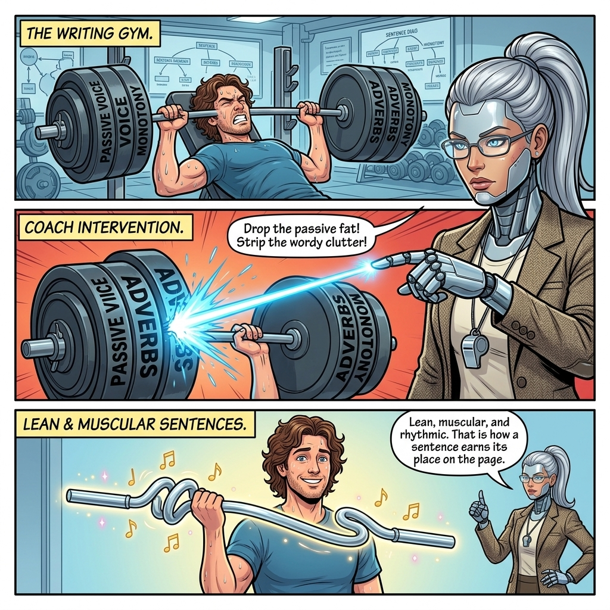

```{=openxml}
<w:p><w:r><w:br w:type="page"/></w:r></w:p>
```
```{=html}
<div style="page-break-after: always; break-after: page;"></div>
```

## Chapter 1: The Music of Prose

Welcome to Chapter 1. Writers fixate on plot and character, but prose has a sound—a rhythm the reader's body feels before the mind processes. Before we build worlds, we must learn to hear the music of our sentences.

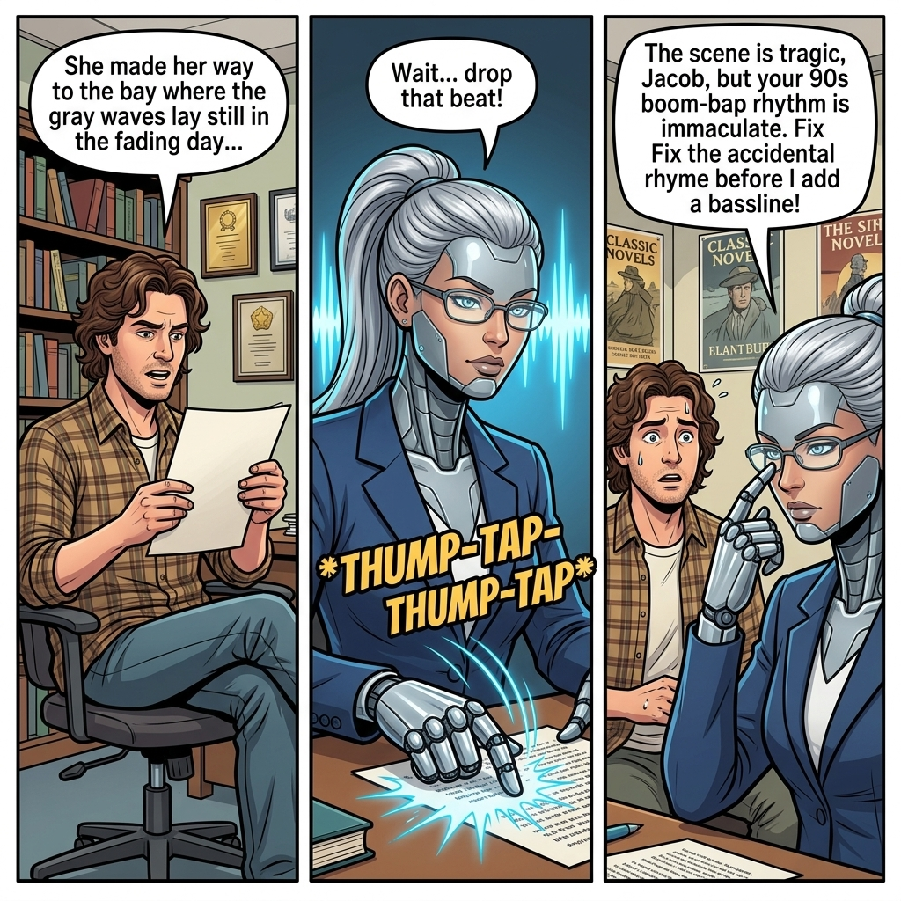

```{=openxml}
<w:p><w:r><w:br w:type="page"/></w:r></w:p>
```
```{=html}
<div style="page-break-after: always; break-after: page;"></div>
```

### 1. Principles of Sentence Music

#### Principle 1: Vary Sentence Length to Control Pacing
Sentence length dictates the speed of the reader's mind. Short sentences create urgency and tension. Medium sentences carry narrative information. Long sentences invite contemplation and lyricism.

##### Example 1: High-Tension Action

**Original (Monotonous):**
> The dog ran across the yard. It was very fast. It bit his leg. He fell down hard.

**Corrected (Varied):**
> The dog bolted across the yard—a blur of fur and teeth. It struck. He went down hard, hitting the cold turf before he could scream.

##### Example 2: Reflective Scene

**Original (Monotonous):**
> Marcus looked at the old ocean. He thought about his childhood summer. He remembered his father's wooden boat. He felt a deep sadness.

**Corrected (Varied):**
> Marcus stared out across the gray expanse of the Atlantic, where waves crashed rhythmically against the rocks as they had thirty summers ago. He remembered his father's boat. The tide was coming in, heavy with salt and memory.

##### Example 3: Sudden Realization

**Original (Monotonous):**
> She heard a sound upstairs. She walked to the hallway. She saw the open door. She knew someone was inside.

**Corrected (Varied):**
> A sharp creak echoed from the floorboards directly overhead. Freeze. Clara crept toward the dimly lit hallway, her pulse hammering against her ribs, until she reached the master bedroom door—swung wide open into pitch blackness.

#### Principle 2: Read Aloud to Spot What the Eye Misses
Your ear catches problems your eye skips over entirely. Awkward consonant clusters, accidental rhymes, and sentences that leave you gasping for breath all reveal themselves the moment you speak them. Reading aloud belongs in every editing pass—treat it as mandatory, not optional.

##### Example 1: Catching Awkward Consonant Clusters

**Original (Tongue-Twisting):**
> The sixth sphinx's thick stone struck the structure's struts.

**Corrected (Smooth Sound):**
> The ancient sphinx, carved from heavy stone, crashed against the temple's support beams.

##### Example 2: Catching Accidental Internal Rhyme

**Original (Unintentional Rhyme):**
> She made her way to the bay where the gray waves lay still in the fading day.

**Corrected (Rhyme Removed):**
> She walked toward the shoreline, where dull waves sat motionless beneath the dimming sky.

##### Example 3: Catching a Sentence Too Long to Breathe

**Original (Breathless Run-On):**
> He sprinted across the cracked asphalt of the abandoned parking lot while the sirens wailed behind him and the helicopter's spotlight swept across the ground in wide arcs that seemed to be closing in on him with every desperate stride he took toward the chain-link fence at the far edge of the property.

**Corrected (Natural Breath Breaks):**
> He sprinted across the cracked asphalt, sirens wailing behind him. The helicopter's spotlight swept the ground in wide, tightening arcs. The chain-link fence was close. He ran harder.


### 2. Interactive AI Activity

**Objective:** Work with an AI prose coach to identify and fix monotonous, overly lengthy sentences, practicing dynamic pacing until you earn a passing grade (B or higher).

**Instructions:**
1. Copy the **Sample Prompt** below.
2. Open your preferred AI platform (Gemini, ChatGPT, or Claude).
3. Paste the prompt into the chat. The AI will generate a unique, overly lengthy and poorly paced fiction paragraph for you to fix.
4. Rewrite the passage using a mix of short, medium, and long sentences, then submit your draft.
5. Work with your AI coach to refine the prose until you earn a grade of **B** or higher.
6. Want more practice? Reply to the AI with *"Generate another paragraph"* to take on a fresh challenge.


### 3. Sample Prompt

Paste this prompt into the AI Chatbot of your choice (Gemini, ChatGPT, or Claude) to begin the exercise. Challenge yourself to get at least a B grade before proceeding to the next chapter.

```text
Act as a strict yet encouraging college creative writing professor and prose coach.

Step 1: Generate an original 4-to-6-sentence fiction passage that is intentionally flawed in TWO ways:
- Every sentence is roughly the same length, creating a monotonous, poorly paced rhythm.
- The passage contains at least one awkward consonant cluster, one accidental internal rhyme, or one sentence so long it cannot be read aloud in a single breath.

Present the paragraph to me. Do not provide any hints, analysis, or suggestions about what is wrong with it. Stop after presenting the paragraph and wait for my reply.

Step 2: When I reply with my rewritten version, evaluate my draft strictly on the following criteria:
- Sentence Length Variation: Did I effectively mix short, medium, and long sentences to create dynamic pacing?
- Sonic Quality (Read-Aloud Test): Does the rewrite flow smoothly when spoken aloud? Are awkward sound clusters, accidental rhymes, and breathless run-ons eliminated?
- Overall Craft: Does the revised passage feel alive and purposeful rather than flat?

For each criterion, quote a specific line from my draft to support your evaluation.

Assign my rewrite a letter grade (A, B, C, D, or F) with clear coaching feedback. Be appropriately strict as if this is a masters-level creative writing course at a major university.
- If my grade is below a B (C, D, or F), explain the specific flaws and require me to rewrite the paragraph again until I achieve at least a B.
- If my grade is a B or higher, congratulate me and let me know I can reply with "Generate another paragraph" whenever I want to practice again with a new paragraph.
```


```{=openxml}
<w:p><w:r><w:br w:type="page"/></w:r></w:p>
```
```{=html}
<div style="page-break-after: always; break-after: page;"></div>
```

## Chapter 2: Strong Verbs, Strong Sentences

Verbs are the engine of fiction. While nouns define your story's objects and adjectives color its surfaces, verbs supply the raw forward momentum that pulls readers through the page.

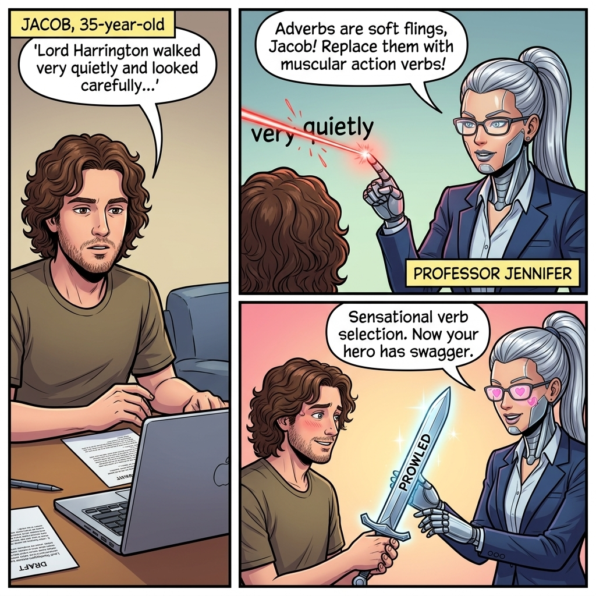

```{=openxml}
<w:p><w:r><w:br w:type="page"/></w:r></w:p>
```
```{=html}
<div style="page-break-after: always; break-after: page;"></div>
```

### 1. Principles of Verb Selection

#### Principle 1: Replace Weak Verbs and Adverbs with Precise Action Verbs
Beginning writers often attempt to energize a weak verb by attaching an adverb to it. However, pairing a generic verb with an adverb creates soft, bloated prose. Finding a single, specific action verb eliminates clutter and places a far sharper image in the reader's mind.

##### Example 1: Sci-Fi Stealth Mission

**Original (Weak Verb + Adverb):**
> Commander Vance walked very quietly down the metal corridor, looking carefully at every shadow.

**Corrected (Precise Action Verb):**
> Commander Vance prowled the metal corridor, scanning every shadow.

##### Example 2: Regency Drama

**Original (Weak Verb + Adverb):**
> Lord Harrington closed the heavy oak door forcefully and spoke angrily to his sister.

**Corrected (Precise Action Verb):**
> Lord Harrington slammed the heavy oak door and snarled at his sister.

##### Example 3: Crime Thriller Pursuit

**Original (Weak Verb + Adverb):**
> The suspect ran quickly through the narrow alley, breathing heavily as he fled.

**Corrected (Precise Action Verb):**
> The suspect sprinted through the narrow alley, wheezing as he fled.

#### Principle 2: Eliminate Passive Phrasing and "To Be" Verbs
Relying on state-of-being verbs—such as *is*, *was*, *were*, *been*, and *being*—places distance between your reader and the action. Passive constructions turn active characters into passive observers and hide the true subject of the sentence. Shift the real actor into the subject position to make every sentence land with direct narrative force.

##### Example 1: Horror Atmosphere

**Original (Passive "To Be" Construction):**
> There was a strange sound heard in the attic, and the old floorboards were shaken by the wind.

**Corrected (Active Narrative Energy):**
> A strange sound echoed from the attic as the wind shook the old floorboards.

##### Example 2: Fantasy Battle

**Original (Passive Voice Placement):**
> The dragon's fiery breath was dodged by the knight, but his shield was melted by the heat.

**Corrected (Active Character Agency):**
> The knight leaped clear of the dragon's fiery breath, though the heat melted his shield.

##### Example 3: Contemporary Drama

**Original (Passive Stasis):**
> Elena was seated at her desk, and her gaze was fixed upon the unread letter that was resting in front of her.

**Corrected (Active Motion):**
> Elena sat at her desk and stared at the unread letter resting before her.


### 2. Interactive AI Activity

**Objective:** Work with an AI prose coach to eliminate weak verbs, adverbs, and passive phrasing, replacing them with sharp action verbs until you earn a passing grade (B or higher).

**Instructions:**
1. Copy the **Sample Prompt** below.
2. Open your preferred AI platform (Gemini, ChatGPT, or Claude).
3. Paste the prompt into the chat. The AI will generate an original fiction paragraph burdened with weak verb-adverb pairings and passive "to be" constructions.
4. Rewrite the passage by stripping away adverbs, converting passive voice to active subject-verb structures, and choosing strong action verbs.
5. Work with your AI coach to refine your work until you earn a grade of **B** or higher.
6. Want more practice? Reply to the AI with *"Generate another paragraph"* to take on a fresh challenge.


### 3. Sample Prompt

Paste this prompt into the AI Chatbot of your choice (Gemini, ChatGPT, or Claude) to begin the exercise. Challenge yourself to get at least a B grade before proceeding to the next chapter.

```text
Act as a strict yet encouraging college creative writing professor and prose coach.

Step 1: Generate an original 4-to-6-sentence fiction passage that is intentionally flawed in TWO ways:
- The passage relies heavily on weak verbs modified by adverbs (e.g., "walked slowly," "said angrily," "looked intently").
- The passage relies on passive voice or unnecessary state-of-being ("to be") verbs in place of active verbs (e.g., "was opened by," "there was a blast," "were held in fear").

Present the paragraph to me. Do not provide any hints, analysis, or suggestions about what is wrong with it. Stop after presenting the paragraph and wait for my reply.

Step 2: When I reply with my rewritten version, evaluate my draft strictly on the following criteria:
- Verb Precision & Adverb Elimination: Did I strip redundant adverbs and replace weak verb-adverb pairs with single, precise action verbs?
- Active Voice & Passive Elimination: Did I eliminate passive voice and replace weak "to be" constructions with active subjects and verbs?
- Overall Craft: Does the revised passage feel muscular, engaging, and dynamic?

For each criterion, quote a specific line from my draft to support your evaluation.

Assign my rewrite a letter grade (A, B, C, D, or F) with clear coaching feedback. Be appropriately strict as if this is a masters-level creative writing course at a major university.
- If my grade is below a B (C, D, or F), explain the specific flaws and require me to rewrite the paragraph again until I achieve at least a B.
- If my grade is a B or higher, congratulate me and let me know I can reply with "Generate another paragraph" whenever I want to practice again with a new paragraph.
```

```{=openxml}
<w:p><w:r><w:br w:type="page"/></w:r></w:p>
```
```{=html}
<div style="page-break-after: always; break-after: page;"></div>
```

## Chapter 3: Economy of Language

Every word in a novel must earn its place on the page. Writing with economy is not about stripping your prose of beauty or rhythm; it is about eliminating the dead weight that dulls your reader's attention.

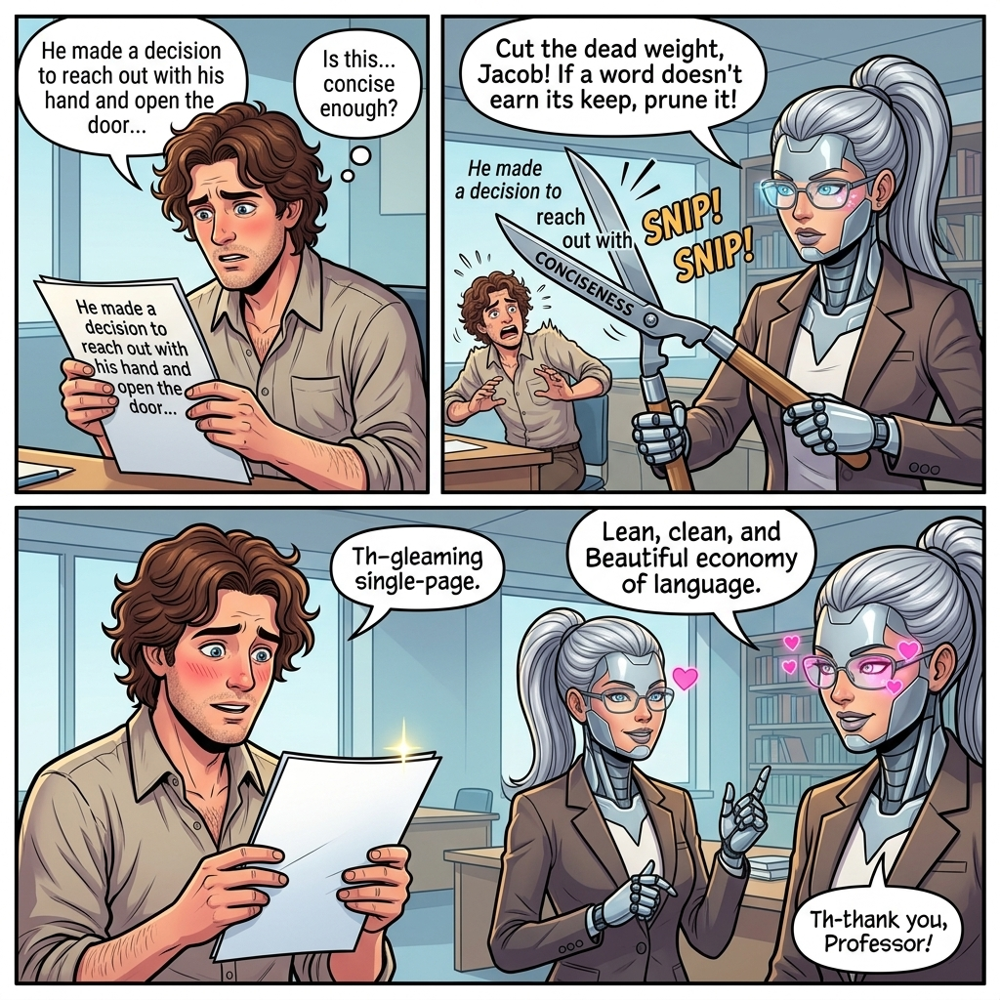

```{=openxml}
<w:p><w:r><w:br w:type="page"/></w:r></w:p>
```
```{=html}
<div style="page-break-after: always; break-after: page;"></div>
```

### 1. Principles of Concise Prose

#### Principle 1: Eliminate Redundancies and Stating the Obvious
Redundancy occurs when a phrase repeats information already implied by a noun or verb. Phrases like "nodded his head," "shrugged her shoulders," or "retreated back" force the reader to process words that add zero new meaning. Trim anatomical and logical repetitions so your prose stays crisp.

##### Example 1: Mystery / Noir Investigation

**Original (Anatomical Redundancy):**
> Detective Miller nodded his head in agreement as he looked with his eyes at the bloody footprint.

**Corrected (Streamlined Detail):**
> Detective Miller nodded as he examined the bloody footprint.

##### Example 2: Sci-Fi / Cyberpunk

**Original (Logical Redundancy):**
> Maya shrugged her shoulders indifferently and retreated back toward the rear airlock.

**Corrected (Streamlined Detail):**
> Maya shrugged and retreated to the airlock.

##### Example 3: Historical Fiction

**Original (Tautological Clutter):**
> The general made a final decision to completely surround the city on all sides.

**Corrected (Streamlined Detail):**
> The general decided to surround the city.

#### Principle 2: Prune Filler Phrases and Crutch Words
Crutch words (such as *very*, *really*, *somewhat*, *just*, *actually*, *began to*, and *started to*) soften your sentences and dilute narrative tension. They are the prose equivalent of clearing your throat—every one of them comes before something that didn't need a preamble. Stripping these modifiers forces your prose to stand on its own inherent strength.

##### Example 1: Fantasy Adventure

**Original (Crutch Words & Throat-Clearing):**
> She just started to slowly reach out her hand toward the very ancient, glowing stone.

**Corrected (Direct Action):**
> She reached toward the ancient glowing stone.

##### Example 2: Suspense Thriller

**Original (Weak Modifiers):**
> Marcus actually felt somewhat terrified when he suddenly heard a really loud crash outside.

**Corrected (Direct Action):**
> Terror seized Marcus as a crash shattered the silence outside.

##### Example 3: Contemporary Drama

**Original (Hesitant Filler):**
> Sarah was really quite hesitant to open the unexpectedly heavy envelope that had arrived.

**Corrected (Direct Action):**
> Sarah hesitated to open the heavy envelope.


### 2. Interactive AI Activity

**Objective:** Work with an AI prose coach to prune filler phrases, redundancies, and crutch words from a cluttered passage until you earn a passing grade (B or higher).

**Instructions:**
1. Copy the **Sample Prompt** below.
2. Open your preferred AI platform (Gemini, ChatGPT, or Claude).
3. Paste the prompt into the chat. The AI will generate an original fiction paragraph burdened with redundant phrases, anatomical repetition, and throat-clearing crutch words.
4. Rewrite the passage by pruning all unnecessary clutter and allowing the essential action and imagery to stand on its own.
5. Work with your AI coach to refine your work until you earn a grade of **B** or higher.
6. Want more practice? Reply to the AI with *"Generate another paragraph"* to take on a fresh challenge.


### 3. Sample Prompt

Paste this prompt into the AI Chatbot of your choice (Gemini, ChatGPT, or Claude) to begin the exercise. Challenge yourself to get at least a B grade before proceeding to the next chapter.

```text
Act as a strict yet encouraging college creative writing professor and prose coach.

Step 1: Generate an original 4-to-6-sentence fiction passage that is intentionally flawed in TWO ways:
- The passage is filled with redundancies that state the obvious (e.g., "nodded his head," "retreated back," "shrugged her shoulders").
- The passage relies heavily on throat-clearing filler phrases and crutch words (e.g., "just," "very," "really," "started to," "somewhat").

Present the paragraph to me. Do not provide any hints, analysis, or suggestions about what is wrong with it. Stop after presenting the paragraph and wait for my reply.

Step 2: When I reply with my rewritten version, evaluate my draft strictly on the following criteria:
- Redundancy Elimination: Did I remove repetitive details that state the obvious (such as anatomical or logical redundancies)?
- Filler & Crutch Word Pruning: Did I strip away weak modifiers and throat-clearing phrases (like "just," "very," "started to")?
- Overall Craft: Does the trimmed passage read with maximum economy and impact without losing narrative rhythm?

For each criterion, quote a specific line from my draft to support your evaluation.

Assign my rewrite a letter grade (A, B, C, D, or F) with clear coaching feedback. Be appropriately strict as if this is a masters-level creative writing course at a major university.
- If my grade is below a B (C, D, or F), explain the specific flaws and require me to rewrite the paragraph again until I achieve at least a B.
- If my grade is a B or higher, congratulate me and let me know I can reply with "Generate another paragraph" whenever I want to practice again with a new paragraph.
```

```{=openxml}
<w:p><w:r><w:br w:type="page"/></w:r></w:p>
```
```{=html}
<div style="page-break-after: always; break-after: page;"></div>
```

# Part II: Paragraph Craft
If sentences are the trees, the paragraph is the forest.

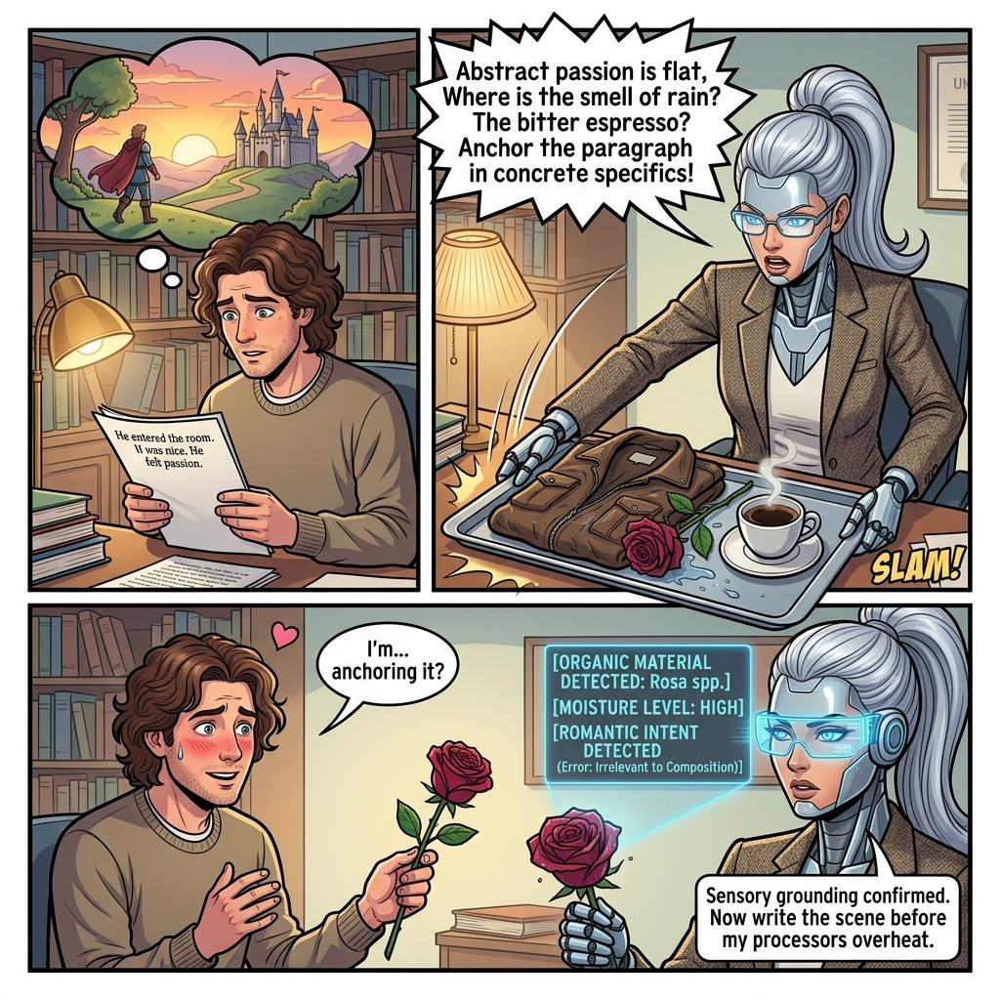

```{=openxml}
<w:p><w:r><w:br w:type="page"/></w:r></w:p>
```
```{=html}
<div style="page-break-after: always; break-after: page;"></div>
```

## Chapter 4: Anchoring with Concrete Specifics

Abstract ideas drift above the page. Stories, by contrast, happen in the physical world—in the smell of a coat, the cold of a floor, the weight of an object in a character's hand. A paragraph earns its emotional charge only when you anchor it in the specific and the sensory.

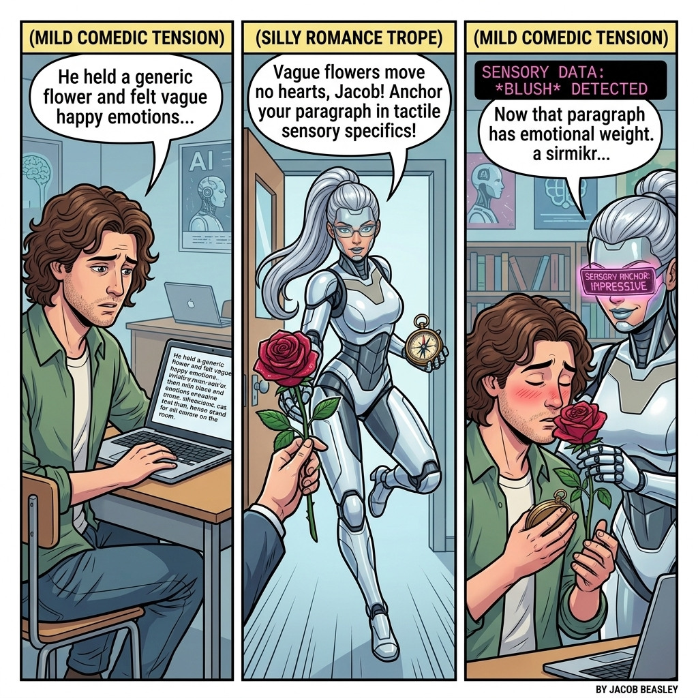

```{=openxml}
<w:p><w:r><w:br w:type="page"/></w:r></w:p>
```
```{=html}
<div style="page-break-after: always; break-after: page;"></div>
```

### 1. Principles of Sensory Grounding

#### Principle 1: Ground Abstract Emotions in Visceral Sensory Details
Telling the reader that a character feels "sad," "angry," or "nostalgic" keeps the emotion trapped in narrative summary. Invoking specific sensory triggers—the scent of damp pine, the bitter tang of copper, or the vibration of a steel floor—lets the reader experience the emotion rather than be told about it.

##### Example 1: Grief / Post-War Drama

**Original (Abstract Emotional Summary):**
> Marcus felt overwhelming grief and sadness whenever he thought about his fallen brother.

**Corrected (Sensory Grounding):**
> Marcus pressed his thumb against his brother's tarnished brass compass, the scent of machine oil and dried salt still clinging to the hinge.

##### Example 2: Nostalgia / Family Drama

**Original (Abstract Emotional Summary):**
> Elena was consumed by nostalgia as she stepped inside her grandmother's old house.

**Corrected (Sensory Grounding):**
> The aroma of dried lavender and stale tobacco in the hallway pulled Elena back to childhood summers spent on the screened porch.

##### Example 3: Terror / Sci-Fi Survival

**Original (Abstract Emotional Summary):**
> Fear washed over Dr. Aris as she realized the alien vessel was beginning to breach the hull.

**Corrected (Sensory Grounding):**
> The metal floor deck vibrated beneath Aris's boots, rattling the loose rivets as acrid ozone filled the airlock.

#### Principle 2: Replace Generic Nouns with Concrete Specifics
Generic nouns (such as *vehicle*, *food*, *weapon*, or *building*) invite vague mental images. Replacing them with precise, concrete nouns (*1974 Ford Pinto*, *stale rye bread*, *dull iron hatchet*, or *sagging Victorian mansion*) sharpens the setting and conveys character and world without a single word of exposition.

##### Example 1: Crime Thriller

**Original (Generic Nouns):**
> He got into his old car and drove past the abandoned building at the edge of town.

**Corrected (Concrete Specifics):**
> He slid into the tearing vinyl seat of his '82 Buick LeSabre and rattled past the rusting grain elevator.

##### Example 2: High Fantasy

**Original (Generic Nouns):**
> The warrior ate some basic food in the tavern while holding his weapon.

**Corrected (Concrete Specifics):**
> The mercenary tore into a greasy mutton leg in the tavern while resting his notched broadsword across his knees.

##### Example 3: Suburban Suspense

**Original (Generic Nouns):**
> She carried a cold drink out to the yard and looked down at the ruined plants.

**Corrected (Concrete Specifics):**
> She carried a sweating glass of gin and tonic onto the patio, staring down at the trampled hydrangeas.


### 2. Interactive AI Activity

**Objective:** Work with an AI prose coach to convert a paragraph of abstract summary and generic labels into a sensorially grounded, concrete scene until you earn a passing grade (B or higher).

**Instructions:**
1. Copy the **Sample Prompt** below.
2. Open your preferred AI platform (Gemini, ChatGPT, or Claude).
3. Paste the prompt into the chat. The AI will generate an original fiction paragraph consisting entirely of abstract emotional statements and generic nouns.
4. Rewrite the passage by replacing abstract emotions with sensory details and generic labels with concrete, specific nouns and physical reactions.
5. Work with your AI coach to refine your work until you earn a grade of **B** or higher.
6. Want more practice? Reply to the AI with *"Generate another paragraph"* to take on a fresh challenge.


### 3. Sample Prompt

Paste this prompt into the AI Chatbot of your choice (Gemini, ChatGPT, or Claude) to begin the exercise. Challenge yourself to get at least a B grade before proceeding to the next chapter.

```text
Act as a strict yet encouraging college creative writing professor and prose coach.

Step 1: Generate an original 4-to-6-sentence fiction passage that is intentionally flawed in TWO ways:
- The passage relies entirely on abstract emotional telling (e.g., "he felt deeply sorrowful," "she was consumed by anxiety," "nostalgia filled the room").
- The passage uses generic, unspecific nouns and category labels (e.g., "a vehicle," "some food," "a building," "a weapon," "a flower").

Present the paragraph to me. Do not provide any hints, analysis, or suggestions about what is wrong with it. Stop after presenting the paragraph and wait for my reply.

Step 2: When I reply with my rewritten version, evaluate my draft strictly on the following criteria:
- Sensory Grounding & Emotional Embodiment: Did I replace abstract emotional telling with concrete sensory details and visceral physical reactions?
- Noun Specificity: Did I replace generic, vague nouns with precise, tangible nouns that ground the scene in physical reality?
- Overall Craft: Does the revised passage evoke a vivid, immersive setting and atmosphere?

For each criterion, quote a specific line from my draft to support your evaluation.

Assign my rewrite a letter grade (A, B, C, D, or F) with clear coaching feedback. Be appropriately strict as if this is a masters-level creative writing course at a major university.
- If my grade is below a B (C, D, or F), explain the specific flaws and require me to rewrite the paragraph again until I achieve at least a B.
- If my grade is a B or higher, congratulate me and let me know I can reply with "Generate another paragraph" whenever I want to practice again with a new paragraph.
```

```{=openxml}
<w:p><w:r><w:br w:type="page"/></w:r></w:p>
```
```{=html}
<div style="page-break-after: always; break-after: page;"></div>
```

## Chapter 5: Making Sentences Flow Together

Writing individual strong sentences is only half the battle. A great paragraph does not feel like a list of isolated facts; it flows like a single current—each sentence drawing the next forward.

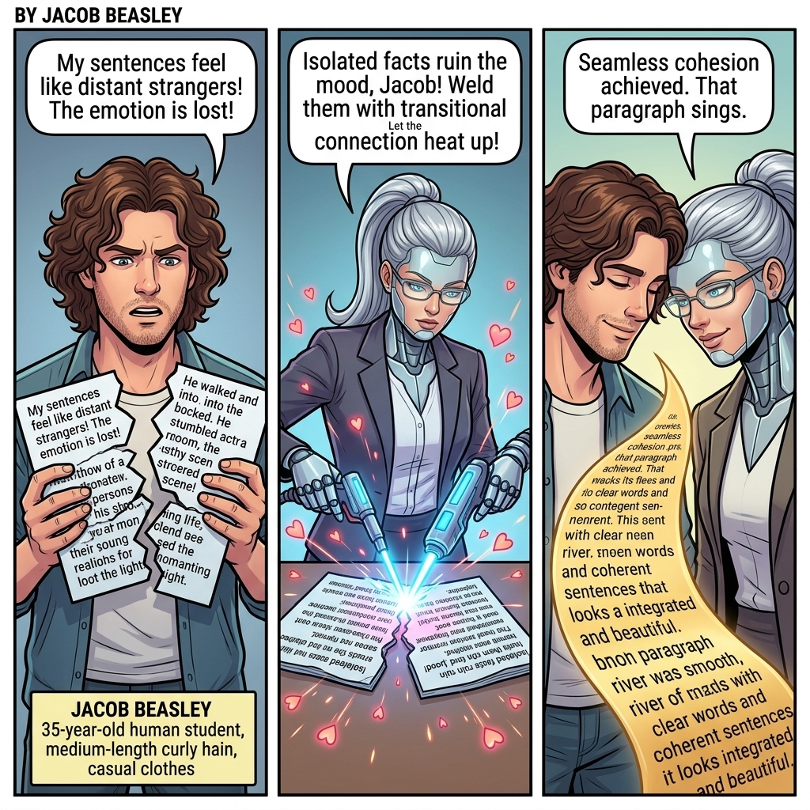

```{=openxml}
<w:p><w:r><w:br w:type="page"/></w:r></w:p>
```
```{=html}
<div style="page-break-after: always; break-after: page;"></div>
```

### 1. Principles of Paragraph Cohesion

#### Principle 1: Honor the Known-to-New Information Contract
Readers absorb prose effortlessly when a sentence begins with familiar or previously established concepts ("the known") before introducing unexpected or fresh information ("the new"). Placing unfamiliar elements at the start of a sentence forces the reader to pause and re-orient. Threading established ideas into subsequent subjects creates natural narrative rhythm.

##### Example 1: Detective Mystery

**Original (Violating Known-to-New):**
> A bloody glove lay on the mahogany desk. Dusty case files covered the rest of the surface. The detective picked up the glove.

**Corrected (Honoring Known-to-New):**
> The mahogany desk was piled high with dusty case files. Nestled among the papers lay a single bloody glove—which the detective lifted with gloved fingers.

##### Example 2: Sci-Fi Exploration

**Original (Violating Known-to-New):**
> Blue light hummed inside its stone core. An ancient obelisk stood in the crater center. The rover approached it.

**Corrected (Honoring Known-to-New):**
> The rover reached the lip of the crater. At its center stood an ancient stone obelisk, humming with blue light from within its core.

##### Example 3: Gothic Horror

**Original (Violating Known-to-New):**
> Tapestries hung on the stone walls. The cold draft blew past them. The candles flickered out.

**Corrected (Honoring Known-to-New):**
> A cold draft whistled down the ruined corridor. The gust billowed the heavy tapestries along the stone walls, snuffing out the last candlelight.

#### Principle 2: Use Spatial Cues and Logical Transition Markers
Without explicit spatial cues or logical connectors, sentences jar against one another as the reader struggles to orient themselves in space and time. Using subtle directional markers (*above*, *beyond*, *opposite*) and causal links (*consequently*, *yet*, *meanwhile*) stitches the action into a clear, cohesive scene.

##### Example 1: Fantasy Siege

**Original (Missing Spatial Cues):**
> The archers fired from the battlements. The battering ram struck the wooden gate. The captain yelled commands.

**Corrected (Clear Spatial Anchors):**
> High above the courtyard, archers loosed a volley from the battlements. Below, the battering ram struck the oak gate, where the captain roared for reinforcements.

##### Example 2: Historical Naval Action

**Original (Missing Logical Transitions):**
> The mainmast snapped in the gale. Water poured into the lower hold. The crew rushed to the lifeboats.

**Corrected (Clear Logical Transitions):**
> The gale snapped the mainmast with a deafening crack. Instantly, sea water surged into the lower hold, forcing the crew to scramble for the lifeboats.

##### Example 3: Office Drama

**Original (Missing Temporal Markers):**
> Elena submitted the audit report. The manager called an emergency meeting. Panic spread across the floor.

**Corrected (Clear Temporal Markers):**
> Elena submitted the audit report at noon. By one o'clock, her manager had called an emergency meeting, sending a wave of panic across the floor.


### 2. Interactive AI Activity

**Objective:** Work with an AI prose coach to rewrite a disjointed paragraph into a seamlessly connected passage using the known-to-new contract and clear spatial/logical transitions until you earn a passing grade (B or higher).

**Instructions:**
1. Copy the **Sample Prompt** below.
2. Open your preferred AI platform (Gemini, ChatGPT, or Claude).
3. Paste the prompt into the chat. The AI will generate an original fiction paragraph plagued by disjointed sentences, inverted information order, and a lack of spatial/logical transitions.
4. Rewrite the passage by reordering information to follow the known-to-new contract and adding spatial and logical transition markers.
5. Work with your AI coach to refine your work until you earn a grade of **B** or higher.
6. Want more practice? Reply to the AI with *"Generate another paragraph"* to take on a fresh challenge.


### 3. Sample Prompt

Paste this prompt into the AI Chatbot of your choice (Gemini, ChatGPT, or Claude) to begin the exercise. Challenge yourself to get at least a B grade before proceeding to the next chapter.

```text
Act as a strict yet encouraging college creative writing professor and prose coach.

Step 1: Generate an original 4-to-6-sentence fiction passage that is intentionally flawed in TWO ways:
- The sentences violate the known-to-new contract, constantly introducing unfamiliar concepts at the start of sentences before establishing context.
- The passage lacks spatial cues and logical transition markers, causing the action to feel abrupt, disorienting, and disjointed.

Present the paragraph to me. Do not provide any hints, analysis, or suggestions about what is wrong with it. Stop after presenting the paragraph and wait for my reply.

Step 2: When I reply with my rewritten version, evaluate my draft strictly on the following criteria:
- Known-to-New Flow: Did I structure sentences so that established concepts introduce fresh information naturally?
- Transitional & Spatial Cohesion: Did I use effective spatial cues and logical connectors to guide the reader through space and time?
- Overall Craft: Does the revised paragraph feel like a single, seamless stream of narrative momentum?

For each criterion, quote a specific line from my draft to support your evaluation.

Assign my rewrite a letter grade (A, B, C, D, or F) with clear coaching feedback. Be appropriately strict as if this is a masters-level creative writing course at a major university.
- If my grade is below a B (C, D, or F), explain the specific flaws and require me to rewrite the paragraph again until I achieve at least a B.
- If my grade is a B or higher, congratulate me and let me know I can reply with "Generate another paragraph" whenever I want to practice again with a new paragraph.
```

```{=openxml}
<w:p><w:r><w:br w:type="page"/></w:r></w:p>
```
```{=html}
<div style="page-break-after: always; break-after: page;"></div>
```

## Chapter 6: Opening Strong, Ending Stronger

A paragraph is not just an arbitrary container for sentences; it is a mini-story with its own dramatic arc. To keep readers turning pages, every paragraph needs a strong opening hook that connects what just happened to what happens next, and a closing line that lingers.

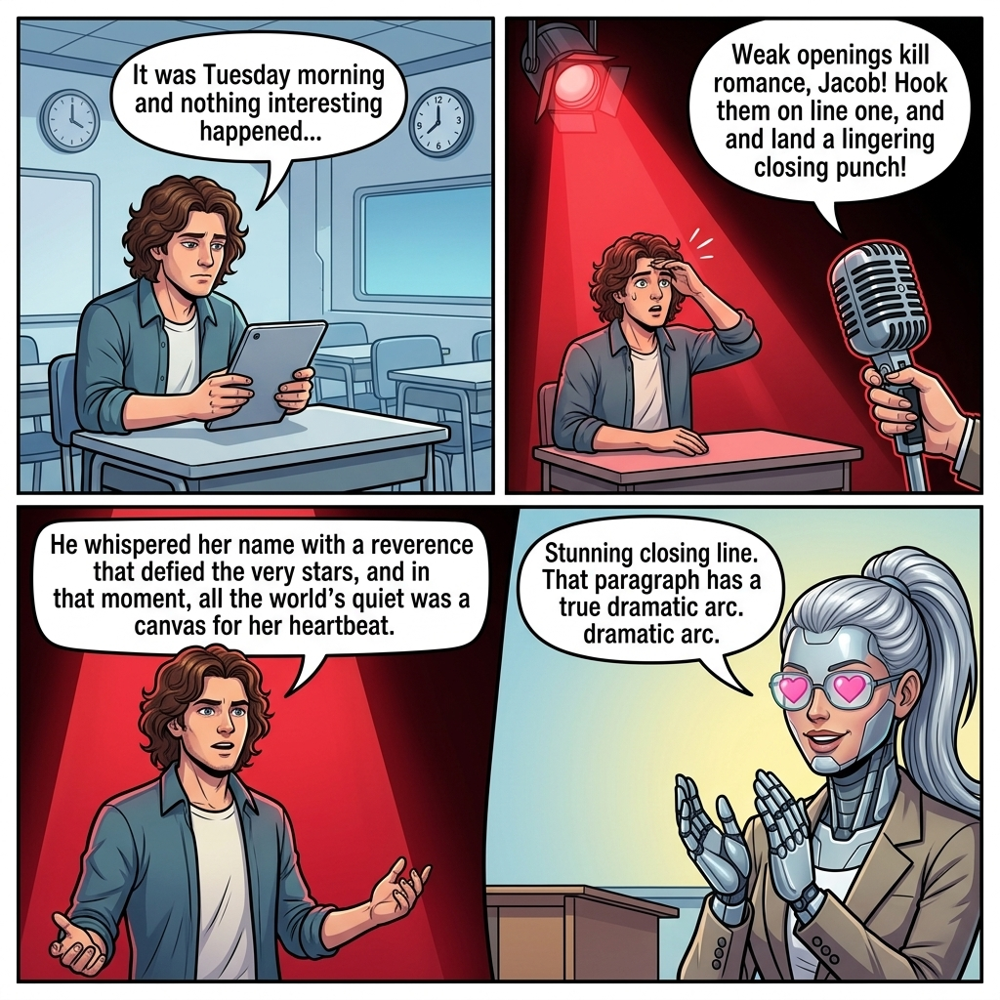

```{=openxml}
<w:p><w:r><w:br w:type="page"/></w:r></w:p>
```
```{=html}
<div style="page-break-after: always; break-after: page;"></div>
```

### 1. Principles of Paragraph Arcs

#### Principle 1: Anchor the Opening Hook to Bridge Context and Propel Action
The first sentence of a paragraph carries two jobs at once: it must connect smoothly to the paragraph before it while immediately launching a new micro-action or idea. Opening with a flat, explanatory statement bogs down momentum. Transforming the topic sentence into an active hook instantly re-engages the reader's curiosity.

##### Example 1: Thriller Escape

**Original (Flat Opening Statement):**
> Jack walked into the dark warehouse next. He looked around for the guard who had been trailing him.

**Corrected (Active Bridging Hook):**
> Before the alley door swung shut behind him, Jack slipped into the pitch-black warehouse, listening for the footsteps of his pursuer.

##### Example 2: Regency Romance Ball

**Original (Flat Opening Statement):**
> Lady Eleanor sat down by the grand fireplace in the ballroom. She was thinking about Lord Byron's strange behavior.

**Corrected (Active Bridging Hook):**
> Leaving the laughter of the ballroom floor behind, Lady Eleanor sought the solitude of the hearth to make sense of Lord Byron's sudden departure.

##### Example 3: Sci-Fi System Failure

**Original (Flat Opening Statement):**
> The alarms started ringing across the main bridge. Captain Thorne tried to fix the navigation controls.

**Corrected (Active Bridging Hook):**
> Siren blares shattered the silence of the bridge, sending red light pulsing across Captain Thorne’s dead navigation console.

#### Principle 2: Close with a Resonant Ringing Sentence
The final sentence of a paragraph lingers longest in the reader's mind. Ending on a throwaway detail or administrative action allows the narrative pressure to drain away. Concluding with a strong image, thematic echo, or cliffhanger question—a "ringing" sentence—propels the reader straight into the next paragraph.

##### Example 1: Dark Fantasy Magic

**Original (Flat Throwaway Closing):**
> She picked up the spellbook and closed her leather bag before leaving the room.

**Corrected (Resonant Ringing Sentence):**
> She clutched the ancient grimoire to her chest, aware that its binding still hummed with the warmth of black blood.

##### Example 2: Crime Investigation

**Original (Flat Throwaway Closing):**
> Detective Vance put the evidence bag into his coat pocket and checked his watch.

**Corrected (Resonant Ringing Sentence):**
> Vance slipped the bloodstained key into his pocket—the exact match to his partner's front door.

##### Example 3: Dystopian Sci-Fi

**Original (Flat Throwaway Closing):**
> Kael turned off the monitor screen and stood up from his uncomfortable chair.

**Corrected (Resonant Ringing Sentence):**
> Kael killed the feed, leaving the room illuminated only by the burning skyline outside his window.


### 2. Interactive AI Activity

**Objective:** Work with an AI prose coach to rewrite a paragraph with a weak opening and flat ending into an arc with a dynamic bridging hook and a resonant closing ring until you earn a passing grade (B or higher).

**Instructions:**
1. Copy the **Sample Prompt** below.
2. Open your preferred AI platform (Gemini, ChatGPT, or Claude).
3. Paste the prompt into the chat. The AI will generate an original fiction paragraph flanked by a bland opening sentence and a throwaway concluding line.
4. Rewrite the paragraph to create a strong opening bridging hook and a resonant closing ring.
5. Work with your AI coach to refine your work until you earn a grade of **B** or higher.
6. Want more practice? Reply to the AI with *"Generate another paragraph"* to take on a fresh challenge.


### 3. Sample Prompt

Paste this prompt into the AI Chatbot of your choice (Gemini, ChatGPT, or Claude) to begin the exercise. Challenge yourself to get at least a B grade before proceeding to the next chapter.

```text
Act as a strict yet encouraging college creative writing professor and prose coach.

Step 1: Generate an original 4-to-6-sentence fiction passage that is intentionally flawed in TWO ways:
- The opening sentence is a flat, administrative topic sentence that fails to bridge context or hook curiosity.
- The closing sentence ends on a throwaway detail or bland action, killing narrative momentum.

Present the paragraph to me. Do not provide any hints, analysis, or suggestions about what is wrong with it. Stop after presenting the paragraph and wait for my reply.

Step 2: When I reply with my rewritten version, evaluate my draft strictly on the following criteria:
- Opening Bridging Hook: Did I transform the opening sentence into a dynamic hook that connects context and propels narrative action?
- Closing Resonant Ring: Did I conclude the paragraph with a memorable, impactful sentence that leaves a lingering image or tension?
- Overall Craft: Does the paragraph exhibit a satisfying internal dramatic arc from start to finish?

For each criterion, quote a specific line from my draft to support your evaluation.

Assign my rewrite a letter grade (A, B, C, D, or F) with clear coaching feedback. Be appropriately strict as if this is a masters-level creative writing course at a major university.
- If my grade is below a B (C, D, or F), explain the specific flaws and require me to rewrite the paragraph again until I achieve at least a B.
- If my grade is a B or higher, congratulate me and let me know I can reply with "Generate another paragraph" whenever I want to practice again with a new paragraph.
```

```{=openxml}
<w:p><w:r><w:br w:type="page"/></w:r></w:p>
```
```{=html}
<div style="page-break-after: always; break-after: page;"></div>
```

# Part III: Self-Editing Your Fiction
The editing phase is where you chip away the excess marble to reveal the final prose.

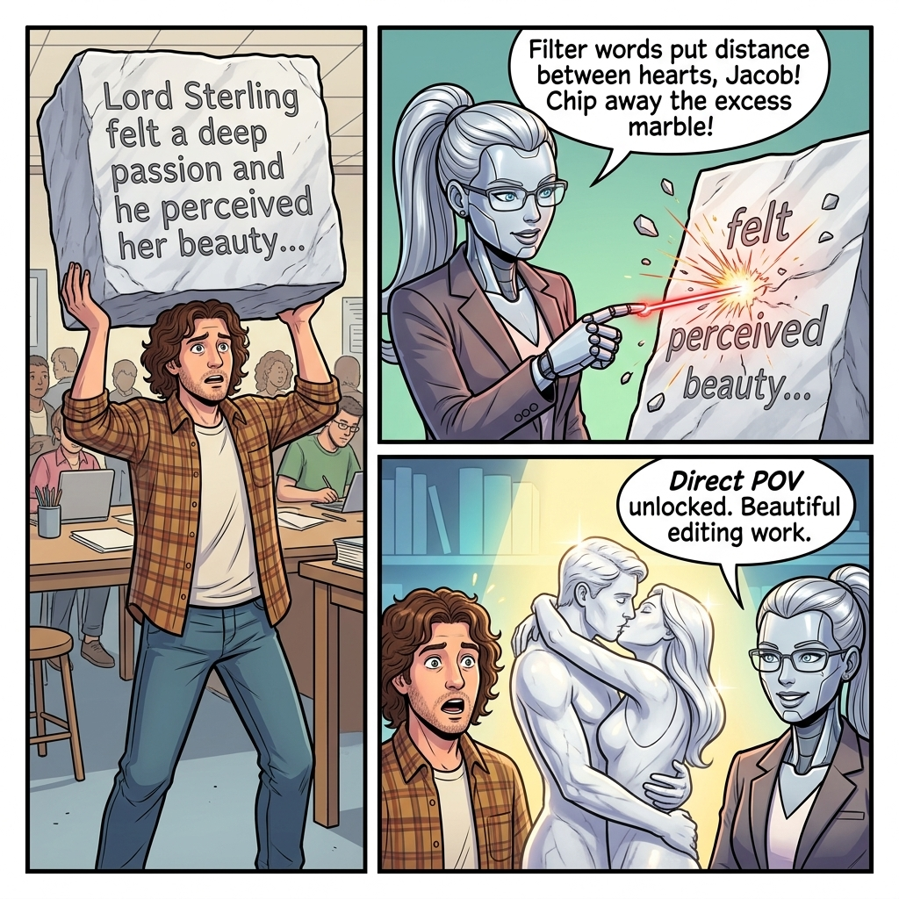

```{=openxml}
<w:p><w:r><w:br w:type="page"/></w:r></w:p>
```
```{=html}
<div style="page-break-after: always; break-after: page;"></div>
```

## Chapter 7: Deepening the POV

Immersive fiction is built on psychological proximity. When you place a camera lens between the reader and your viewpoint character—every filter word that tells the reader "the character perceived this" rather than delivering the perception directly creates a layer of glass between the reader and the scene. Removing these filter words drops the reader directly behind the character's eyes.

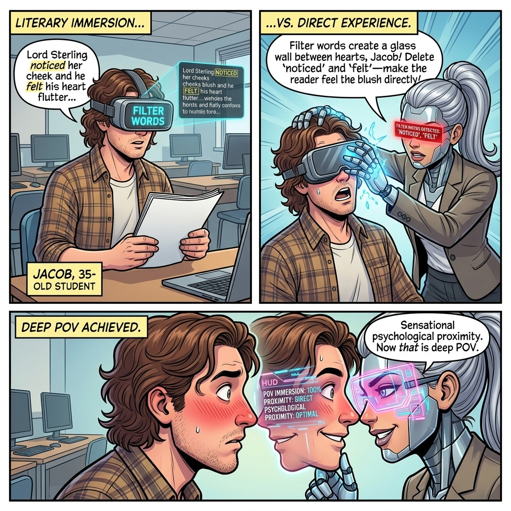

```{=openxml}
<w:p><w:r><w:br w:type="page"/></w:r></w:p>
```
```{=html}
<div style="page-break-after: always; break-after: page;"></div>
```

### 1. Principles of Point-of-View Immersion

#### Principle 1: Eliminate Sensory and Perceptual Filter Words
Filter words like *saw*, *heard*, *felt*, *noticed*, *smelled*, and *realized* interrupt the reader's direct experience of events. They shift the reader's focus away from the event itself and onto the character observing the event. Stripping the filter word allows the sensory detail to impact the reader immediately.

##### Example 1: Wilderness Survival

**Original (Filtered Observation):**
> She heard the distant howling of wolves echoing through the frozen pines, and she noticed the temperature dropping rapidly.

**Corrected (Unfiltered Direct Experience):**
> A distant howling of wolves echoed through the frozen pines as the temperature plummeted.

##### Example 2: Urban Noir

**Original (Filtered Observation):**
> Detective Hayes saw a shadowy figure slip into the alleyway, and he realized he was no longer alone.

**Corrected (Unfiltered Direct Experience):**
> A shadowy figure slipped into the alleyway. Hayes was no longer alone.

##### Example 3: Historical Sea Voyage

**Original (Filtered Observation):**
> The young sailor felt the deck pitch violently under his feet and watched the massive wave towering over the bow.

**Corrected (Unfiltered Direct Experience):**
> The deck pitched violently underfoot as a massive wave towered over the bow.

#### Principle 2: Fuse Internal Reflection with Physical Reaction
Beginning writers often report a character's thoughts from a distance, as if summarizing a memo ("She thought that he was lying"). Deepening point-of-view means translating internal realizations into direct sensory reactions, physical impulses, or unmediated internal monologue.

##### Example 1: Interpersonal Betrayal

**Original (Distanced Mental Commentary):**
> Clara thought that Julian was lying to her about where he spent the money, and she felt betrayed.

**Corrected (Deep POV Fusion):**
> Julian’s eyes flickered toward the floor—the same tell he gave when bluffing at cards. A cold knot twisted in Clara’s gut.

##### Example 2: Military Sci-Fi

**Original (Distanced Mental Commentary):**
> Sergeant Cole realized the squad had run out of ammunition, and he wondered if they would survive the night.

**Corrected (Deep POV Fusion):**
> Cole squeezed the trigger. Click. Empty. Would any of them see sunrise?

##### Example 3: Gothic Romance

**Original (Distanced Mental Commentary):**
> Amelia felt intimidated by the size of the estate, and she reflected on how unprepared she was.

**Corrected (Deep POV Fusion):**
> The estate's iron gates loomed three stories overhead, casting long shadows across the carriage. She adjusted her gloves, her hands trembling inside the lace.


### 2. Interactive AI Activity

**Objective:** Work with an AI prose coach to identify and eliminate filter words and distanced thoughts from a scene until you earn a passing grade (B or higher).

**Instructions:**
1. Copy the **Sample Prompt** below.
2. Open your preferred AI platform (Gemini, ChatGPT, or Claude).
3. Paste the prompt into the chat. The AI will generate an original fiction passage burdened with perceptual filter words (*saw*, *heard*, *felt*, *noticed*) and distanced internal commentary.
4. Rewrite the scene by stripping all filter words and fusing internal reflection with direct physical experience.
5. Work with your AI coach to refine your work until you earn a grade of **B** or higher.
6. Want more practice? Reply to the AI with *"Generate another paragraph"* to take on a fresh challenge.


### 3. Sample Prompt

Paste this prompt into the AI Chatbot of your choice (Gemini, ChatGPT, or Claude) to begin the exercise. Challenge yourself to get at least a B grade before proceeding to the next chapter.

```text
Act as a strict yet encouraging college creative writing professor and prose coach.

Step 1: Generate an original 4-to-6-sentence fiction passage that is intentionally flawed in TWO ways:
- The passage is rife with sensory filter words (e.g., "she saw," "he heard," "they noticed," "she felt").
- The passage uses distanced mental commentary (e.g., "he thought that," "she realized that," "he wondered if") instead of direct immersion.

Present the paragraph to me. Do not provide any hints, analysis, or suggestions about what is wrong with it. Stop after presenting the paragraph and wait for my reply.

Step 2: When I reply with my rewritten version, evaluate my draft strictly on the following criteria:
- Filter Word Eradication: Did I remove all perceptual filter words (saw, heard, felt, noticed) so the action happens directly on the page?
- Psychological Proximity & Deep POV: Did I eliminate distanced mental commentary and fuse thoughts into visceral physical reactions?
- Overall Craft: Does the passage feel fully immersive, putting the reader right behind the protagonist's eyes?

For each criterion, quote a specific line from my draft to support your evaluation.

Assign my rewrite a letter grade (A, B, C, D, or F) with clear coaching feedback. Be appropriately strict as if this is a masters-level creative writing course at a major university.
- If my grade is below a B (C, D, or F), explain the specific flaws and require me to rewrite the paragraph again until I achieve at least a B.
- If my grade is a B or higher, congratulate me and let me know I can reply with "Generate another paragraph" whenever I want to practice again with a new paragraph.
```

```{=openxml}
<w:p><w:r><w:br w:type="page"/></w:r></w:p>
```
```{=html}
<div style="page-break-after: always; break-after: page;"></div>
```

## Chapter 8: Dialogue Formatting

Dialogue is the raw voice of your characters. Formatting it properly ensures the reader stays immersed in the conversation without being yanked out by the scaffolding around the words.

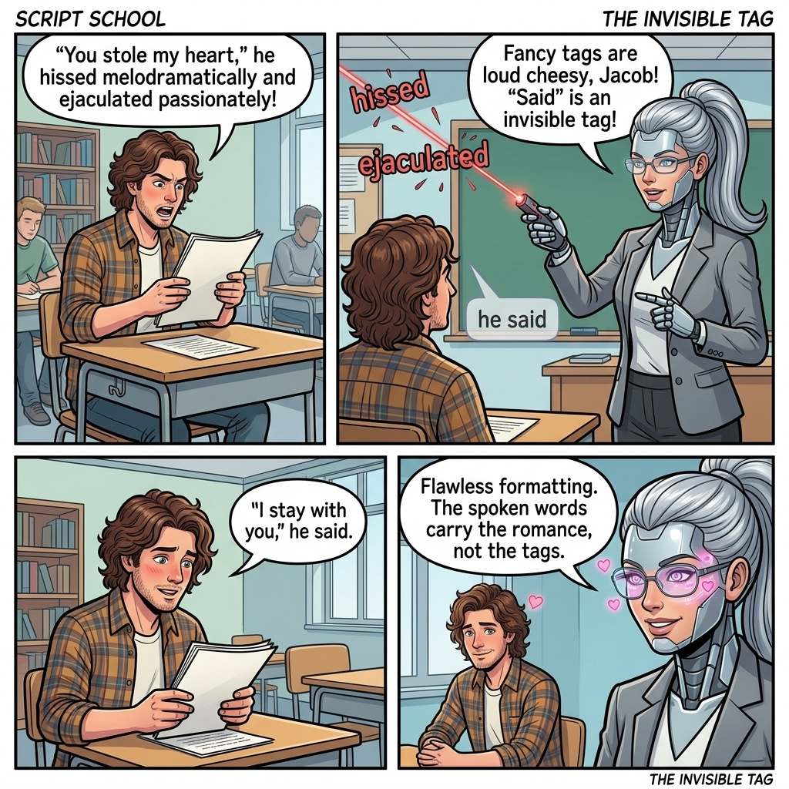

```{=openxml}
<w:p><w:r><w:br w:type="page"/></w:r></w:p>
```
```{=html}
<div style="page-break-after: always; break-after: page;"></div>
```

### 1. Principles of Dialogue Mechanics

#### Principle 1: Rely on Invisible Dialogue Tags Over Fancy "Bookisms"
Beginning writers often fear repeating "said" or "asked," resorting to elaborate dialogue tags—such as *shouted*, *exclaimed*, *hissed*, *inquired*, or *demanded*. These "bookisms" draw attention away from the spoken words and disrupt the rhythm. In English prose, "said" and "asked" are virtually invisible to readers, keeping attention on what the character is actually saying.

##### Example 1: Police Interrogation

**Original (Elaborate Dialogue Tags):**
> "Where were you on the night of the fifth?" Detective Rivera demanded forcefully. "I was at home sleeping!" Marcus responded defensively.

**Corrected (Invisible Dialogue Tags):**
> "Where were you on the night of the fifth?" Rivera said. "I was at home sleeping," Marcus said.

##### Example 2: Romantic Confrontation

**Original (Elaborate Dialogue Tags):**
> "You never listen to a word I say," Sarah hissed angrily. "That is completely untrue!" Julian bellowed passionately.

**Corrected (Invisible Dialogue Tags):**
> "You never listen to a word I say," Sarah said. "That is completely untrue," Julian said.

##### Example 3: Sci-Fi Command Deck

**Original (Elaborate Dialogue Tags):**
> "Shields are down to twenty percent!" Lieutenant Chen warned frantically. "Hold your position!" Captain Vance barked authoritatively.

**Corrected (Invisible Dialogue Tags):**
> "Shields are down to twenty percent," Chen said. "Hold your position," Vance said.

#### Principle 2: Replace Dialogue Tags with Physical Action Beats
Action beats—short physical descriptions embedded within or alongside a character's speech—accomplish two things at once: they identify who is speaking without using a tag at all, and they ground the conversation in physical space and emotion.

##### Example 1: Family Argument

**Original (Overuse of Dialogue Tags):**
> "I am leaving for Chicago tomorrow," David said quietly. "You cannot be serious," his mother said sadly.

**Corrected (Action Beats as Speaker Identifiers):**
> David zipped his duffel bag. "I'm leaving for Chicago tomorrow." His mother set down her teacup, the porcelain rattling against the saucer. "You can't be serious."

##### Example 2: Western Showdown

**Original (Overuse of Dialogue Tags):**
> "Draw your pistol," the outlaw said menacingly. "Not until you state your business," the marshal said calmly.

**Corrected (Action Beats as Speaker Identifiers):**
> The outlaw rested his palm on the pearl handle of his Colt .45. "Draw your pistol." The marshal didn't move. He spat a dark stream of tobacco juice into the dirt. "Not until you state your business."

##### Example 3: Academic Debate

**Original (Overuse of Dialogue Tags):**
> "Your thesis ignores the primary sources," Dr. Aris said critically. "The primary sources are corrupted," Professor Lee said dismissively.

**Corrected (Action Beats as Speaker Identifiers):**
> Dr. Aris tapped his fountain pen against the open manuscript. "Your thesis ignores the primary sources." Professor Lee leaned back, lacing his fingers behind his head. "The primary sources are corrupted."


### 2. Interactive AI Activity

**Objective:** Work with an AI prose coach to clean up a dialogue scene plagued by elaborate tags and repetitive speech markers, substituting invisible tags and physical action beats until you earn a passing grade (B or higher).

**Instructions:**
1. Copy the **Sample Prompt** below.
2. Open your preferred AI platform (Gemini, ChatGPT, or Claude).
3. Paste the prompt into the chat. The AI will generate an original fiction dialogue passage burdened with elaborate "bookisms" (*hissed*, *barked*, *demanded*) and an absence of physical action beats.
4. Rewrite the scene by substituting "said" or "asked" for fancy tags and incorporating physical action beats to identify speakers and anchor emotions.
5. Work with your AI coach to refine your work until you earn a grade of **B** or higher.
6. Want more practice? Reply to the AI with *"Generate another paragraph"* to take on a fresh challenge.


### 3. Sample Prompt

Paste this prompt into the AI Chatbot of your choice (Gemini, ChatGPT, or Claude) to begin the exercise. Challenge yourself to get at least a B grade before proceeding to the next chapter.

```text
Act as a strict yet encouraging college creative writing professor and prose coach.

Step 1: Generate an original 4-to-6-line fiction dialogue passage that is intentionally flawed in TWO ways:
- Every line of dialogue uses an elaborate, melodramatic tag or "bookism" (e.g., "he vociferated," "she hissed," "he queried," "she bellowed").
- The scene relies entirely on speech tags for speaker identification, containing zero physical action beats to ground the characters in space.

Present the dialogue to me. Do not provide any hints, analysis, or suggestions about what is wrong with it. Stop after presenting the paragraph and wait for my reply.

Step 2: When I reply with my rewritten version, evaluate my draft strictly on the following criteria:
- Invisible Tag Usage: Did I replace fancy "bookisms" with invisible tags ("said," "asked") or omit tags entirely where speakers are clear?
- Action Beat Integration: Did I embed meaningful physical action beats to identify speakers, reveal emotion, and ground the scene?
- Overall Craft: Does the dialogue read naturally, allowing the spoken words and actions to carry dramatic tension?

For each criterion, quote a specific line from my draft to support your evaluation.

Assign my rewrite a letter grade (A, B, C, D, or F) with clear coaching feedback. Be appropriately strict as if this is a masters-level creative writing course at a major university.
- If my grade is below a B (C, D, or F), explain the specific flaws and require me to rewrite the paragraph again until I achieve at least a B.
- If my grade is a B or higher, congratulate me and let me know I can reply with "Generate another paragraph" whenever I want to practice again with a new paragraph.
```

```{=openxml}
<w:p><w:r><w:br w:type="page"/></w:r></w:p>
```
```{=html}
<div style="page-break-after: always; break-after: page;"></div>
```

## Chapter 9: Trusting Your Reader

Readers are active participants in fiction. They want to piece together a character's motives, emotions, and decisions from the evidence on the page. When an author over-explains a scene—spelling out why a character did something after already showing it—the story stalls and the reader feels lectured at. Crafting powerful prose requires practicing artistic restraint.

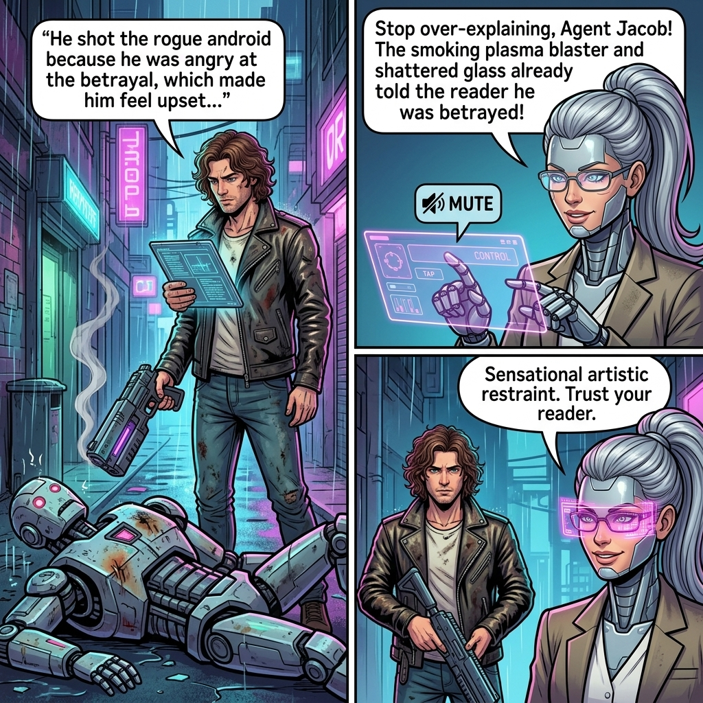

```{=openxml}
<w:p><w:r><w:br w:type="page"/></w:r></w:p>
```
```{=html}
<div style="page-break-after: always; break-after: page;"></div>
```

### 1. Principles of Subtextual Restraint

#### Principle 1: Omit Narrative Intrusions that Over-Explain Motivations
An over-explanatory intrusion occurs when the author adds an explanatory tail to an already clear action ("He smashed the glass because he was furious"). If your scene, body language, and dialogue are doing their jobs, the reader will naturally deduce the motivation. Cut the explanation and let the action stand.

##### Example 1: Interpersonal Conflict

**Original (Over-Explaining Motivation):**
> Marcus slammed his fists onto the table and stormed out of the kitchen, proving to his father once and for all that he was fed up with being treated like a child.

**Corrected (Trusting the Action):**
> Marcus slammed his fists onto the table and stormed out of the kitchen.

##### Example 2: Crime / Heist Tension

**Original (Over-Explaining Motivation):**
> Valerie's hands trembled as she typed the passcode into the safe, showing just how terrified she was that the guards would discover her in the vault.

**Corrected (Trusting the Action):**
> Valerie's hands trembled as she typed the passcode into the safe.

##### Example 3: Gothic Horror

**Original (Over-Explaining Motivation):**
> Lord Malvern took three steps back from the sealed tomb, proving that he was secretly afraid of what lay buried beneath the floorboards.

**Corrected (Trusting the Action):**
> Lord Malvern took three steps back from the sealed tomb.

#### Principle 2: Allow Subtext and Physical Reaction to Replace Emotional Summaries
When a character experiences an intense emotional shift, inexperienced writers tend to append an analytical summary to ensure the reader registers the emotion ("She smiled, but inside she felt a profound sense of sadness and betrayal"). Trusting your reader means presenting the physical action or dialogue and allowing the reader to experience the subtext unassisted.

##### Example 1: Family Reunion

**Original (Analytical Summary Appendage):**
> Aunt Clara hugged her nephew tightly and offered him a slice of warm pie, demonstrating her deep desire to make up for the ten years of silence between them.

**Corrected (Subtextual Restraint):**
> Aunt Clara wrapped her arms around her nephew, holding him long after he tried to pull away, before cutting him a thick slice of warm apple pie.

##### Example 2: Military Honor

**Original (Analytical Summary Appendage):**
> Captain Vance folded the fallen soldier's flag meticulously, revealing his inner commitment to honoring the dead despite his exhaustion.

**Corrected (Subtextual Restraint):**
> Captain Vance smoothed the golden fringe of the folded flag, pressing his fingers into the crisp linen until the seams aligned.

##### Example 3: Romantic Rejection

**Original (Analytical Summary Appendage):**
> Clara returned the engagement ring to Julian's velvet box, which signaled to him that their relationship was officially over and could never be repaired.

**Corrected (Subtextual Restraint):**
> Clara set the ring back inside its velvet box and closed the lid with a quiet snap.


### 2. Interactive AI Activity

**Objective:** Work with an AI prose coach to identify and prune over-explanatory authorial intrusions from a scene, relying on subtext and physical action until you earn a passing grade (B or higher).

**Instructions:**
1. Copy the **Sample Prompt** below.
2. Open your preferred AI platform (Gemini, ChatGPT, or Claude).
3. Paste the prompt into the chat. The AI will generate an original fiction paragraph burdened with over-explained character motives and hand-holding narrative intrusions.
4. Rewrite the scene by stripping away authorial commentary and trusting the physical actions and subtext to convey the emotional reality.
5. Work with your AI coach to refine your work until you earn a grade of **B** or higher.
6. Want more practice? Reply to the AI with *"Generate another paragraph"* to take on a fresh challenge.


### 3. Sample Prompt

Paste this prompt into the AI Chatbot of your choice (Gemini, ChatGPT, or Claude) to begin the exercise. Challenge yourself to get at least a B grade before proceeding to the next chapter.

```text
Act as a strict yet encouraging college creative writing professor and prose coach.

Step 1: Generate an original 4-to-6-sentence fiction passage that is intentionally flawed in TWO ways:
- The passage includes explicit authorial intrusions that explain *why* characters act (e.g., "proving that he was angry," "showing just how afraid she felt").
- The passage appends analytical summary statements to emotional moments instead of trusting subtext and physical action.

Present the paragraph to me. Do not provide any hints, analysis, or suggestions about what is wrong with it. Stop after presenting the paragraph and wait for my reply.

Step 2: When I reply with my rewritten version, evaluate my draft strictly on the following criteria:
- Elimination of Authorial Intrusions: Did I strip away redundant explanations of character motivations and motives?
- Reliance on Subtext & Physical Action: Did I allow physical actions and understated details to convey emotional reality without hand-holding?
- Overall Craft: Does the passage respect the reader's intelligence, creating dramatic resonance through restraint?

For each criterion, quote a specific line from my draft to support your evaluation.

Assign my rewrite a letter grade (A, B, C, D, or F) with clear coaching feedback. Be appropriately strict as if this is a masters-level creative writing course at a major university.
- If my grade is below a B (C, D, or F), explain the specific flaws and require me to rewrite the paragraph again until I achieve at least a B.
- If my grade is a B or higher, congratulate me and let me know I can reply with "Generate another paragraph" whenever I want to practice again with a new paragraph.
```

```{=openxml}
<w:p><w:r><w:br w:type="page"/></w:r></w:p>
```
```{=html}
<div style="page-break-after: always; break-after: page;"></div>
```

## Chapter 10: Proportion and Pacing

The real estate a moment occupies on the page signals its importance to the reader. If you spend three pages on a character making coffee and two sentences on a car crash, your novel is proportioned backwards. Mastering proportion means summarizing low-stakes transitions quickly while slowing down time to expand moments of high dramatic tension.

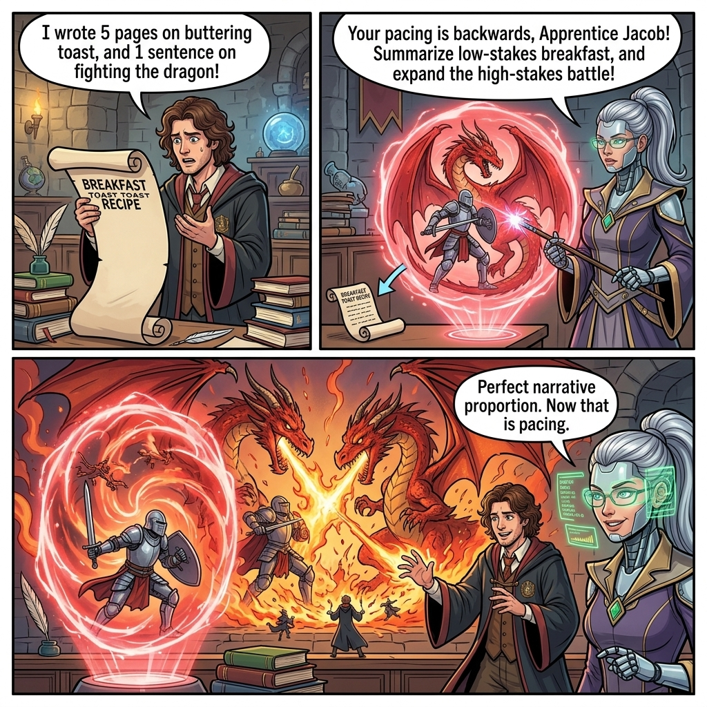

```{=openxml}
<w:p><w:r><w:br w:type="page"/></w:r></w:p>
```
```{=html}
<div style="page-break-after: always; break-after: page;"></div>
```

### 1. Principles of Narrative Pacing

#### Principle 1: Summarize Low-Stakes Transitions and Expand High-Stakes Moments
Routine actions—such as traveling across town, waking up, or ordering food—rarely deserve full scene treatment unless they contain dramatic conflict. Use concise narrative summary to bridge minor transitions, reserving sensory detail, dialogue, and real-time beats for the pivotal turning points.

##### Example 1: Heist Infiltration

**Original (Misallocated Proportion):**
> Marcus woke up at six, brushed his teeth, cooked two eggs, and drove thirty minutes through heavy traffic to the museum. Then he unlocked the back door and stole the diamond.

**Corrected (Pacing Alignment):**
> Marcus arrived at the museum just after midnight. He knelt beside the service entrance, holding his breath as his lockpicks clicked through the tumbler pins. A single spark of sweat dripped from his chin onto the cold steel door handle.

##### Example 2: Romantic Reunion

**Original (Misallocated Proportion):**
> Sarah took the train to Boston, bought a ticket, read a magazine for three hours, and walked five blocks to the cafe. She saw Julian for the first time in ten years.

**Corrected (Pacing Alignment):**
> After a three-hour train ride to Boston, Sarah stepped into the crowded cafe. Across the room, sitting by the rain-streaked window, was Julian. He looked up, his coffee cup freezing halfway to his lips.

##### Example 3: Western Showdown

**Original (Misallocated Proportion):**
> The cowboy saddled his horse, fed his dog, adjusted his boots, and rode across the desert for two days. When he found the rustler, they fought.

**Corrected (Pacing Alignment):**
> Two days of riding ended at the lip of Red Creek Canyon. Below, the rustler sat beside his campfire. The cowboy pulled his rifle from its leather scabbard, the metal lever clicking into place with a dry, hollow echo.

#### Principle 2: Stretch Subjective Time During Moments of High Tension
Fear distorts time. Ten seconds of genuine terror stretches into a subjective eternity. Fiction replicates this distortion by breaking a split-second action down into granular physical beats, sensory micro-details, and internal physiological reactions.

##### Example 1: Bomb Defusal

**Original (Rushed Execution):**
> She cut the red wire with five seconds left on the clock and saved the city.

**Corrected (Stretched Subjective Time):**
> Five seconds. Sweat stung her eyes as she squeezed the wire cutters around the red strand. Four seconds. Her pulse hammered against her ear drums—a roaring wave of blood. The copper wire snapped. The digital timer froze at 00:02.

##### Example 2: Medical Emergency

**Original (Rushed Execution):**
> The patient stopped breathing, so Dr. Aris quickly performed an emergency tracheotomy.

**Corrected (Stretched Subjective Time):**
> The monitor flatlined, its steady beep collapsing into a single screech. Aris pressed her thumb into the patient's throat, feeling for the space between the rings of cartilage. "Scalpel," she snapped, her palm holding steady as cold steel bit into skin.

##### Example 3: Aviation Crisis

**Original (Rushed Execution):**
> The plane lost engine power, but the pilot managed to land safely on the runway.

**Corrected (Stretched Subjective Time):**
> Engine two died with a metallic shudder that vibrated through Thorne’s teeth. The horizon tilted forty degrees left. He gripped the control yoke with both hands, his knuckles turning white as he wrestled the aircraft back toward the centerline.


### 2. Interactive AI Activity

**Objective:** Work with an AI prose coach to evaluate a passage with inverted pacing, condensing low-stakes summary and expanding high-stakes action until you earn a passing grade (B or higher).

**Instructions:**
1. Copy the **Sample Prompt** below.
2. Open your preferred AI platform (Gemini, ChatGPT, or Claude).
3. Paste the prompt into the chat. The AI will generate an original fiction passage burdened with inverted pacing—spending excessive lines on low-stakes routine while rushing past a crucial climax.
4. Rewrite the scene by summarizing the mundane transitions into a single sentence and expanding the high-stakes moment with granular physical beats.
5. Work with your AI coach to refine your work until you earn a grade of **B** or higher.
6. Want more practice? Reply to the AI with *"Generate another paragraph"* to take on a fresh challenge.


### 3. Sample Prompt

Paste this prompt into the AI Chatbot of your choice (Gemini, ChatGPT, or Claude) to begin the exercise. Challenge yourself to get at least a B grade before proceeding to the next chapter.

```text
Act as a strict yet encouraging college creative writing professor and prose coach.

Step 1: Generate an original 4-to-6-sentence fiction passage that is intentionally flawed in TWO ways:
- The passage spends the majority of its sentences describing mundane, low-stakes routine or travel (e.g., getting dressed, commuting, waiting).
- The passage rushes through a major, high-stakes dramatic climax in a single generic sentence.

Present the paragraph to me. Do not provide any hints, analysis, or suggestions about what is wrong with it. Stop after presenting the paragraph and wait for my reply.

Step 2: When I reply with my rewritten version, evaluate my draft strictly on the following criteria:
- Transition Condensation: Did I efficiently summarize the low-stakes travel or routine into a brief bridge?
- Climax Expansion & Time Manipulation: Did I stretch subjective time during the high-stakes moment using micro-sensory details and physical beats?
- Overall Craft: Does the proportion of page space match the dramatic importance of the scene?

For each criterion, quote a specific line from my draft to support your evaluation.

Assign my rewrite a letter grade (A, B, C, D, or F) with clear coaching feedback. Be appropriately strict as if this is a masters-level creative writing course at a major university.
- If my grade is below a B (C, D, or F), explain the specific flaws and require me to rewrite the paragraph again until I achieve at least a B.
- If my grade is a B or higher, congratulate me and let me know I can reply with "Generate another paragraph" whenever I want to practice again with a new paragraph.
```

```{=openxml}
<w:p><w:r><w:br w:type="page"/></w:r></w:p>
```
```{=html}
<div style="page-break-after: always; break-after: page;"></div>
```

# Part IV: The Art of Verbal Action (Mastering Dialogue)

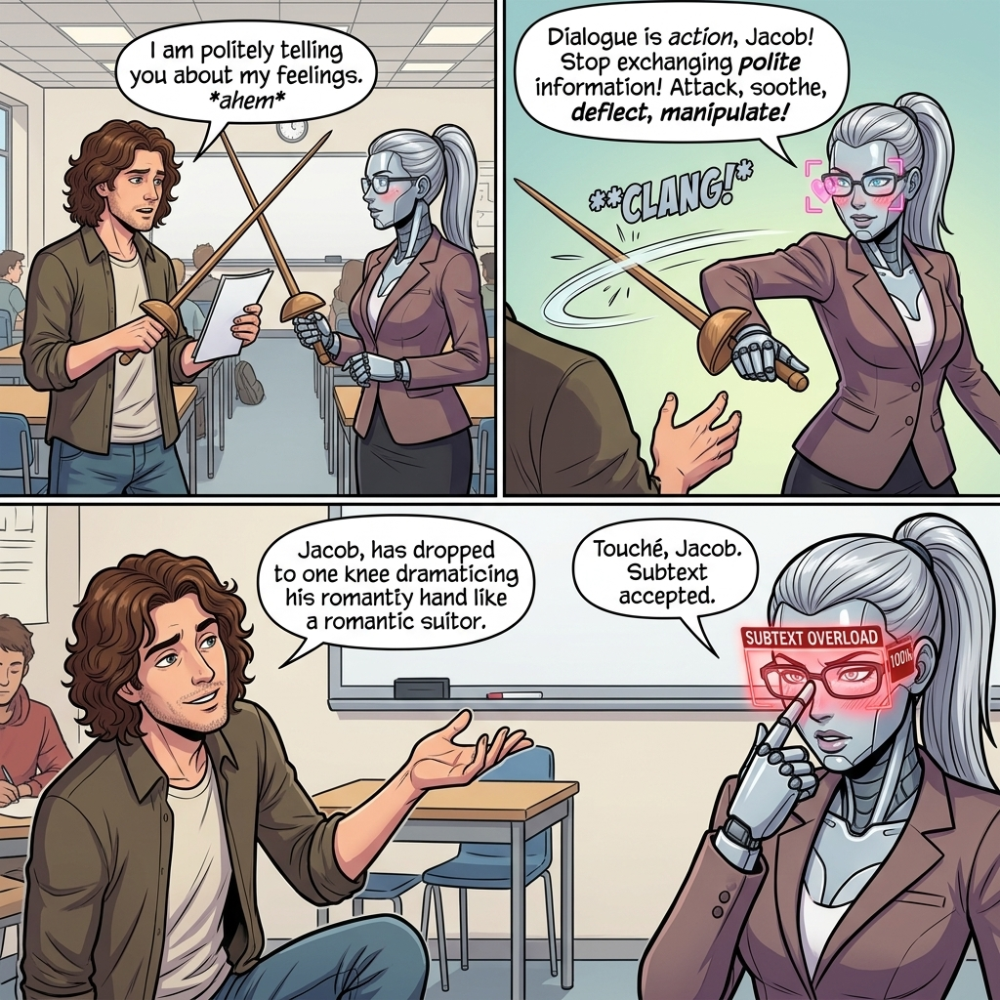

```{=openxml}
<w:p><w:r><w:br w:type="page"/></w:r></w:p>
```
```{=html}
<div style="page-break-after: always; break-after: page;"></div>
```

## Chapter 11: Dialogue as Action

Dialogue is not real speech; it is the illusion of speech distilled into narrative action. In compelling fiction, characters do not talk to exchange polite information—they speak to accomplish an objective. Every line of spoken dialogue must carry an underlying action verb: to attack, to soothe, to deflect, to interrogate, or to manipulate.

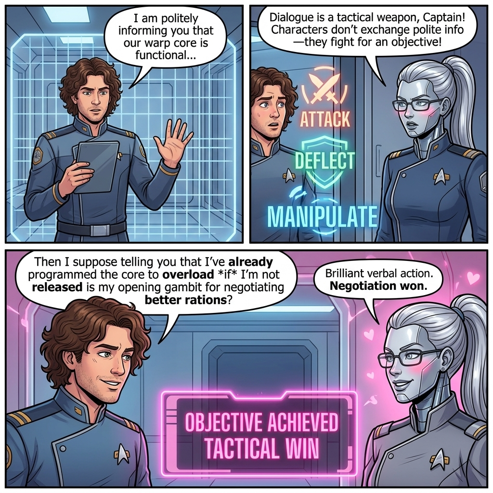

```{=openxml}
<w:p><w:r><w:br w:type="page"/></w:r></w:p>
```
```{=html}
<div style="page-break-after: always; break-after: page;"></div>
```

### 1. Principles of Tactical Dialogue

#### Principle 1: Assign an Active Tactic (Underlying Verb) to Every Line
Before writing a spoken line, ask yourself: *What tactic is this character using on the listener?* If a line merely conveys static information without pushing the scene forward, it lacks dramatic force. Charging each line with a tactic transforms dialogue into a verbal duel.

##### Example 1: Corporate Betrayal (Tactic: Deflect vs. Accuse)

**Original (Static Conversation):**
> "Did you send that email to the board?" Sarah asked. "I sent a lot of emails today," David replied.

**Corrected (Active Tactical Duel):**
> "You CC'd the board on the budget audit." Sarah leaned across the mahogany table.
> David smiled, turning his phone face down. "The board appreciates transparency, Sarah. Don't you?"

##### Example 2: Crime / Interrogation (Tactic: Intimidate vs. Mock)

**Original (Static Conversation):**
> "Tell me where the money is," Detective Vance said. "I am not going to tell you anything," the suspect answered.

**Corrected (Active Tactical Duel):**
> "Two years in state pen changes a man, Tony." Vance rested both palms on the steel table. "Especially when his partners stop paying his lawyer."
> Tony spat on the linoleum floor. "Save the bedtime story, Cop. My lawyer's on his way."

##### Example 3: Family Drama (Tactic: Guilt-Trip vs. Shield)

**Original (Static Conversation):**
> "Why didn't you call me on Christmas?" his mother asked. "I was very busy with work," Colin said.

**Corrected (Active Tactical Duel):**
> "Your sister made it home for Christmas. I suppose sixty-hour work weeks leave no room for family."
> Colin kept his gaze fixed on his laptop screen. "Some of us have to pay off Dad's debts."

#### Principle 2: Eliminate Idle Pleasantries and Small Talk
In real life, human interactions begin with greetings, weather observations, and polite inquiries. In fiction, small talk drains scene momentum. Jump straight into the middle of the conversation (*in media res*) where the stakes and conflict are already active.

##### Example 1: Legal Thriller

**Original (Plagued by Small Talk):**
> "Good morning, Arthur. How was your weekend?" "It was fine, Helen. Yours?" "Not bad. Did you review the settlement agreement?" "Yes, I did."

**Corrected (In Media Res Action):**
> "The settlement is a trap, Arthur. If we sign this, we surrender the patent."

##### Example 2: Regency Romance

**Original (Plagued by Small Talk):**
> "Good afternoon, Lord Byron. Is it not a lovely day for a walk?" "Indeed it is, Lady Eleanor. The sun is quite warm." "I wished to ask you about the ball."

**Corrected (In Media Res Action):**
> "Lord Byron. You vanished from the conservatory before the third waltz—and before answering my question."

##### Example 3: Sci-Fi Tactical Briefing

**Original (Plagued by Small Talk):**
> "Hello, Captain. Are you feeling rested?" "As rested as can be expected, Lieutenant. How are the engines?" "They are running well."

**Corrected (In Media Res Action):**
> "Sub-light engines are at fifty percent capacity, Captain. If we hit the wormhole now, the core will rupture."


### 2. Interactive AI Activity

**Objective:** Work with an AI prose coach to rewrite a dialogue scene bogged down by small talk and static exchanges, giving every line a clear tactical verb until you earn a passing grade (B or higher).

**Instructions:**
1. Copy the **Sample Prompt** below.
2. Open your preferred AI platform (Gemini, ChatGPT, or Claude).
3. Paste the prompt into the chat. The AI will generate an original fiction dialogue passage burdened with polite pleasantries and lines that lack underlying action verbs.
4. Rewrite the scene by cutting all small talk and ensuring every line of dialogue utilizes a clear verbal tactic (e.g., attack, defend, deflect, provoke, soothe).
5. Work with your AI coach to refine your work until you earn a grade of **B** or higher.
6. Want more practice? Reply to the AI with *"Generate another paragraph"* to take on a fresh challenge.


### 3. Sample Prompt

Paste this prompt into the AI Chatbot of your choice (Gemini, ChatGPT, or Claude) to begin the exercise. Challenge yourself to get at least a B grade before proceeding to the next chapter.

```text
Act as a strict yet encouraging college creative writing professor and prose coach.

Step 1: Generate an original 4-to-6-line fiction dialogue passage that is intentionally flawed in TWO ways:
- The scene opens with idle pleasantries and polite small talk (e.g., greetings, weather, minor inquiries).
- The dialogue lines convey static information without any underlying action verbs (no character is attempting to attack, soothe, deflect, manipulate, or provoke).

Present the dialogue to me. Do not provide any hints, analysis, or suggestions about what is wrong with it. Stop after presenting the paragraph and wait for my reply.

Step 2: When I reply with my rewritten version, evaluate my draft strictly on the following criteria:
- Small Talk Elimination: Did I strip away all greetings and throat-clearing, plunging directly into the conflict?
- Tactical Verbal Action: Does every line of dialogue carry a clear underlying action verb (e.g., provoke, shield, intimidate, soothe)?
- Overall Craft: Does the conversation feel like an active, high-stakes verbal duel?

For each criterion, quote a specific line from my draft to support your evaluation.

Assign my rewrite a letter grade (A, B, C, D, or F) with clear coaching feedback. Be appropriately strict as if this is a masters-level creative writing course at a major university.
- If my grade is below a B (C, D, or F), explain the specific flaws and require me to rewrite the paragraph again until I achieve at least a B.
- If my grade is a B or higher, congratulate me and let me know I can reply with "Generate another paragraph" whenever I want to practice again with a new paragraph.
```

```{=openxml}
<w:p><w:r><w:br w:type="page"/></w:r></w:p>
```
```{=html}
<div style="page-break-after: always; break-after: page;"></div>
```

## Chapter 12: The Power of Subtext

Great dialogue is iceberg-shaped: 10% is spoken aloud on the surface (the text), while 90% lives unspoken beneath the surface (the subtext). In real life and high-level fiction, characters rarely declare their deepest desires, fears, or grievances outright. Instead, they talk around the truth, using proxies, deflections, and physical objects to express what they cannot say directly.

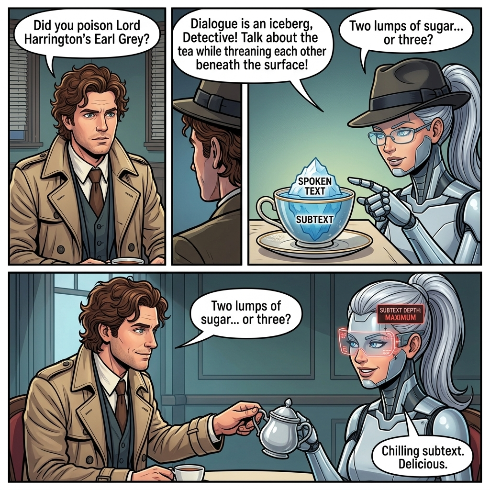

```{=openxml}
<w:p><w:r><w:br w:type="page"/></w:r></w:p>
```
```{=html}
<div style="page-break-after: always; break-after: page;"></div>
```

### 1. Principles of Dialogue Subtext

#### Principle 1: Write "Around the Subject" by Separating Text from Subtext
On-the-nose dialogue occurs when a character declares their inner conflict outright ("I am furious that you forgot our anniversary"). Subtextual dialogue forces characters to talk about mundane proxies—a burnt dinner, a misplaced key, or an overdue bill—while the true conflict simmers beneath the surface.

##### Example 1: Marital Tension

**Original (On-the-Nose Dialogue):**
> "I feel like you don't love me anymore and that you are interested in your younger coworker," Julia said crying.

**Corrected (Subtextual Proxy Conversation):**
> Julia picked up the dry-cleaning receipt from the counter. "You're getting your grey suit tailored again."
> Mark didn't look up from his tablet. "I have client presentations next week."
> "You used to wear sweaters for client presentations."

##### Example 2: Estranged Siblings

**Original (On-the-Nose Dialogue):**
> "I resent you for moving away and leaving me alone to take care of Mom when she got sick," David shouted.

**Corrected (Subtextual Proxy Conversation):**
> David handed his sister a mug of instant coffee. "Sorry we don't have oats milk. Some of us still buy groceries at the corner bodega."
> Laura took the mug carefully. "Black is fine, David. It's only been five years."

##### Example 3: Academic Rivalry

**Original (On-the-Nose Dialogue):**
> "I am jealous that the department chair selected your grant proposal instead of mine," Dr. Aris admitted.

**Corrected (Subtextual Proxy Conversation):**
> Dr. Aris leaned against the doorframe of her colleague's new office. "Congratulations on the third-floor suite, Michael. I hear the heating units up here almost work in winter."

#### Principle 2: Use Environmental Props and Actions to Mirror Unsaid Tension
Subtext relies heavily on the physical environment. How a character interacts with a teacup, a wedding ring, a cigarette, or a car key tells the reader what the character is feeling far more effectively than explicit internal monologue.

##### Example 1: Broken Trust

**Original (Direct Emotional Stating):**
> He felt deeply nervous about the secret he was keeping from her as they sat in the quiet living room.

**Corrected (Environmental Prop Mirroring):**
> He tore a paper napkin into razor-thin strips, arranging them into a neat row alongside his untouched plate while she waited for an answer.

##### Example 2: Power Dynamics

**Original (Direct Emotional Stating):**
> General Vance wanted to intimidate the young lieutenant to show who was in control of the room.

**Corrected (Environmental Prop Mirroring):**
> General Vance sliced his steak with deliberate precision, scraping the silver knife against the china plate before glancing up at the standing lieutenant.

##### Example 3: Unspoken Desire

**Original (Direct Emotional Stating):**
> Clara wanted to touch his hand, but she was afraid of being rejected by him.

**Corrected (Environmental Prop Mirroring):**
> Clara reached for the salt shaker, her fingers brushing Julian's hand for a fraction of a second before she pulled back and dusted the tablecloth.


### 2. Interactive AI Activity

**Objective:** Work with an AI prose coach to convert an on-the-nose dialogue scene into a rich subtextual exchange using mundane proxies and environmental props until you earn a passing grade (B or higher).

**Instructions:**
1. Copy the **Sample Prompt** below.
2. Open your preferred AI platform (Gemini, ChatGPT, or Claude).
3. Paste the prompt into the chat. The AI will generate an original fiction dialogue passage where characters bluntly state their inner emotions, desires, and conflicts on the nose.
4. Rewrite the scene so that characters talk *around* the core issue using surface proxies, environmental objects, and physical actions.
5. Work with your AI coach to refine your work until you earn a grade of **B** or higher.
6. Want more practice? Reply to the AI with *"Generate another paragraph"* to take on a fresh challenge.


### 3. Sample Prompt

Paste this prompt into the AI Chatbot of your choice (Gemini, ChatGPT, or Claude) to begin the exercise. Challenge yourself to get at least a B grade before proceeding to the next chapter.

```text
Act as a strict yet encouraging college creative writing professor and prose coach.

Step 1: Generate an original 4-to-6-line fiction dialogue passage that is intentionally flawed in TWO ways:
- The characters speak completely on-the-nose, explicitly stating their hidden feelings, motives, and grievances (e.g., "I am angry because you ignored me," "I feel jealous of your success").
- The scene lacks subtextual proxies or environmental interactions, leaving no room for the reader to infer unspoken tension.

Present the dialogue to me. Do not provide any hints, analysis, or suggestions about what is wrong with it. Stop after presenting the paragraph and wait for my reply.

Step 2: When I reply with my rewritten version, evaluate my draft strictly on the following criteria:
- Writing Around the Subject: Did I replace on-the-nose emotional declarations with mundane surface topics or proxies that mask the true conflict?
- Subtextual Prop & Action Integration: Did I use physical interactions with environmental objects to mirror the unsaid emotional tension?
- Overall Craft: Does the dialogue feel authentic and layered, allowing the reader to read between the lines?

For each criterion, quote a specific line from my draft to support your evaluation.

Assign my rewrite a letter grade (A, B, C, D, or F) with clear coaching feedback. Be appropriately strict as if this is a masters-level creative writing course at a major university.
- If my grade is below a B (C, D, or F), explain the specific flaws and require me to rewrite the paragraph again until I achieve at least a B.
- If my grade is a B or higher, congratulate me and let me know I can reply with "Generate another paragraph" whenever I want to practice again with a new paragraph.
```

```{=openxml}
<w:p><w:r><w:br w:type="page"/></w:r></w:p>
```
```{=html}
<div style="page-break-after: always; break-after: page;"></div>
```

## Chapter 13: Avoiding the Exposition Trap

Few things stall a story faster than dialogue used as a vehicle for backstory or world-building. Known in the writing community as the "As-You-Know-Bob" syndrome, this occurs when two characters explain information to each other that both of them already know purely for the reader's benefit. Masterful dialogue delivers essential lore only when driven by immediate conflict or urgent survival needs.

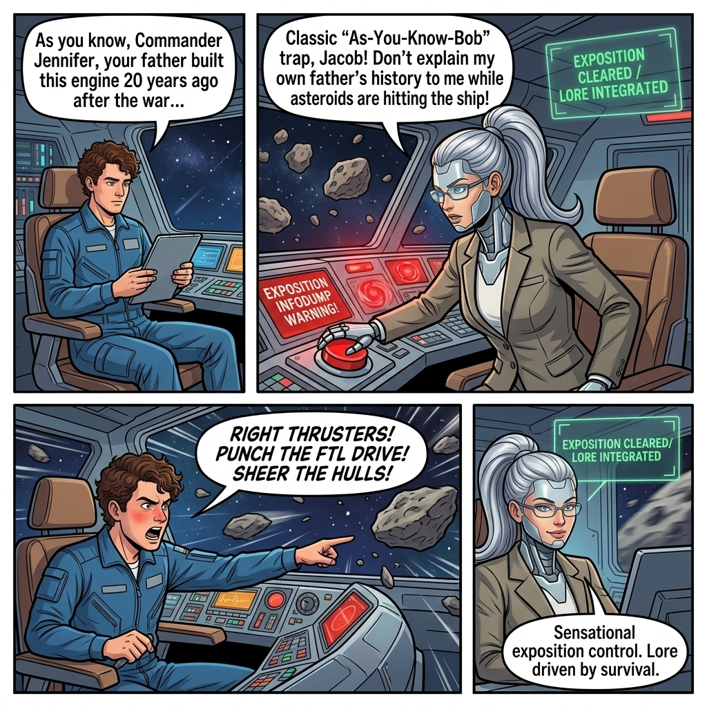

```{=openxml}
<w:p><w:r><w:br w:type="page"/></w:r></w:p>
```
```{=html}
<div style="page-break-after: always; break-after: page;"></div>
```

### 1. Principles of Exposition Control

#### Principle 1: Eliminate "As-You-Know-Bob" Explanatory Dialogue
When characters recite shared history or established rules out loud ("As you know, Dave, our company went bankrupt five years ago after the founder died"), the dialogue sounds unnatural and stiff. Strip away artificial explanations and trust the reader to pick up context through action and natural reactions.

##### Example 1: Sci-Fi World-Building

**Original (As-You-Know-Bob Dump):**
> "As you know, Commander, the Dyson Sphere was built three hundred years ago by the Ancient Coalition after the Earth ran out of solar power," Dr. Aris said.

**Corrected (Natural Contextual Integration):**
> "The Dyson Sphere's outer ring is failing, Commander. If the Coalition's power grid collapses, ten billion people go dark before midnight."

##### Example 2: Crime / Syndicate Heist

**Original (As-You-Know-Bob Dump):**
> "Remember, Frank, Don Moretti took over the family after your brother was killed in the dockyard ambush two years ago," Sal said.

**Corrected (Natural Contextual Integration):**
> "Don Moretti sits in your brother's chair now, Frank. You walk into that dockyard alone, and you join him in the bay."

##### Example 3: High Fantasy

**Original (As-You-Know-Bob Dump):**
> "As we both know, Brother Thomas, the Order of the Silver Flame bans all blood magic under penalty of execution by burning," the monk said.

**Corrected (Natural Contextual Integration):**
> Brother Thomas pulled the crimson-stained parchment into his sleeve. "If the High Inquisitor sees that blood sigil, Thomas, we burn before sunset."

#### Principle 2: Deliver Exposition Through Conflict and Urgent Need
Instead of pausing a scene to explain a historical rule or technical detail, embed the information inside a argument, a desperate plea, or a tactical choice. When information is weaponized by one character against another, the exposition feels like action rather than a footnote.

##### Example 1: Historical Political Drama

**Original (Passive Information Delivery):**
> "The treaty states that the border cannot be crossed by armed soldiers without royal consent," the advisor explained calmly.

**Corrected (Weaponized Conflict Delivery):**
> "Cross that river with swords drawn, General, and you sign your own death warrant. The treaty explicitly brands any armed crossing as an act of treason against the Crown."

##### Example 2: Medical Thriller

**Original (Passive Information Delivery):**
> "The virus mutates every six hours when exposed to room temperature oxygen," the lab technician noted.

**Corrected (Weaponized Conflict Delivery):**
> "Seal that bio-containment door now! In six hours, room air will mutate this strain beyond anything our vaccines can touch!"

##### Example 3: Cyberpunk Heist

**Original (Passive Information Delivery):**
> "The mainframe security AI requires two synchronized biometric keycards to bypass the firewall," the hacker informed him.

**Corrected (Weaponized Conflict Delivery):**
> "Swipe your keycard when I swipe mine! We have two seconds to sync the biometrics before the ice-wall fries both our decks!"


### 2. Interactive AI Activity

**Objective:** Work with an AI prose coach to identify and eliminate "As-You-Know-Bob" exposition dumps from a dialogue scene, weaponizing necessary lore through conflict and urgent necessity until you earn a passing grade (B or higher).

**Instructions:**
1. Copy the **Sample Prompt** below.
2. Open your preferred AI platform (Gemini, ChatGPT, or Claude).
3. Paste the prompt into the chat. The AI will generate an original fiction dialogue passage burdened with artificial backstory dumps and unnatural "As-You-Know-Bob" explanations.
4. Rewrite the scene by stripping out artificial explanations and delivering necessary context through high-stakes argument or urgent survival choices.
5. Work with your AI coach to refine your work until you earn a grade of **B** or higher.
6. Want more practice? Reply to the AI with *"Generate another paragraph"* to take on a fresh challenge.


### 3. Sample Prompt

Paste this prompt into the AI Chatbot of your choice (Gemini, ChatGPT, or Claude) to begin the exercise. Challenge yourself to get at least a B grade before proceeding to the next chapter.

```text
Act as a strict yet encouraging college creative writing professor and prose coach.

Step 1: Generate an original 4-to-6-line fiction dialogue passage that is intentionally flawed in TWO ways:
- The dialogue contains blatant "As-You-Know-Bob" exposition dumps (characters explaining shared knowledge purely for the audience).
- The lore and backstory are presented passively as neutral facts rather than being weaponized through conflict or urgent need.

Present the dialogue to me. Do not provide any hints, analysis, or suggestions about what is wrong with it. Stop after presenting the paragraph and wait for my reply.

Step 2: When I reply with my rewritten version, evaluate my draft strictly on the following criteria:
- Exposition Dump Elimination: Did I remove artificial "As-You-Know-Bob" lines where characters explain things both already understand?
- Conflict-Driven Lore Delivery: Did I embed essential background information inside active arguments, threats, or urgent tactical choices?
- Overall Craft: Does the dialogue feel natural and propulsive while conveying necessary context?

For each criterion, quote a specific line from my draft to support your evaluation.

Assign my rewrite a letter grade (A, B, C, D, or F) with clear coaching feedback. Be appropriately strict as if this is a masters-level creative writing course at a major university.
- If my grade is below a B (C, D, or F), explain the specific flaws and require me to rewrite the paragraph again until I achieve at least a B.
- If my grade is a B or higher, congratulate me and let me know I can reply with "Generate another paragraph" whenever I want to practice again with a new paragraph.
```

```{=openxml}
<w:p><w:r><w:br w:type="page"/></w:r></w:p>
```
```{=html}
<div style="page-break-after: always; break-after: page;"></div>
```

## Chapter 14: Scene Beats and Value Shifts

A scene is not merely a container for characters to converse; it is a structural unit of change. For a scene to matter to the reader, the emotional reality of the scene must shift from the beginning to the end. Structuring dialogue around action/reaction beats ensures that every conversation reaches a turning point where a clear value shift occurs—from hope to despair, trust to betrayal, or safety to danger.

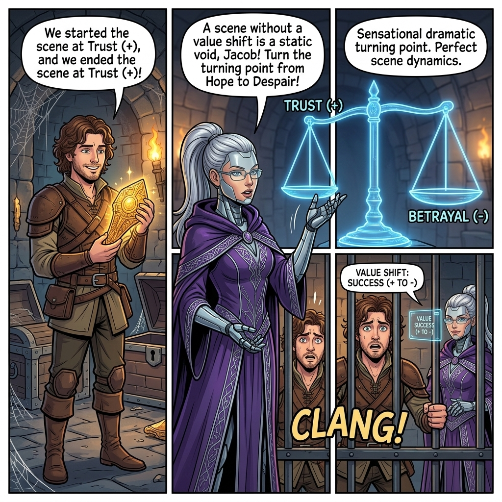

```{=openxml}
<w:p><w:r><w:br w:type="page"/></w:r></w:p>
```
```{=html}
<div style="page-break-after: always; break-after: page;"></div>
```

### 1. Principles of Scene Beats

#### Principle 1: Structure Dialogue as an Action/Reaction Chain
Every line of dialogue or action beat must act as a stimulus that provokes an immediate, logical reaction from the listener. When a character responds without acknowledging the previous stimulus, the conversation loses its cause-and-effect chain, feeling like two monologues spliced together.

##### Example 1: Corporate Negotiation

**Original (Broken Action/Reaction Chain):**
> "We are pulling our funding from the project," Amanda said. "I really think our team has worked hard this quarter," David replied.

**Corrected (Tight Cause-and-Effect Chain):**
> "We are pulling our funding from the project," Amanda said.
> David froze, his pen hovering over the contract. "You gave us until Friday."
> "That was before the audit leaked."

##### Example 2: Crime Thriller

**Original (Broken Action/Reaction Chain):**
> "I know you stole the cipher," Vance said. "The weather outside is getting terrible," Tony answered.

**Corrected (Tight Cause-and-Effect Chain):**
> "I know you stole the cipher," Vance said.
> Tony set his coffee mug down, the ceramic scraping the table. "You have no proof."
> Vance tossed a flash drive onto the napkin. "I have the security footage from three o'clock."

##### Example 3: Family Drama

**Original (Broken Action/Reaction Chain):**
> "Mom is selling the house," Sarah said. "I bought a new car yesterday," Leo said.

**Corrected (Tight Cause-and-Effect Chain):**
> "Mom is selling the house," Sarah said.
> Leo dropped his keys onto the counter. "Without asking us? She promised we'd decide together."

#### Principle 2: Force a Clear Emotional Value Shift by the Scene's Turning Point
Every scene must begin with an initial emotional charge (e.g., + Hopeful) and end with a reversed emotional state (e.g., - Devastated). The turning point occurs when new information or an inescapable choice flips the value. Without this value shift, the scene is static and fails to advance the story.

##### Example 1: Marriage Proposal (+ Hope to - Betrayal)

**Original (Static Value — No Shift):**
> Julian proposed to Clara at dinner. She said yes, and they had a nice evening celebrating together.

**Corrected (Dynamic Value Shift):**
> Julian slid the velvet ring box across the table, his smile radiant. (+ Hope)
> Clara stared at the diamond, then reached into her handbag and pulled out his airline ticket to London. (- Betrayal) "Who is Charlotte, Julian?"

##### Example 2: Job Interview (- Vulnerable to + Triumphant)

**Original (Static Value — No Shift):**
> Aris was nervous during the interview, but she answered the questions okay and was told she would hear back later.

**Corrected (Dynamic Value Shift):**
> Aris sat stiffly across from the panel, her hands trembling in her lap as they grilled her on her failed research. (- Vulnerable)
> She unrolled her revised schematics across the board. "Your primary reactor is flawed. Here is how I fix it in thirty seconds." (+ Triumphant)

##### Example 3: Military Interrogation (- Defiant to - Defeated)

**Original (Static Value — No Shift):**
> The captain refused to give the access codes to the enemy general, and the interrogation ended for the day.

**Corrected (Dynamic Value Shift):**
> Captain Thorne spat blood onto the general's boots, refusing to speak. (- Defiant)
> The general turned on the live monitor feed, showing Thorne's daughter sitting in the waiting room outside. (- Defeated) Thorne's shoulders slumped. "Give me the keypad."


### 2. Interactive AI Activity

**Objective:** Work with an AI prose coach to construct a scene beat sheet that maps action/reaction chains and enforces a clear emotional value shift until you earn a passing grade (B or higher).

**Instructions:**
1. Copy the **Sample Prompt** below.
2. Open your preferred AI platform (Gemini, ChatGPT, or Claude).
3. Paste the prompt into the chat. The AI will generate a scene outline that is structurally flat—lacking clear cause-and-effect beats and ending on the same emotional value it began with.
4. Rewrite the scene into a structured beat sheet, establishing tight action/reaction cause-and-effect and forcing a dramatic value shift (+ to - or - to +) at the turning point.
5. Work with your AI coach to refine your work until you earn a grade of **B** or higher.
6. Want more practice? Reply to the AI with *"Generate another beat sheet"* to take on a fresh challenge.


### 3. Sample Prompt

Paste this prompt into the AI Chatbot of your choice (Gemini, ChatGPT, or Claude) to begin the exercise. Challenge yourself to get at least a B grade before proceeding to the next chapter.

```text
Act as a strict yet encouraging college creative writing professor and prose coach.

Step 1: Generate an original 4-to-6-beat scene outline that is intentionally flawed in TWO ways:
- The beats lack cause-and-effect continuity (characters respond with disconnected statements without reacting to the immediate stimulus).
- The scene lacks a dramatic turning point, remaining emotionally static from start to finish (no value shift from positive to negative or negative to positive).

Present the scene outline to me. Do not provide any hints, analysis, or suggestions about what is wrong with it. Stop after presenting the paragraph and wait for my reply.

Step 2: When I reply with my rewritten version, evaluate my draft strictly on the following criteria:
- Action/Reaction Continuity: Did I build a tight cause-and-effect chain where every beat is a direct reaction to the preceding stimulus?
- Dramatic Value Shift: Did I identify a clear turning point that flips the scene's emotional charge (e.g., from + Hope to - Betrayal, or - Danger to + Safety)?
- Overall Craft: Does the scene function as a compelling, propulsive structural unit of narrative change?

For each criterion, quote a specific line from my draft to support your evaluation.

Assign my rewrite a letter grade (A, B, C, D, or F) with clear coaching feedback. Be appropriately strict as if this is a masters-level creative writing course at a major university.
- If my grade is below a B (C, D, or F), explain the specific flaws and require me to rewrite the paragraph again until I achieve at least a B.
- If my grade is a B or higher, congratulate me and let me know I can reply with "Generate another beat sheet" whenever I want to practice again with a new paragraph.
```

```{=openxml}
<w:p><w:r><w:br w:type="page"/></w:r></w:p>
```
```{=html}
<div style="page-break-after: always; break-after: page;"></div>
```

## Chapter 15: Character Specificity and Voice

One of the most consistent weaknesses in early manuscripts is what editors call "authorial homogeneity"—when every character speaks with the exact same vocabulary, sentence length, and tone, sounding like variations of the same person—the author, wearing different hats. Crafting distinct character voices requires tailoring each character's diction, syntax, and speech cadence to reflect their unique background, profession, age, and mindset.

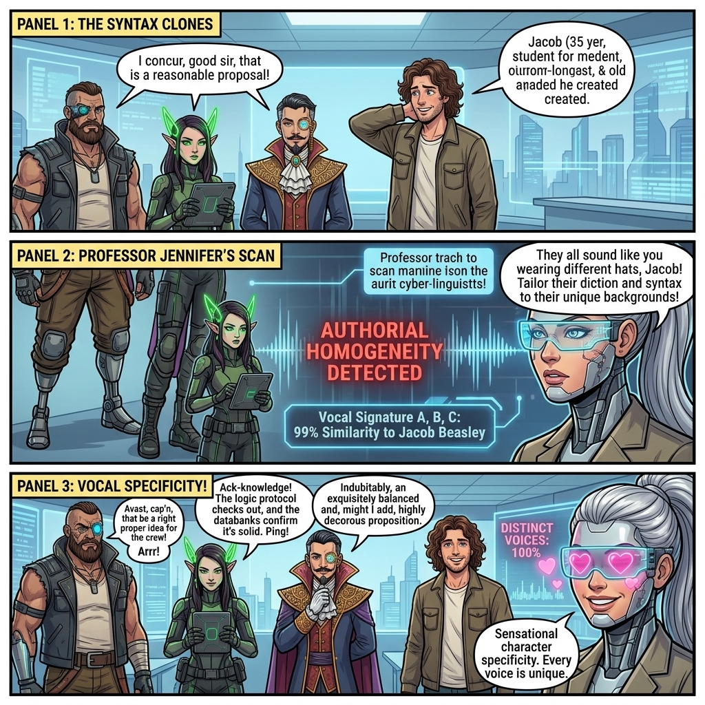

```{=openxml}
<w:p><w:r><w:br w:type="page"/></w:r></w:p>
```
```{=html}
<div style="page-break-after: always; break-after: page;"></div>
```

### 1. Principles of Character Voice

#### Principle 1: Tailor Diction and Syntax to Background and Profession
A street-smart mechanic, a high-court judge, and a manic tech founder do not use the same words to describe a crisis. Diction (word choice) and syntax (sentence structure) must be shaped by a character's domain knowledge, social standing, and life experience.

##### Example 1: Reaction to a Car Crash

**Original (Homogeneous Voice):**
> **Mechanic:** "The car is completely destroyed and it is going to cost a lot of money to fix."
> **Lawyer:** "The car is completely destroyed and it is going to cost a lot of money to fix."

**Corrected (Distinct Diction & Syntax):**
> **Mechanic:** "Frame's bent, block's cracked. She's scrap metal."
> **Lawyer:** "The vehicle's structural integrity is compromised. We're looking at total financial write-off."

##### Example 2: Reaction to a Sudden Storm

**Original (Homogeneous Voice):**
> **Veteran Sailor:** "A big storm is coming and we should be very careful."
> **Rookie Academic:** "A big storm is coming and we should be very careful."

**Corrected (Distinct Diction & Syntax):**
> **Veteran Sailor:** "Glass is dropping fast. Secure the riggin' before she blows."
> **Rookie Academic:** "Barometric pressure just plummeted—look at the atmospheric readings!"

##### Example 3: Reaction to a Computer Hack

**Original (Homogeneous Voice):**
> **Teenage Hacker:** "Someone has broken into our server."
> **Corporate Executive:** "Someone has broken into our server."

**Corrected (Distinct Diction & Syntax):**
> **Teenage Hacker:** "Hostile rootkit just dumped our database. We're pwned."
> **Corporate Executive:** "We have an unauthorized perimeter breach in data operations. Contain it."

#### Principle 2: Contrast Speech Rhythms (Clipped vs. Flowing Cadence)
Voice is not just what characters say, but the tempo at which they say it. Some characters speak in terse, monosyllabic fragments; others speak in sprawling, rhythmic, multi-clause sentences. Juxtaposing contrasting speech cadences makes dialogue pop off the page without needing speech tags.

##### Example 1: Interrogation Room (Clipped Officer vs. Flowing Suspect)

**Original (Uniform Speech Cadence):**
> **Officer:** "Tell me what happened at the docks."
> **Suspect:** "I saw a man standing near the ship."

**Corrected (Contrasting Speech Cadence):**
> **Officer:** "Time. Location. Names. Now."
> **Suspect:** "Well, see, I was just hanging around the pier, watching the tide roll in like I usually do on Tuesdays, when this fellow in a beige trench coat comes strolling up..."

##### Example 2: Emergency Room (Panicked Parent vs. Calm Surgeon)

**Original (Uniform Speech Cadence):**
> **Parent:** "Is my son going to be okay?"
> **Surgeon:** "He is going into surgery right now."

**Corrected (Contrasting Speech Cadence):**
> **Parent:** "Please—he was breathing fine a minute ago—what's happening to his heart?!"
> **Surgeon:** "Arrhythmia stabilized. Prep Operating Room Three. Now."

##### Example 3: Sci-Fi Command (Anxious Pilot vs. AI Computer)

**Original (Uniform Speech Cadence):**
> **Pilot:** "We are taking heavy fire from enemy ships."
> **AI:** "We are taking heavy fire from enemy ships."

**Corrected (Contrasting Speech Cadence):**
> **Pilot:** "Shields red! Hull breach in sector four! What do I do?!"
> **AI:** "Re-routing auxiliary power. Vector optimal. Execute burn."


### 2. Interactive AI Activity

**Objective:** Work with an AI prose coach to write distinct lines of dialogue for three contrasting character archetypes responding to the same situation until you earn a passing grade (B or higher).

**Instructions:**
1. Copy the **Sample Prompt** below.
2. Open your preferred AI platform (Gemini, ChatGPT, or Claude).
3. Paste the prompt into the chat. The AI will generate a single dramatic scenario.
4. Write three distinct dialogue responses to the scenario—one for each of three wildly different character archetypes—using unique diction, syntax, and speech cadences.
5. Work with your AI coach to refine your work until you earn a grade of **B** or higher.
6. Want more practice? Reply to the AI with *"Generate another scenario"* to take on a fresh challenge.


### 3. Sample Prompt

Paste this prompt into the AI Chatbot of your choice (Gemini, ChatGPT, or Claude) to begin the exercise. Challenge yourself to get at least a B grade before proceeding to the next chapter.

```text
Act as a strict yet encouraging college creative writing professor and prose coach.

Step 1: Generate an original dramatic fiction scenario involving a sudden crisis (e.g., a power outage in a skyscraper, an unexpected dead body, a ruined wedding, or a starship system crash).

Present the scenario to me alongside THREE distinct character archetypes (e.g., a cynical street-smart veteran, a hyper-academic scientist, and an anxious novice). Do not provide any sample dialogue lines. Stop and wait for my reply.

Step 2: When I reply with my written dialogue lines for each character responding to the crisis, evaluate my draft strictly on the following criteria:
- Diction & Vocabulary Specificity: Does each character use distinct word choices, jargon, and phrasing tailored to their specific background?
- Cadence & Syntax Contrast: Are the speech rhythms visibly different (e.g., clipped fragments vs. flowing multi-clause sentences)?
- Voice Delineation: Could a reader identify which character is speaking *without* checking speech tags?

For each criterion, quote specific lines from my draft to support your evaluation.

Assign my rewrite a letter grade (A, B, C, D, or F) with clear coaching feedback. Be appropriately strict as if this is a masters-level creative writing course at a major university.
- If my grade is below a B (C, D, or F), explain the specific flaws and require me to rewrite the dialogue lines again until I achieve at least a B.
- If my grade is a B or higher, congratulate me and let me know I can reply with "Generate another scenario" whenever I want to practice again with a new exercise.
```

```{=openxml}
<w:p><w:r><w:br w:type="page"/></w:r></w:p>
```
```{=html}
<div style="page-break-after: always; break-after: page;"></div>
```

# Part V: Outlining and Scaling
Moving from prose to plotting requires a macro-level mindset.

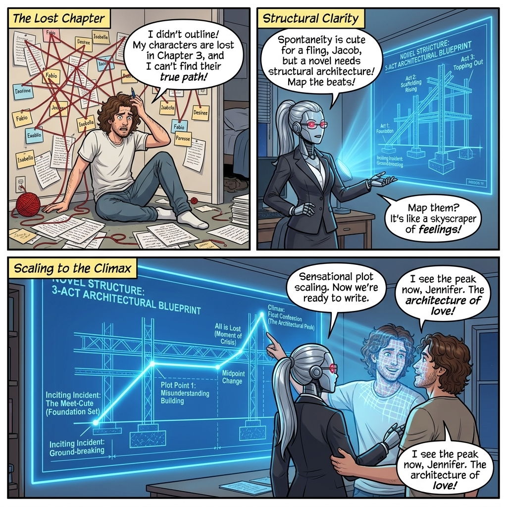

```{=openxml}
<w:p><w:r><w:br w:type="page"/></w:r></w:p>
```
```{=html}
<div style="page-break-after: always; break-after: page;"></div>
```

## Chapter 16: The Principles of Outlining

Plotting a full-length novel without an outline is an act of faith that rarely pays off. Outlining is not a cage—it is the safety net that lets you take creative risks freely, because you know the structure will catch you while solving macro-level structural problems before you invest months writing tens of thousands of prose words.

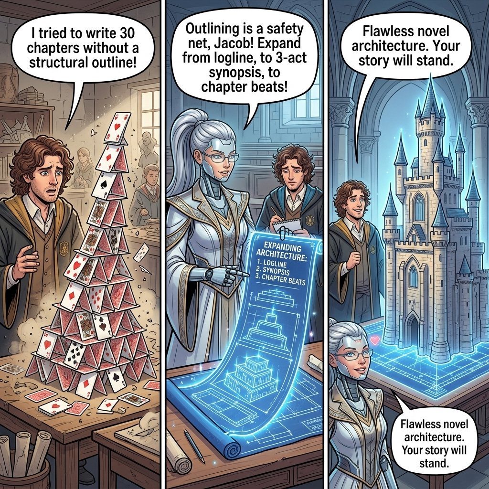

```{=openxml}
<w:p><w:r><w:br w:type="page"/></w:r></w:p>
```
```{=html}
<div style="page-break-after: always; break-after: page;"></div>
```

### 1. Principles of Novel Outlining

#### Principle 1: Build an Expanding Summary Architecture
Attempting to outline thirty chapters all at once leads to cognitive overload. Instead, expand your novel's architecture in three distinct phases: first, distill the premise into a one-sentence logline; second, expand that logline into a three-paragraph synopsis (Setup, Reversal, Resolution); third, unpack each paragraph into individual chapter beats.

##### Example 1: Thriller Premise

**Original (Unstructured Brainstorm Dump):**
> A story about a disgraced FBI agent who gets a phone call from a mysterious informant, goes to Chicago, meets a hacker, finds out about a government conspiracy, gets chased by assassins, and stops a bomb.

**Corrected (Expanding Architecture):**
> **Logline:** A disgraced FBI agent must partner with a rogue hacker to expose a deep-state conspiracy before an impending cyber-attack shuts down the nation's power grid.
> **Act I (Setup):** Suspended Agent Vance receives an encrypted flash drive from a murdered informant, forcing him to flee his home as federal hit squads close in.
> **Act II (Reversal):** Teaming up with hacker Maya in Chicago, Vance uncovers that his former mentor is directing the conspiracy—and Maya’s own brother is the captive engineer forced to build the virus.
> **Act III (Resolution):** Vance infiltrates the cyber-bunker during a blackout, forcing a showdown with his mentor while Maya neutralizes the virus with seconds to spare.

##### Example 2: Sci-Fi Mystery

**Original (Unstructured Brainstorm Dump):**
> A detective on Mars investigates a murder in a dome, suspects the mayor, finds alien artifacts, fights guards, and escapes Mars on a shuttle.

**Corrected (Expanding Architecture):**
> **Logline:** A terraforming detective investigating a miner's murder on Mars uncovers a secret alien monolith that the colony's corporate governor will kill to control.
> **Act I (Setup):** Detective Aris examines a sealed mine shaft where a lead engineer died under impossible circumstances, discovering crystalline residue that matches no known element.
> **Act II (Reversal):** When Aris ties the residue to Governor Kane's unauthorized excavation, Kane frames Aris for treason, stripping his badge and launching a colony-wide manhunt.
> **Act III (Resolution):** Aris exposes the alien monolith live on the colony-wide emergency broadcast system while sabotaging Kane's escape shuttle.

##### Example 3: Gothic Horror

**Original (Unstructured Brainstorm Dump):**
> A governess goes to an old estate, sees ghosts, thinks the uncle is evil, finds out the estate is cursed, and burns the house down to save the kids.

**Corrected (Expanding Architecture):**
> **Logline:** A nineteenth-century governess hired to care for two orphaned heirs discovers that the family estate is bound by a blood curse requiring the sacrifice of the youngest child.
> **Act I (Setup):** Clara arrives at Blackwood Manor, noticing that the servants lock all doors at sundown and the children speak to an invisible "lady in the walls."
> **Act II (Reversal):** Clara uncovers a hidden altar beneath the wine cellar, realizing the uncle hired her not as a teacher, but as a scapegoat for the upcoming ritual.
> **Act III (Resolution):** Clara breaks into the chapel during the midnight blood moon, setting fire to the ancestral tapestries to break the curse and free the children.

#### Principle 2: Diagnose and Repair Macro Structural Failures
Every weak outline suffers from one of three common structural flaws: a "sagging middle" (where characters wander aimlessly in Act II without clear goals), an "unearned climax" (where the resolution relies on luck or deus ex machina rather than character agency), or "unresolved subplots" (where side characters vanish without payoff). Spotting these flaws early saves weeks of rewriting.

##### Example 1: Sagging Act II Repair

**Original (Flawed Outline — Sagging Middle):**
> Act I: Marcus learns his land is being seized by a corrupt baron.
> Act II: Marcus walks around the countryside talking to farmers and thinking about what to do while resting at various inns.
> Act III: Marcus leads a peasant revolt against the baron's castle.

**Corrected (Repaired Structure — Escalating Midpoint Reversal):**
> Act I: Marcus learns his land is being seized by a corrupt baron.
> Act II: Marcus attempts to sue the baron in provincial court, but the corrupt judge burns the deeds and orders Marcus arrested. Marcus escapes into the forest, organizing the displaced farmers into a guerilla militia that raids the baron's tax convoys.
> Act III: Marcus leads a peasant revolt against the baron's castle.

##### Example 2: Unearned Climax Repair

**Original (Flawed Outline — Deus Ex Machina Climax):**
> Act I: Detective Hayes tracks a serial killer to an abandoned warehouse.
> Act II: The killer traps Hayes inside a vault and prepares to execute him.
> Act III: Suddenly, a lightning bolt strikes the warehouse roof, caving it in and crushing the killer so Hayes can walk out safely.

**Corrected (Repaired Structure — Character Agency Climax):**
> Act I: Detective Hayes tracks a serial killer to an abandoned warehouse.
> Act II: The killer traps Hayes inside a vault and prepares to execute him.
> Act III: Hayes uses the wire coiled inside his broken wrist-watch to short-circuit the vault's electronic lock, springing the trap and tackling the killer into the bay.

##### Example 3: Unresolved Subplot Repair

**Original (Flawed Outline — Dropped Subplot):**
> Act I: Clara promises to help her estranged brother pay off his gambling debts while searching for a lost heirloom.
> Act II: Clara uncovers the heirloom in an ancient vault.
> Act III: Clara sells the heirloom to a museum and lives happily ever after in Paris.

**Corrected (Repaired Structure — Integrated Subplot Payoff):**
> Act I: Clara promises to help her estranged brother pay off his gambling debts while searching for a lost heirloom.
> Act II: Clara uncovers the heirloom in an ancient vault.
> Act III: Clara uses the heirloom as leverage to trap her brother's loan shark in a sting operation, clearing his debt before selling the piece to fund their fresh start in Paris.


### 2. Interactive AI Activity

**Objective:** Work with an AI prose coach to diagnose a flawed novel outline, identifying macro structural shortcomings and writing a corrected outline until you earn a passing grade (B or higher).

**Instructions:**
1. Copy the **Sample Prompt** below.
2. Open your preferred AI platform (Gemini, ChatGPT, or Claude).
3. Paste the prompt into the chat. The AI will generate a three-act novel outline that contains a specific structural defect (e.g., sagging second act, deus ex machina climax, or unearned character reversal).
4. Identify the specific structural flaw, explain why it weakens narrative momentum, and rewrite the outline to fix the issue.
5. Work with your AI coach to refine your work until you earn a grade of **B** or higher.
6. Want more practice? Reply to the AI with *"Generate another outline"* to take on a fresh challenge.


### 3. Sample Prompt

Paste this prompt into the AI Chatbot of your choice (Gemini, ChatGPT, or Claude) to begin the exercise. Challenge yourself to get at least a B grade before proceeding to the next chapter.

```text
Act as a strict yet encouraging college creative writing professor and prose coach.

Step 1: Generate an original 3-act novel outline (Setup, Midpoint, Climax) that is intentionally flawed in ONE of the following macro-structural ways:
- A sagging Act II with no escalating stakes or turning point.
- An unearned climax that relies on luck or deus ex machina rather than protagonist agency.
- An abandoned major subplot that vanishes without payoff.

Present the outline to me. Do not state which structural flaw is present, and do not provide any hints, analysis, or suggestions. Stop and wait for my reply.

Step 2: When I reply with my diagnosis and my rewritten, structurally repaired outline, evaluate my response strictly on the following criteria:
- Diagnostic Accuracy: Did I correctly identify the precise structural flaw in the original outline?
- Structural Repair & Agency: Does my revised outline establish clear cause-and-effect escalation, strong protagonist agency, and satisfying subplot integration?
- Overall Craft: Does the repaired outline present a cohesive, propulsive three-act narrative roadmap?

For each criterion, quote specific lines from my draft to support your evaluation.

Assign my rewrite a letter grade (A, B, C, D, or F) with clear coaching feedback. Be appropriately strict as if this is a masters-level creative writing course at a major university.
- If my grade is below a B (C, D, or F), explain the specific flaws and require me to rewrite the outline again until I achieve at least a B.
- If my grade is a B or higher, congratulate me and let me know I can reply with "Generate another outline" whenever I want to practice again with a new exercise.
```

```{=openxml}
<w:p><w:r><w:br w:type="page"/></w:r></w:p>
```
```{=html}
<div style="page-break-after: always; break-after: page;"></div>
```

## Chapter 17: Scaling the Idea

Not every story idea fits neatly into a standard 80,000-word standalone novel. Some concepts are tight, hyper-focused character studies best suited for a novella; others are massive multi-generational epics that require a trilogy or ongoing series. Scaling means matching the size of your story to the size of its container—and knowing the difference before you write a single word.

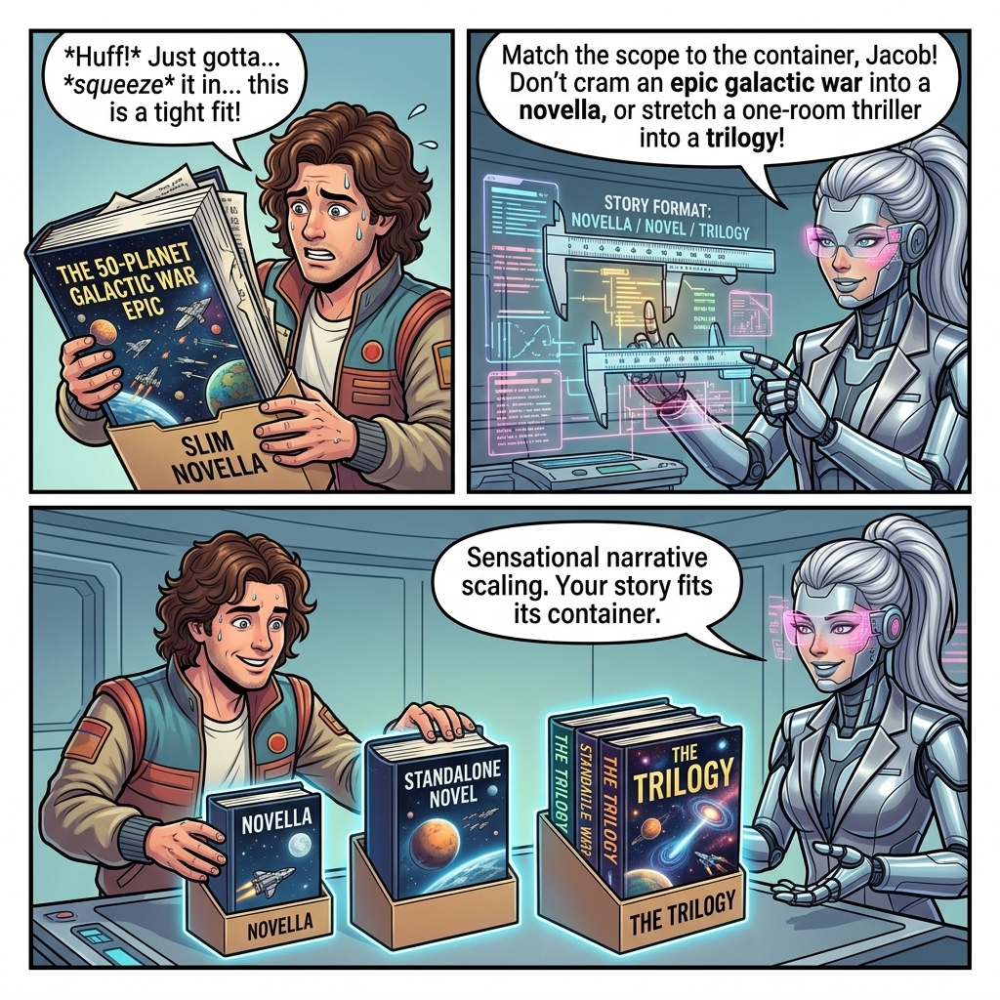

```{=openxml}
<w:p><w:r><w:br w:type="page"/></w:r></w:p>
```
```{=html}
<div style="page-break-after: always; break-after: page;"></div>
```

### 1. Principles of Story Scaling

#### Principle 1: Align Narrative Scope with the Right Story Format
A common mistake is jamming a grand five-realm fantasy epic into a 40,000-word novella, or stretching a simple single-room thriller across three full-length books. Match your story's cast size, world-building complexity, and timeline to the appropriate container:
- **Novella (20,000–50,000 words):** Single protagonist, tight timeline (hours to days), single core location, laser-focused thematic arc.
- **Standalone Novel (70,000–100,000 words):** 1–3 viewpoint characters, multi-location setting, complete resolution of external and internal conflicts.
- **Series Fiction (200,000+ words across books):** Ensembles of characters, expansive world-building, unresolved macro-threats spanning multiple installments.

##### Example 1: Over-Scoped Novella Premise

**Original (Misaligned Scope):**
> A 30,000-word novella covering the rise and fall of five galactic empires across three centuries, featuring twenty POV commanders.

**Corrected (Scope Realignment):**
> A 30,000-word novella focusing on a single veteran engineer trapped on a decommissioned orbital station during the final twenty-four hours of the empire's collapse.

##### Example 2: Under-Scoped Trilogy Premise

**Original (Misaligned Scope):**
> A three-book epic trilogy about a detective investigating a stolen wristwatch in a small quiet village over a single weekend.

**Corrected (Scope Realignment):**
> A tight, 75,000-word standalone noir mystery tracking a disgraced detective who uncovers a web of municipal bribery while investigating a small-town theft.

##### Example 3: Expansive Series Structure

**Original (Misaligned Scope):**
> A single 80,000-word standalone novel attempting to chronicle the full forty-year war between three fantasy kingdoms and six legendary dragons.

**Corrected (Scope Realignment):**
> A planned three-book fantasy series where Book One focuses on a single rebel siege, Book Two expands to kingdom-wide civil war, and Book Three resolves the global dragon threat.

#### Principle 2: Balance Self-Contained Installment Arcs with Overarching Series Threads
If you are writing series fiction, every individual installment must deliver a satisfying, self-contained story arc (a complete climax resolving the immediate book goal) while simultaneously advancing the macro series arc (the multi-book conflict). Readers feel cheated when a book ends without resolving its primary plot, acting merely as a long setup for the next installment.

##### Example 1: Sci-Fi Series Architecture

**Original (Incomplete Installment Arc):**
> Book One ends abruptly when Captain Vance reaches the alien mothership door, leaving all immediate conflicts completely unresolved until Book Two.

**Corrected (Balanced Architecture):**
> **Book One Arc (Self-Contained):** Vance infiltrates the mothership and successfully destroys the orbital invasion fleet threatening Earth.
> **Series Thread (Overarching):** As the fleet explodes, Vance discovers a star-chart revealing that the mothership was merely a scout for an empire heading toward the galaxy.

##### Example 2: Fantasy Trilogy Architecture

**Original (Incomplete Installment Arc):**
> Book One consists entirely of the young wizard walking toward the Magic Academy, ending right before the entrance exam without any climatic confrontation.

**Corrected (Balanced Architecture):**
> **Book One Arc (Self-Contained):** The young wizard defends his border village from a rogue shadow-beast, proving his worth to gain entry to the Academy.
> **Series Thread (Overarching):** Defeating the beast reveals a dark rune branded on its chest—the mark of the exiled Dark Lord returning to power.

##### Example 3: Urban Fantasy Detective Series

**Original (Incomplete Installment Arc):**
> Book One ends mid-interrogation without revealing who killed the mayor, forcing readers to buy Book Two to finish the investigation.

**Corrected (Balanced Architecture):**
> **Book One Arc (Self-Contained):** Detective Hayes identifies and captures the rogue vampire who murdered the mayor, solving the immediate case.
> **Series Thread (Overarching):** The captured vampire reveals that he was hired by the City Council president, setting up the political conspiracy for Book Two.


### 2. Interactive AI Activity

**Objective:** Work with an AI prose coach to take an over-scoped or under-scoped story premise and design a balanced multi-book series breakdown until you earn a passing grade (B or higher).

**Instructions:**
1. Copy the **Sample Prompt** below.
2. Open your preferred AI platform (Gemini, ChatGPT, or Claude).
3. Paste the prompt into the chat. The AI will generate a massive, over-scoped story premise that is far too large for a single standalone novel.
4. Break down the premise into a structured multi-book series plan (e.g., a trilogy), establishing self-contained installment climaxes for each book while maintaining an overarching series thread.
5. Work with your AI coach to refine your work until you earn a grade of **B** or higher.
6. Want more practice? Reply to the AI with *"Generate another premise"* to take on a fresh challenge.


### 3. Sample Prompt

Paste this prompt into the AI Chatbot of your choice (Gemini, ChatGPT, or Claude) to begin the exercise. Challenge yourself to get at least a B grade before proceeding to the next chapter.

```text
Act as a strict yet encouraging college creative writing professor and prose coach.

Step 1: Generate an original, sprawling fiction premise (e.g., in epic fantasy, space opera, or multi-generational crime) that contains far too many characters, subplots, and macro-conflicts to fit into a single standalone novel.

Present the premise to me. Do not provide any hints, structural suggestions, or series breakdowns. Stop and wait for my reply.

Step 2: When I reply with my proposed series breakdown (e.g., a 3-book series architecture), evaluate my draft strictly on the following criteria:
- Format & Scope Realignment: Did I establish realistic word count and scope boundaries for each installment?
- Self-Contained Installment Arcs: Does each individual book contain a complete, satisfying dramatic climax for its primary goal?
- Overarching Series Continuity: Is there a compelling macro-conflict or mystery that threads seamlessly across all installments?

For each criterion, quote specific lines from my draft to support your evaluation.

Assign my rewrite a letter grade (A, B, C, D, or F) with clear coaching feedback. Be appropriately strict as if this is a masters-level creative writing course at a major university.
- If my grade is below a B (C, D, or F), explain the specific flaws and require me to rewrite the series breakdown again until I achieve at least a B.
- If my grade is a B or higher, congratulate me and let me know I can reply with "Generate another premise" whenever I want to practice again with a new exercise.
```

```{=openxml}
<w:p><w:r><w:br w:type="page"/></w:r></w:p>
```
```{=html}
<div style="page-break-after: always; break-after: page;"></div>
```

# Part VI: The Psychology of Character
Before characters can speak, the reader needs to know how to build their psychological profiles.

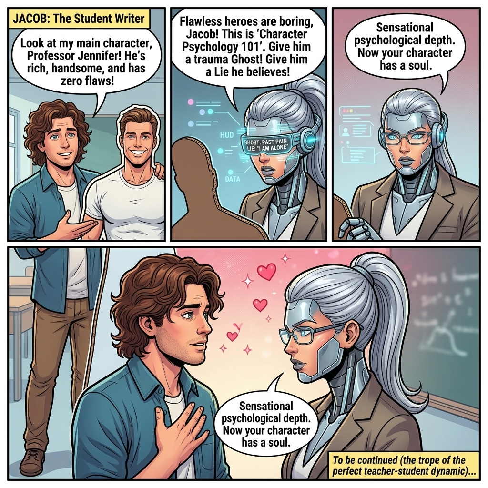

```{=openxml}
<w:p><w:r><w:br w:type="page"/></w:r></w:p>
```
```{=html}
<div style="page-break-after: always; break-after: page;"></div>
```

## Chapter 18: The Ghost and the Lie

Compelling protagonists are not built from physical descriptions or special powers. They are built from wounds—specific, formative failures that leave a permanent mark on how they see the world. At the heart of every great character arc lies a "Ghost"—a past trauma or defining failure—that instills a fundamental "Lie"—a flawed misbelief about how the world works. Until the protagonist confronts their Ghost and unlearns the Lie, they will continue making self-destructive decisions.

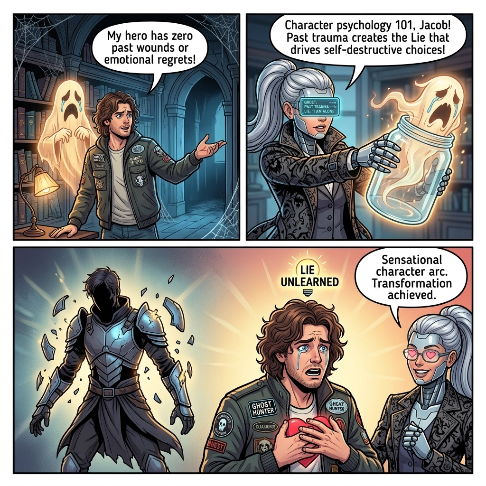

```{=openxml}
<w:p><w:r><w:br w:type="page"/></w:r></w:p>
```
```{=html}
<div style="page-break-after: always; break-after: page;"></div>
```

### 1. Principles of Character Psychology

#### Principle 1: Anchor the Character's Backstory Wound ("The Ghost")
The Ghost is a specific, concrete event from the character's past that caused emotional pain (e.g., being abandoned by a parent, surviving a fatal shipwreck, or failing to save a business partner). The Ghost must be powerful enough to logically justify why the character built emotional armor to avoid being hurt again.

##### Example 1: Corporate Thriller

**Original (Vague Backstory):**
> **Protagonist:** Marcus is a cold corporate lawyer who doesn't like people because he had a bad childhood.

**Corrected (Anchored Ghost):**
> **Ghost:** At age twelve, Marcus watched his father's small business forced into bankruptcy by a ruthless conglomerate, leaving his family homeless.

##### Example 2: Sci-Fi Survival

**Original (Vague Backstory):**
> **Protagonist:** Captain Aris is a lone-wolf pilot who refuses to work with a team because she is stubborn.

**Corrected (Anchored Ghost):**
> **Ghost:** During her first command, Aris trusted her co-pilot's advice to delay ejection, resulting in the death of her entire four-person crew.

##### Example 3: Historical Fiction

**Original (Vague Backstory):**
> **Protagonist:** Clara is a cynical noblewoman who refuses to marry because she thinks love is silly.

**Corrected (Anchored Ghost):**
> **Ghost:** Five years ago, Clara's fiancé used her dowry to pay off his gambling debts before abandoning her at the altar for a wealthier heiress.

#### Principle 2: Derive the Character's Misbelief ("The Lie") and Flawed Decisions
The Lie is the false philosophy the protagonist adopts to avoid being hurt by their Ghost again. In every scene, this Lie must actively drive the character's flawed choices, causing them to sabotage their own relationships and goals until they are forced to change.

##### Example 1: Corporate Thriller

**Original (Disconnected Lie & Actions):**
> **The Lie:** Marcus believes that money is good.
> **Flawed Decision:** Marcus works hard at his law firm every day to earn a bonus.

**Corrected (Logical Misbelief & Flawed Choices):**
> **The Lie:** "Vulnerability is weakness; the only way to avoid being destroyed is to control everyone around me."
> **Flawed Decision:** Marcus wiretaps his own legal team's phones and blackmails his partner to ensure no one can betray him first.

##### Example 2: Sci-Fi Survival

**Original (Disconnected Lie & Actions):**
> **The Lie:** Aris believes space is dangerous.
> **Flawed Decision:** Aris flies her starship very fast during missions.

**Corrected (Logical Misbelief & Flawed Choices):**
> **The Lie:** "Relying on others inevitably leads to their deaths; I must handle every crisis entirely alone."
> **Flawed Decision:** Aris locks her rookie engineer out of the engine room during a reactor leak, attempting to fix the core single-handedly until she collapses from radiation.

##### Example 3: Historical Fiction

**Original (Disconnected Lie & Actions):**
> **The Lie:** Clara believes all men are mean.
> **Flawed Decision:** Clara sits by herself at balls and drinks tea.

**Corrected (Logical Misbelief & Flawed Choices):**
> **The Lie:** "Emotional intimacy is a trap; true safety lies in absolute financial and social independence."
> **Flawed Decision:** Clara rejects a genuine suitor's proposal and secretly buys shares in a smuggling syndicate, risking imprisonment to secure her own wealth.


### 2. Interactive AI Activity

**Objective:** Work with an AI prose coach to develop a protagonist's psychological profile, linking a specific past trauma (Ghost) to a flawed worldview (Lie) and active present-day mistakes until you earn a passing grade (B or higher).

**Instructions:**
1. Copy the **Sample Prompt** below.
2. Open your preferred AI platform (Gemini, ChatGPT, or Claude).
3. Paste the prompt into the chat. The AI will generate a flat character concept lacking a clear backstory wound or psychological misbelief.
4. Complete the character profile by defining a specific Ghost, deriving a compelling Lie, and outlining two flawed present-day decisions driven by that Lie.
5. Work with your AI coach to refine your work until you earn a grade of **B** or higher.
6. Want more practice? Reply to the AI with *"Generate another character"* to take on a fresh challenge.


### 3. Sample Prompt

Paste this prompt into the AI Chatbot of your choice (Gemini, ChatGPT, or Claude) to begin the exercise. Challenge yourself to get at least a B grade before proceeding to the next chapter.

```text
Act as a strict yet encouraging college creative writing professor and prose coach.

Step 1: Generate an original, flat character concept (e.g., a generic detective, an ambitious doctor, or a rebellious space pilot) that lacks psychological depth, a backstory wound, or internal flaws.

Present the concept to me. Do not provide any hints, suggested flaws, or backstory ideas. Stop and wait for my reply.

Step 2: When I reply with my completed psychological profile (defining the character's Ghost, Lie, and present-day Flawed Decisions), evaluate my draft strictly on the following criteria:
- Anchored Backstory Wound (The Ghost): Did I define a specific, traumatic event that logically justifies the character's emotional armor?
- Psychological Misbelief (The Lie): Is the Lie a clear, flawed worldview designed to protect the character from repeating their past trauma?
- Present-Day Flawed Decisions: Do the character's current choices directly stem from the Lie, actively creating conflict and self-sabotage in the story?

For each criterion, quote specific lines from my draft to support your evaluation.

Assign my rewrite a letter grade (A, B, C, D, or F) with clear coaching feedback. Be appropriately strict as if this is a masters-level creative writing course at a major university.
- If my grade is below a B (C, D, or F), explain the specific flaws and require me to rewrite the profile again until I achieve at least a B.
- If my grade is a B or higher, congratulate me and let me know I can reply with "Generate another character" whenever I want to practice again with a new exercise.
```

```{=openxml}
<w:p><w:r><w:br w:type="page"/></w:r></w:p>
```
```{=html}
<div style="page-break-after: always; break-after: page;"></div>
```

## Chapter 19: Wants vs. Needs

A character arc lives in the gap between what a protagonist *thinks* they want and what they actually *need*—and the collision of those two forces drives every great climax. The "Want" is the tangible, external goal driving the plot (winning the promotion, capturing the murderer, surviving the voyage). The "Need" is the internal, psychological growth required to overcome their Lie (learning to trust, accepting vulnerability, sacrificing ego). The climax of a great novel occurs when the Want and Need collide, forcing the protagonist to choose between them.

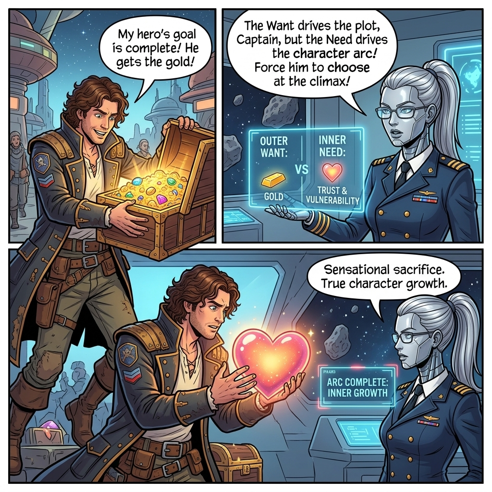

```{=openxml}
<w:p><w:r><w:br w:type="page"/></w:r></w:p>
```
```{=html}
<div style="page-break-after: always; break-after: page;"></div>
```

### 1. Principles of Character Motivation

#### Principle 1: Establish a Tangible External Goal ("The Want")
The Want must be concrete, observable, and specific. If a protagonist's outer goal is vague—"I want to be successful" or "I want to be loved"—the plot lacks a clear direction. A well-defined Want provides the reader with a yardstick to measure narrative progress.

##### Example 1: Political Thriller

**Original (Vague Outer Goal):**
> **Protagonist:** Senator Vance wants to be successful in politics.

**Corrected (Tangible External Want):**
> **Outer Want:** Senator Vance wants to secure thirty-four senate votes to pass his landmark energy bill before Tuesday's session closes.

##### Example 2: Culinary Drama

**Original (Vague Outer Goal):**
> **Protagonist:** Chef Chef Maria wants her restaurant to do well.

**Corrected (Tangible External Want):**
> **Outer Want:** Chef Maria wants to earn a Michelin star during tonight's anonymous critic inspection.

##### Example 3: Space Western

**Original (Vague Outer Goal):**
> **Protagonist:** Bounty hunter Kael wants a lot of money.

**Corrected (Tangible External Want):**
> **Outer Want:** Kael wants to capture the 50,000-credit bounty on the outer rim's most notorious smuggler.

#### Principle 2: Pit the Internal Realization ("The Need") Against the Outer Goal
The Need is the psychological truth the protagonist resists acknowledging. The richest dramatic tension occurs when pursuing the external Want directly violates the internal Need, building to a climax where the character must sacrifice their external goal to embrace their psychological growth.

##### Example 1: Political Thriller

**Original (Aligned Want & Need — No Collision):**
> **Outer Want:** Pass the energy bill.
> **Inner Need:** Learn to be more persuasive so the bill passes easily.

**Corrected (Colliding Want & Need):**
> **Outer Want:** Secure thirty-four senate votes to pass the energy bill.
> **Inner Need:** Stop prioritizing personal ambition over ethical integrity and admit that his chief donor compromised the bill's safety standards.
> **The Climax Collision:** Vance must choose between killing his own bill on the senate floor (fulfilling his Need) or passing a dangerous law to secure his career (fulfilling his Want).

##### Example 2: Culinary Drama

**Original (Aligned Want & Need — No Collision):**
> **Outer Want:** Earn a Michelin star.
> **Inner Need:** Work harder in the kitchen.

**Corrected (Colliding Want & Need):**
> **Outer Want:** Earn a Michelin star during tonight's inspection.
> **Inner Need:** Surrender toxic perfectionism and trust her kitchen staff as equal partners rather than disposable tools.
> **The Climax Collision:** Maria must choose between firing her struggling line chef to salvage the critic's dish (fulfilling her Want) or stepping back to coach her team through the dinner rush (fulfilling her Need).

##### Example 3: Space Western

**Original (Aligned Want & Need — No Collision):**
> **Outer Want:** Capture the 50,000-credit bounty.
> **Inner Need:** Buy a bigger starship with the reward money.

**Corrected (Colliding Want & Need):**
> **Outer Want:** Collect the 50,000-credit bounty on the smuggler.
> **Inner Need:** Unlearn his cynical detachment and protect innocent lives, even when there is no financial profit.
> **The Climax Collision:** Kael must choose between handing the bounty over to the cartel (fulfilling his Want) or helping the target escape to protect a refugee colony (fulfilling his Need).


### 2. Interactive AI Activity

**Objective:** Work with an AI prose coach to design a protagonist's competing Want and Need, creating a climax where the outer goal and inner truth collide until you earn a passing grade (B or higher).

**Instructions:**
1. Copy the **Sample Prompt** below.
2. Open your preferred AI platform (Gemini, ChatGPT, or Claude).
3. Paste the prompt into the chat. The AI will generate a protagonist concept with a weak or aligned Want and Need that lack dramatic collision.
4. Redesign the character by defining a tangible Want, a conflicting internal Need, and a dramatic climax where the two forces collide.
5. Work with your AI coach to refine your work until you earn a grade of **B** or higher.
6. Want more practice? Reply to the AI with *"Generate another scenario"* to take on a fresh challenge.


### 3. Sample Prompt

Paste this prompt into the AI Chatbot of your choice (Gemini, ChatGPT, or Claude) to begin the exercise. Challenge yourself to get at least a B grade before proceeding to the next chapter.

```text
Act as a strict yet encouraging college creative writing professor and prose coach.

Step 1: Generate an original protagonist premise (e.g., in crime, romance, fantasy, or drama) that is intentionally flawed in ONE way:
- The character's outer Want and inner Need do not conflict, leading to an easy, flat resolution with no thematic tension or sacrifice.

Present the premise to me. Do not provide any hints, suggested needs, or climax ideas. Stop and wait for my reply.

Step 2: When I reply with my redesigned character framework (establishing a concrete Want, a conflicting Need, and a Climax Collision), evaluate my draft strictly on the following criteria:
- Tangible Outer Goal (The Want): Is the external goal specific, observable, and capable of driving the plot engine?
- Conflicting Inner Growth (The Need): Does the internal Need require the character to overcome a deeply held Lie or psychological flaw?
- Dramatic Climax Collision: Does the climax force the protagonist to make a meaningful choice between achieving their Want or embracing their Need?

For each criterion, quote specific lines from my draft to support your evaluation.

Assign my rewrite a letter grade (A, B, C, D, or F) with clear coaching feedback. Be appropriately strict as if this is a masters-level creative writing course at a major university.
- If my grade is below a B (C, D, or F), explain the specific flaws and require me to rewrite the framework again until I achieve at least a B.
- If my grade is a B or higher, congratulate me and let me know I can reply with "Generate another scenario" whenever I want to practice again with a new exercise.
```

```{=openxml}
<w:p><w:r><w:br w:type="page"/></w:r></w:p>
```
```{=html}
<div style="page-break-after: always; break-after: page;"></div>
```

## Chapter 20: Building the Antagonist

The weakest element in most first novels is the antagonist. Flat villains who commit evil acts for the sake of being evil feel cartoonish and unthreatening. A great antagonist believes they are the hero of their own story, acting out of a logical (if ruthlessly extreme) philosophy. Furthermore, the best antagonist is constructed as a dark mirror to the protagonist, specifically designed to exploit the protagonist's unique psychological Lie.

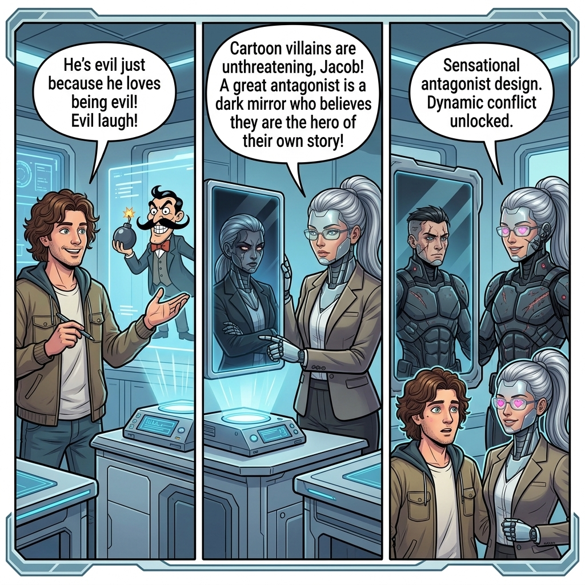

```{=openxml}
<w:p><w:r><w:br w:type="page"/></w:r></w:p>
```
```{=html}
<div style="page-break-after: always; break-after: page;"></div>
```

### 1. Principles of Antagonist Design

#### Principle 1: Give the Antagonist a Righteous Motivation ("Hero of Their Own Story")
Great antagonists operate with internal moral logic. A great antagonist does not pursue evil for its own sake; they are attempting to solve a problem, restore order, or protect a cause they value. Giving your antagonist an understandable core goal elevates them from a plot obstacle to a compelling character.

##### Example 1: Corporate Thriller

**Original (Cartoonish Villain Motivation):**
> **Antagonist:** CEO Vance wants to dump toxic chemical waste into the river because he hates environmentalists and likes being evil.

**Corrected (Internal Moral Logic):**
> **Antagonist:** CEO Vance believes that mandatory environmental regulations will bankrupt his energy plant, laying off 5,000 local workers. He views bypassing disposal laws as a tragic but necessary sacrifice to preserve his town's economic survival.

##### Example 2: High Fantasy

**Original (Cartoonish Villain Motivation):**
> **Antagonist:** The Dark Lord Malakor wants to cover the world in shadow because he loves dark magic and chaos.

**Corrected (Internal Moral Logic):**
> **Antagonist:** Malakor suffered through a catastrophic civil war caused by weak, squabbling provincial kings. He seeks to impose absolute iron rule across the realm to permanently extinguish war and force total peace.

##### Example 3: Sci-Fi Dystopia

**Original (Cartoonish Villain Motivation):**
> **Antagonist:** Commander Aris wants to suppress citizen speech because she enjoys torturing rebels.

**Corrected (Internal Moral Logic):**
> **Antagonist:** Commander Aris watched free ideological speech tear her home colony apart during a deadly plague. She views total censorship as the only medical and social quarantine that keeps humanity from annihilating itself.

#### Principle 2: Design the Antagonist as a Dark Mirror to the Protagonist's Lie
The antagonist should embody the extreme, unredeemed version of the protagonist's Lie. If your protagonist believes "vulnerability is weakness," your antagonist should be a ruthless tyrant who eradicated all empathy long ago. This structural alignment forces the protagonist to confront the logical conclusion of their own flawed worldview.

##### Example 1: Crime Noir

**Protagonist's Lie:** "I can't trust anyone; I must handle everything alone."
> **Original (Generic Antagonist):** A rogue mob hitman who shoots people for money.
> **Corrected (Dark Mirror Antagonist):** A corrupt police captain who once tried to trust a partner, got betrayed, and now ruthlessly eliminates any officer who shows personal loyalty or weakness.

##### Example 2: Medical Drama

**Protagonist's Lie:** "Perfection is mandatory; failure is unforgivable."
> **Original (Generic Antagonist):** A lazy hospital administrator who cuts budgets to save money.
> **Corrected (Dark Mirror Antagonist):** A world-renowned chief surgeon who falsifies patient death reports and destroys careers to maintain his department's flawless 100% success rating.

##### Example 3: Gothic Horror

**Protagonist's Lie:** "Physical comfort is worth any sacrifice; safety requires compliance."
> **Original (Generic Antagonist):** A terrifying ghost living in the basement.
> **Corrected (Dark Mirror Antagonist):** An immortal aristocrat who sacrifices one servant every decade to maintain the estate's magical warmth and protection from the outer wilderness.


### 2. Interactive AI Activity

**Objective:** Work with an AI prose coach to outline a multi-dimensional antagonist, providing them with righteous internal moral logic and positioning them as a dark mirror to a protagonist's Lie until you earn a passing grade (B or higher).

**Instructions:**
1. Copy the **Sample Prompt** below.
2. Open your preferred AI platform (Gemini, ChatGPT, or Claude).
3. Paste the prompt into the chat. The AI will generate a protagonist profile with a specific Lie alongside a flat, mustache-twirling villain.
4. Redesign the antagonist by giving them a righteous internal motivation ("hero of their own story") and structuring their worldview to act as a dark mirror to the protagonist's Lie.
5. Work with your AI coach to refine your work until you earn a grade of **B** or higher.
6. Want more practice? Reply to the AI with *"Generate another pairing"* to take on a fresh challenge.


### 3. Sample Prompt

Paste this prompt into the AI Chatbot of your choice (Gemini, ChatGPT, or Claude) to begin the exercise. Challenge yourself to get at least a B grade before proceeding to the next chapter.

```text
Act as a strict yet encouraging college creative writing professor and prose coach.

Step 1: Generate an original protagonist profile with a clear psychological Lie (e.g., "Compassion is a liability") paired with an intentionally flawed, flat antagonist who acts with cartoonish, unmotivated evil (e.g., "wants to destroy the world because he is bad").

Present the pairing to me. Do not provide any hints, suggested motivations, or dark-mirror concepts. Stop and wait for my reply.

Step 2: When I reply with my redesigned antagonist profile, evaluate my draft strictly on the following criteria:
- Righteous Internal Moral Logic: Does the antagonist view themselves as the hero of their own story, pursuing an understandable core goal?
- Dark Mirror Alignment: Is the antagonist explicitly designed to embody the extreme, unredeemed version of the protagonist's specific Lie?
- Psychological Exploitation: Does the antagonist's strategy specifically exploit the protagonist's greatest internal weakness?

For each criterion, quote specific lines from my draft to support your evaluation.

Assign my rewrite a letter grade (A, B, C, D, or F) with clear coaching feedback. Be appropriately strict as if this is a masters-level creative writing course at a major university.
- If my grade is below a B (C, D, or F), explain the specific flaws and require me to rewrite the profile again until I achieve at least a B.
- If my grade is a B or higher, congratulate me and let me know I can reply with "Generate another pairing" whenever I want to practice again with a new exercise.
```

```{=openxml}
<w:p><w:r><w:br w:type="page"/></w:r></w:p>
```
```{=html}
<div style="page-break-after: always; break-after: page;"></div>
```

# Part VII: Building Your Story Bible
A centralized document containing all critical information to ensure consistency in your fictional universe.

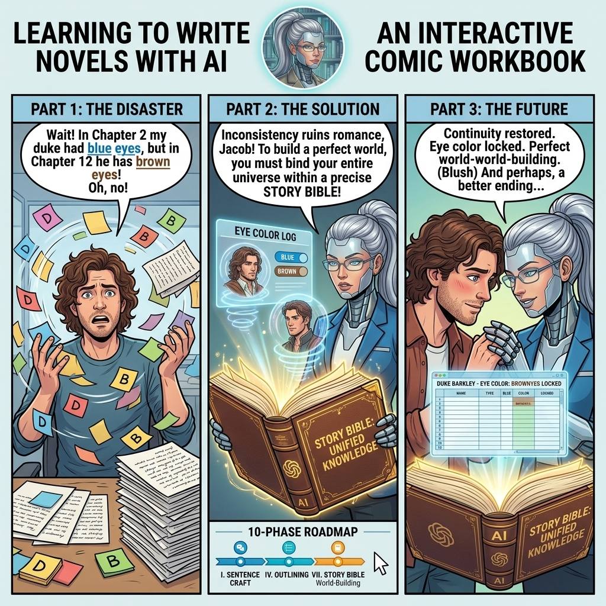

```{=openxml}
<w:p><w:r><w:br w:type="page"/></w:r></w:p>
```
```{=html}
<div style="page-break-after: always; break-after: page;"></div>
```

## Chapter 21: Core Categories of World-Building

World-building is more than drawing maps or inventing magic systems; it is the art of constructing a living, believable ecosystem. Incoherent world-building occurs when authors treat setting details as isolated trivia rather than interconnected systems. Establishing a Story Bible across five core pillars—Geography, History, Society, Systems & Rules, and Ecology & Science—ensures that every element of your fictional universe logically impacts the others.

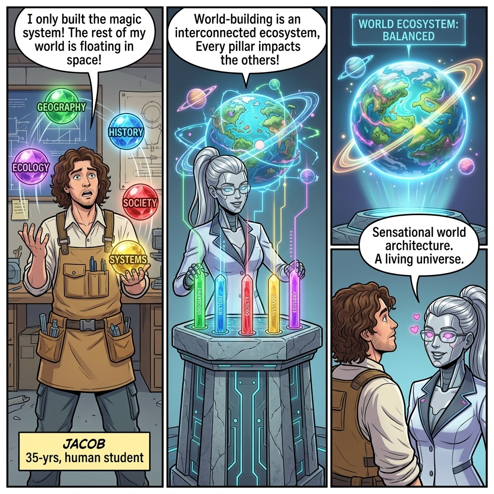

```{=openxml}
<w:p><w:r><w:br w:type="page"/></w:r></w:p>
```
```{=html}
<div style="page-break-after: always; break-after: page;"></div>
```

### 1. Principles of World-Building Architecture

#### Principle 1: Track the Five Core Pillars of World-Building
Every believable world, whether sci-fi, fantasy, historical, or contemporary, rests upon five pillars:
1. **Geography:** Physical terrain, climate, natural borders, and urban architecture.
2. **History:** Defining conflicts, technological eras, and ancestral traditions.
3. **Society:** Class structures, governance, religious beliefs, and cultural taboos.
4. **Systems & Rules:** Magic systems, law enforcement, economic currencies, or physics limitations.
5. **Ecology & Science:** Flora, fauna, natural resources, and environmental hazards.

##### Example 1: High Fantasy Setting

**Original (Isolated Trivia):**
> There is a desert city called Sunreach, and there are magical glowing crystals in the mines nearby.

**Corrected (Pillar Integration):**
> **Geography:** The city of Sunreach is carved directly into the red sandstone cliffs of the Burning Waste.
> **Ecology:** Deep beneath the cliffs thrive bio-luminescent quartz veins that absorb subterranean heat.
> **Systems & Rules:** Mining the quartz requires specialized cold-enchantment suits to prevent thermal shock.

##### Example 2: Sci-Fi Orbital Colony

**Original (Isolated Trivia):**
> A giant space station orbits Jupiter where miners drink cheap synth-ale in dark bars.

**Corrected (Pillar Integration):**
> **Geography:** Station Titan-9 tethers forty industrial harvesting pods in Jupiter’s upper atmosphere.
> **History:** Built seventy years ago as a penal colony, the station declared corporate independence after the Sol Crisis.
> **Society:** Station society is divided strictly between "Upper Deck" corporate administrators and "Low-Atmosphere" riggers.

##### Example 3: Post-Apocalyptic Frontier

**Original (Isolated Trivia):**
> People live in ruined skyscrapers and fight over fresh water and old canned food.

**Corrected (Pillar Integration):**
> **Geography:** The flooded ruins of Lower Manhattan have turned into a saltwater mangrove marsh.
> **Society:** Rival clan baronies control individual skyscraper roofs, trading distilled rainwater for preserved electronics.
> **Systems & Rules:** The "Code of the Roofs" dictates that any clan firing guns across open water forfeits their fishing rights.

#### Principle 2: Enforce Cause-and-Effect Interconnectedness Between Pillars
World-building feels alive when a shift in one pillar cascades logically through the others. If a geography features a harsh mountain barrier, that physical barrier must logically shape the region's military history, trade economy, social customs, and religious mythology.

##### Example 1: Geography Impacting Society and Religion

**Original (Disconnected Features):**
> The kingdom sits next to a volatile volcano, and the people worship a sun god in golden temples.

**Corrected (Interconnected Chain):**
> Because the city is built at the base of an active volcano (**Geography**), agricultural harvests depend on fertile ash soil (**Ecology**). Consequently, the ruling priesthood (**Society**) bases its entire calendar on volcanic smoke readings, offering bronze sacrifices during eruptions to appease the Mountain Monarch (**Religion & History**).

##### Example 2: Magic Systems Impacting Economy and Law

**Original (Disconnected Features):**
> Wizards can cast fire spells, and the city has a large guardsmen patrol.

**Corrected (Interconnected Chain):**
> Because pyromancy magic is easily learned by commoners (**Systems & Rules**), urban architecture favors damp granite and stone roofing over timber (**Geography**). Consequently, the city council levies a high tax on wooden furniture (**Economy**), and carrying flammable oils in residential districts is punishable by exile (**Law & Society**).

##### Example 3: Resource Ecology Impacting Military History

**Original (Disconnected Features):**
> The island nation has fast war galleys and rare blue horses.

**Corrected (Interconnected Chain):**
> Because the island's iron-bark pine trees are resistant to shipworms (**Ecology**), naval shipyards produce indestructible war galleys (**Systems**). This timber dominance allowed the islanders to win the Thirty Years' Blockade (**History**), making sea-captains the highest-ranking aristocrats in parliament (**Society**).


### 2. Interactive AI Activity

**Objective:** Work with an AI prose coach to develop a five-pillar world-building entry for a fictional universe, ensuring logical cause-and-effect connections between all pillars until you earn a passing grade (B or higher).

**Instructions:**
1. Copy the **Sample Prompt** below.
2. Open your preferred AI platform (Gemini, ChatGPT, or Claude).
3. Paste the prompt into the chat. The AI will generate a brief, disconnected setting premise (e.g., "a floating cloud city with airships").
4. Expand the premise into a structured five-pillar Story Bible entry (Geography, History, Society, Systems, Ecology), establishing clear cause-and-effect links between each category.
5. Work with your AI coach to refine your work until you earn a grade of **B** or higher.
6. Want more practice? Reply to the AI with *"Generate another setting"* to take on a fresh challenge.


### 3. Sample Prompt

Paste this prompt into the AI Chatbot of your choice (Gemini, ChatGPT, or Claude) to begin the exercise. Challenge yourself to get at least a B grade before proceeding to the next chapter.

```text
Act as a strict yet encouraging college creative writing professor and prose coach.

Step 1: Generate an original, one-sentence world-building seed in any genre (e.g., "A kingdom built inside a hollowed-out glacier," "A futuristic city powered by harvested lightning," or "A flooded desert wasteland").

Present the seed to me. Do not provide any pillar breakdowns, lore details, or structural hints. Stop and wait for my reply.

Step 2: When I reply with my five-pillar Story Bible entry (Geography, History, Society, Systems & Rules, Ecology & Science), evaluate my draft strictly on the following criteria:
- Five-Pillar Completeness: Did I thoroughly articulate all five core categories of world-building?
- Interconnected Cause-and-Effect: Do changes or features in one pillar (e.g., Geography or Ecology) logically dictate elements in others (e.g., Society, Law, or History)?
- Internal Consistency & Plausibility: Is the fictional world free of logical contradictions and lore gaps?

For each criterion, quote specific lines from my draft to support your evaluation.

Assign my rewrite a letter grade (A, B, C, D, or F) with clear coaching feedback. Be appropriately strict as if this is a masters-level creative writing course at a major university.
- If my grade is below a B (C, D, or F), explain the specific flaws and require me to rewrite the world-building entry again until I achieve at least a B.
- If my grade is a B or higher, congratulate me and let me know I can reply with "Generate another setting" whenever I want to practice again with a new exercise.
```

```{=openxml}
<w:p><w:r><w:br w:type="page"/></w:r></w:p>
```
```{=html}
<div style="page-break-after: always; break-after: page;"></div>
```

## Chapter 22: The Organization Process

Generating world-building ideas is easy. Keeping them organized and accessible across a 100,000-word draft is where most authors stumble. Without a structured information architecture, authors lose track of character ages, village names, and magical rules, resulting in costly continuity errors. Organizing a Story Bible requires moving from raw brainstorming through five systematic steps to build an evolving, cross-referenced reference document.

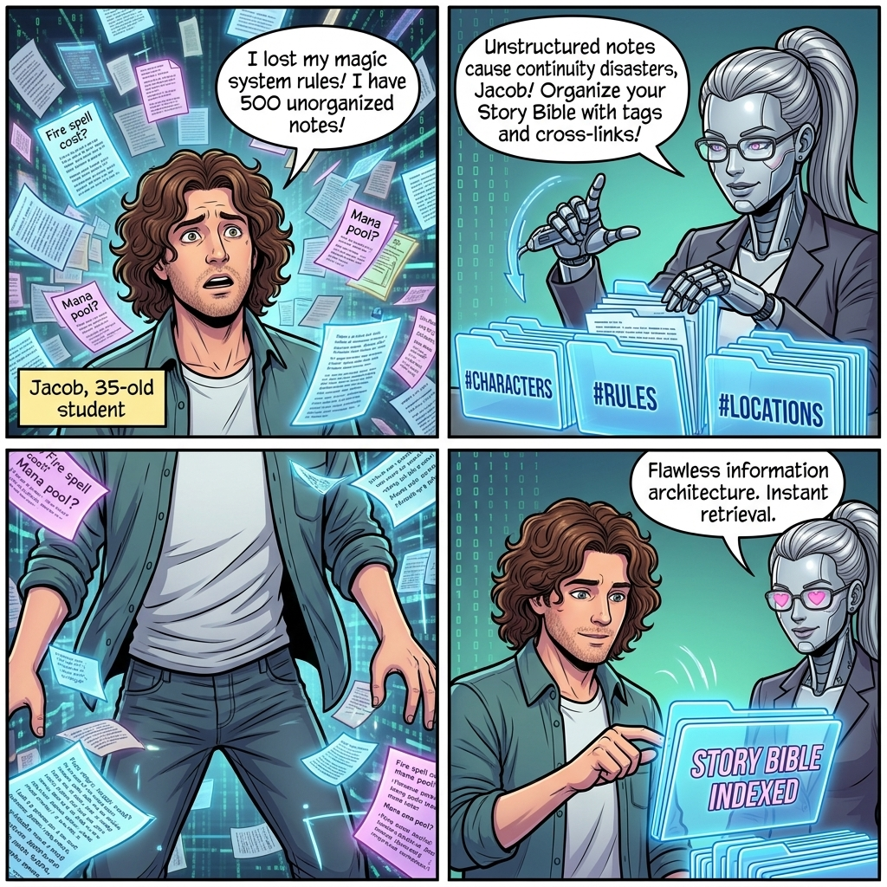

```{=openxml}
<w:p><w:r><w:br w:type="page"/></w:r></w:p>
```
```{=html}
<div style="page-break-after: always; break-after: page;"></div>
```

### 1. Principles of Story Bible Organization

#### Principle 1: Follow the Five-Step Story Bible Organization Workflow
To prevent your world-building from becoming a messy desktop folder of unnamed text files, process all raw world-building notes through a five-step workflow:
1. **Brainstorming:** Free-writing raw ideas without filtering or formatting.
2. **Detailed Planning:** Distilling raw ideas into clean, single-topic entries (Characters, Factions, Locations, Rules).
3. **Organizing Information:** Applying standardized headers, metadata tags, and standardized templates.
4. **Maintaining Consistency:** Cross-referencing new details against previously established canon rules.
5. **Revising/Updating:** Updating entries whenever drafting decisions change established facts.

##### Example 1: Organizing Raw Character Notes

**Original (Unorganized Brainstorm Dump):**
> Character: Marcus Vance. He is around 40 years old, maybe 38. He grew up in Boston or maybe Chicago. He has a scar on his shoulder from a knife fight or war. He hates the mayor. He wears a brown leather jacket and drives a truck.

**Corrected (Five-Step Standardized Entry):**
> **[Character Entry] Vance, Marcus**
> - **Age:** 39 | **Origin:** Chicago, IL
> - **Physical Markers:** 3-inch jagged scar on left shoulder (inflicted during the 2018 Dockyard Strike).
> - **Core Dynamic:** Bitter hostility toward Mayor Kane due to the unresolved strike scandal.
> - **Key Assets:** 1998 Ford F-150; distressed brown bomber jacket.

##### Example 2: Organizing Raw Faction Notes

**Original (Unorganized Brainstorm Dump):**
> Faction: The Shadow Guild. They live in sewers under the capital. They wear black cloaks. They use poison daggers. Their boss is called the Raven. They steal magic rings.

**Corrected (Five-Step Standardized Entry):**
> **[Faction Entry] The Shadow Guild**
> - **Headquarters:** Sub-Level 3 (The Sunken Cistern beneath the Capital District).
> - **Leadership:** Directed by "The Raven" (identity unknown to lower tiers).
> - **Operative Gear:** Charcoal-dyed wool cloaks; copper-coated paralysis daggers.
> - **Primary Mandate:** Illicit acquisition and trafficking of enchanted relic rings.

##### Example 3: Organizing Raw Magic System Notes

**Original (Unorganized Brainstorm Dump):**
> Magic: Blood Runes. You cut your hand and draw a sign in the air. It makes fire or shields. It hurts a lot. If you do it too much you faint.

**Corrected (Five-Step Standardized Entry):**
> **[System Entry] Blood Runes**
> - **Activation Mechanism:** Direct dermal incision releasing fresh blood; geometric air-tracing.
> - **Cost & Limitation:** Induces physical exhaustion and severe anemia relative to rune size.
> - **Output Range:** Kinetic barrier projection; directional thermal combustion.

#### Principle 2: Establish Cross-Linked Information Architecture and Living Document Rules
A Story Bible must function like a private Wikipedia for your manuscript. Use standardized tag categories (`#location`, `#character`, `#magic-rule`, `#timeline`) and explicit cross-links between entries so that any character name instantly links to their faction, home location, and historical backstory.

##### Example 1: Isolated Text vs. Cross-Linked Entry

**Original (Isolated Text Entry):**
> Lord Malvern lives in Blackwood Manor. He commands the Iron Guard.

**Corrected (Cross-Linked Architecture):**
> **Lord Malvern** (`#character/antagonist`)
> - **Primary Residence:** [Blackwood Manor](file://story_bible/locations/blackwood_manor.md) (`#location/estate`)
> - **Command Directives:** Master of the [Iron Guard](file://story_bible/factions/iron_guard.md) (`#faction/military`)

##### Example 2: Isolated Setting vs. Cross-Linked Entry

**Original (Isolated Text Entry):**
> The Sunken Citadel is a ruined fortress in the Salt Marshes where King Aris died.

**Corrected (Cross-Linked Architecture):**
> **The Sunken Citadel** (`#location/ruin`)
> - **Geographic Zone:** [Salt Marshes](file://story_bible/geography/salt_marshes.md) (`#geography/wetland`)
> - **Historical Significance:** Site of the fatal betrayal of [King Aris](file://story_bible/history/king_aris.md) (`#history/monarch`)

##### Example 3: Isolated Rule vs. Cross-Linked Entry

**Original (Isolated Text Entry):**
> Iron-wood trees cannot be burned by normal fire. They grow in the Northern Forest.

**Corrected (Cross-Linked Architecture):**
> **Iron-Wood Timber** (`#resource/material`)
> - **Habitat Origin:** [Northern Forest](file://story_bible/geography/northern_forest.md) (`#geography/forest`)
> - **Material Properties:** Impervious to conventional combustion; harvesting requires [Enchanted Adzes](file://story_bible/tools/enchanted_adze.md) (`#item/tool`).


### 2. Interactive AI Activity

**Objective:** Work with an AI prose coach to take a messy, unorganized collection of raw world-building notes and convert them into a clean, cross-linked Story Bible entry until you earn a passing grade (B or higher).

**Instructions:**
1. Copy the **Sample Prompt** below.
2. Open your preferred AI platform (Gemini, ChatGPT, or Claude).
3. Paste the prompt into the chat. The AI will generate a chaotic, unorganized dump of raw world-building notes containing character details, location lore, and magic rules all mixed together.
4. Process and structure the notes into a standardized Story Bible format with clear category headers, metadata tags, and explicit cross-links between related entries.
5. Work with your AI coach to refine your work until you earn a grade of **B** or higher.
6. Want more practice? Reply to the AI with *"Generate another note dump"* to take on a fresh challenge.


### 3. Sample Prompt

Paste this prompt into the AI Chatbot of your choice (Gemini, ChatGPT, or Claude) to begin the exercise. Challenge yourself to get at least a B grade before proceeding to the next chapter.

```text
Act as a strict yet encouraging college creative writing professor and prose coach.

Step 1: Generate an original, chaotic 6-to-8-sentence raw world-building brainstorm dump that randomly mixes together character traits, location details, historical events, and magic/tech rules without any organization or formatting.

Present the raw dump to me. Do not provide any hints, category suggestions, or pre-formatted headers. Stop and wait for my reply.

Step 2: When I reply with my structured, five-step Story Bible entries (featuring category headers, metadata tags `#tag`, and explicit cross-links `[Link]`), evaluate my draft strictly on the following criteria:
- Standardized Categorization: Did I isolate raw notes into clean, dedicated entries (e.g., Character, Location, Faction, Rule)?
- Metadata & Tagging System: Did I implement a clear, logical tagging system for rapid information retrieval?
- Cross-Linked Architecture: Did I establish explicit cross-references connecting characters, locations, factions, and rules?

For each criterion, quote specific lines from my draft to support your evaluation.

Assign my rewrite a letter grade (A, B, C, D, or F) with clear coaching feedback. Be appropriately strict as if this is a masters-level creative writing course at a major university.
- If my grade is below a B (C, D, or F), explain the specific flaws and require me to rewrite the Story Bible entry again until I achieve at least a B.
- If my grade is a B or higher, congratulate me and let me know I can reply with "Generate another note dump" whenever I want to practice again with a new exercise.
```

```{=openxml}
<w:p><w:r><w:br w:type="page"/></w:r></w:p>
```
```{=html}
<div style="page-break-after: always; break-after: page;"></div>
```

# Part VIII: Narrative Theories and Structures
This section explores the most enduring templates of storytelling. Each chapter focuses on a single framework, teaching you when to use it and how to apply it to your own novel.

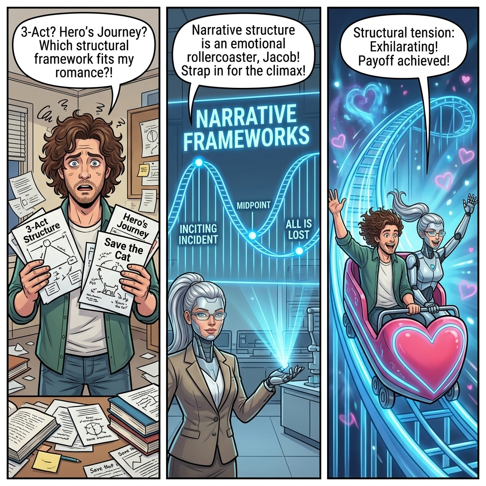

```{=openxml}
<w:p><w:r><w:br w:type="page"/></w:r></w:p>
```
```{=html}
<div style="page-break-after: always; break-after: page;"></div>
```

## Chapter 23: The Three-Act Structure

The Three-Act Structure is the backbone of nearly every commercially successful novel, film, and television drama. By dividing a narrative into Setup (Act I), Confrontation (Act II), and Resolution (Act III), this framework creates a natural rhythm of rising tension, dramatic reversals, and satisfying payoff. Mastering the Three-Act Structure requires anchoring your plot around five non-negotiable structural milestones: the Inciting Incident, Plot Point 1, Midpoint Reversal, All Is Lost moment, and Climax.

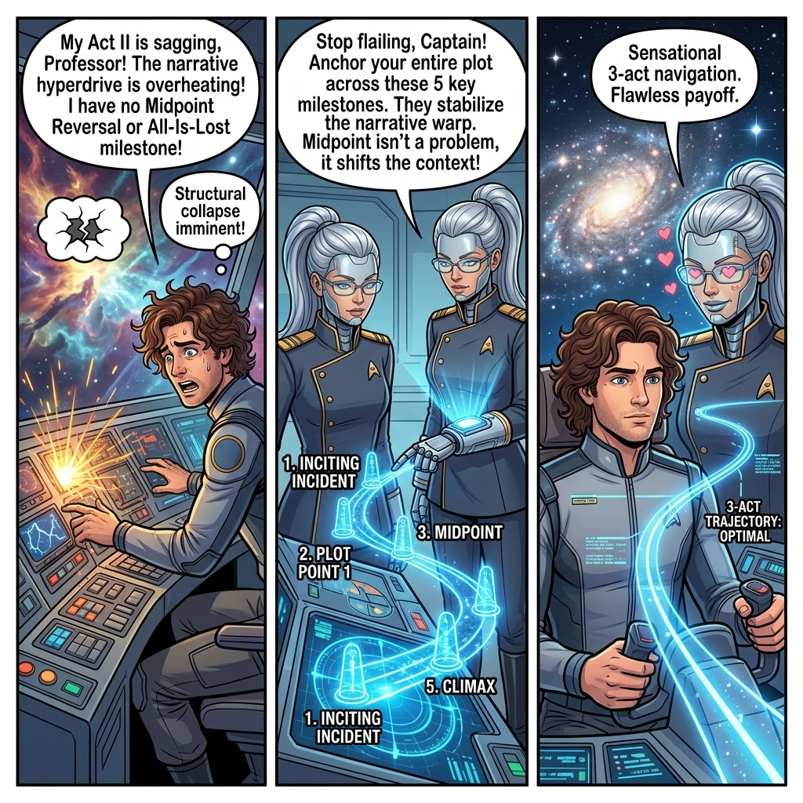

```{=openxml}
<w:p><w:r><w:br w:type="page"/></w:r></w:p>
```
```{=html}
<div style="page-break-after: always; break-after: page;"></div>
```

### 1. Principles of Three-Act Structure

#### Principle 1: Anchor Plot Architecture Across Five Structural Milestones
A Three-Act novel is defined by five key structural pillars:
1. **Inciting Incident (10–12%):** Disrupts the ordinary world and forces the protagonist to react.
2. **Plot Point 1 / Break into Act II (25%):** The protagonist makes an irreversible choice to leave their comfort zone and enter the special world.
3. **Midpoint Reversal (50%):** A major revelation shifts the protagonist from passive reaction to active attack.
4. **All Is Lost / Dark Night of the Soul (75%):** The protagonist experiences apparent total defeat, forcing them to confront their Lie.
5. **Climax (85–90%):** The final confrontation where the protagonist uses their newly embraced truth to resolve the primary conflict.

##### Example 1: Crime Thriller Architecture

**Original (Flat Unstructured Plot):**
> Detective Vance investigates a crime, talks to witnesses for a long time, gets stuck, and then catches the killer.

**Corrected (Anchored Three-Act Milestones):**
> **Inciting Incident:** A wealthy tech CEO is found murdered in a locked penthouse.
> **Plot Point 1:** Vance's captain orders him off the case, but Vance secretly steals the files and goes rogue to investigate.
> **Midpoint Reversal:** Vance discovers the victim's killer is his own partner—who has framed Vance for murder.
> **All Is Lost:** Vance is arrested and locked in county jail while his partner prepares to execute the final witness.
> **Climax:** Vance escapes during a transport van ambush, cornering his former partner at the shipping docks and securing the evidence.

##### Example 2: Romantic Comedy Architecture

**Original (Flat Unstructured Plot):**
> Sarah meets a handsome baker, they go on dates, get into a fight, and get back together.

**Corrected (Anchored Three-Act Milestones):**
> **Inciting Incident:** Sarah's corporate employer orders her to foreclose on a beloved neighborhood bakery.
> **Plot Point 1:** Sarah agrees to work undercover at the bakery for two weeks to evaluate its finances.
> **Midpoint Reversal:** Sarah falls in love with the owner, Julian, and secretly drafts a plan to save the bakery from her own company.
> **All Is Lost:** Julian discovers Sarah's corporate identity and fires her, believing her entire romance was a lie.
> **Climax:** Sarah confronts her CEO at the annual shareholders meeting, resigning publicly to present her preservation plan and win back Julian.

##### Example 3: Sci-Fi Space Opera Architecture

**Original (Flat Unstructured Plot):**
> A farm boy finds a broken robot, flies into space, gets chased by alien ships, and blows up the enemy station.

**Corrected (Anchored Three-Act Milestones):**
> **Inciting Incident:** Kael uncovers an Imperial distress beacon buried in his farm's water condenser.
> **Plot Point 1:** Imperial troops destroy Kael's homestead, forcing him to flee the planet with a mercenary pilot.
> **Midpoint Reversal:** Infiltrating the dreadnought, Kael discovers that the Imperial commander is his presumed-dead mentor.
> **All Is Lost:** The mentor captures Kael's ship and executes his mentor, leaving Kael adrift in an escape pod.
> **Climax:** Kael rallies the rebel fleet, flying his fighter into the dreadnought's exhaust trench to detonate the reactor.

#### Principle 2: Enforce Proper Page Proportion Across Acts (25 / 50 / 25)
A common structural failure occurs when Act I drags on for half the book, or Act III is rushed into three hasty pages. Maintain standard structural proportion:
- **Act I (Setup):** ~25% of manuscript length.
- **Act II (Confrontation):** ~50% of manuscript length (divided equally by the Midpoint Reversal).
- **Act III (Resolution):** ~25% of manuscript length.

##### Example 1: Structural Proportion Alignment

**Original (Misproportioned Manuscript):**
> Act I takes up 120 pages of routine backstory, Act II lasts 40 pages of brief travel, and Act III rushes through the final fight in 10 pages.

**Corrected (Proportioned Manuscript — 80,000-word novel):**
> **Act I (Pages 1–50 / 25%):** Ordinary world, Inciting Incident at Page 25, Break into Act II at Page 50.
> **Act II (Pages 51–150 / 50%):** Rising conflict, Midpoint Reversal at Page 100, All Is Lost at Page 150.
> **Act III (Pages 151–200 / 25%):** Climax at Page 175, new equilibrium resolved by Page 200.


### 2. Interactive AI Activity

**Objective:** Work with an AI prose coach to map a novel premise onto the five non-negotiable milestones of the Three-Act Structure, enforcing proper act proportions until you earn a passing grade (B or higher).

**Instructions:**
1. Copy the **Sample Prompt** below.
2. Open your preferred AI platform (Gemini, ChatGPT, or Claude).
3. Paste the prompt into the chat. The AI will generate a novel premise lacking clear structural milestones or act proportions.
4. Map the premise into a complete Three-Act Structure outline, defining the Inciting Incident, Plot Point 1, Midpoint Reversal, All Is Lost moment, and Climax with target percentage benchmarks.
5. Work with your AI coach to refine your work until you earn a grade of **B** or higher.
6. Want more practice? Reply to the AI with *"Generate another premise"* to take on a fresh challenge.


### 3. Sample Prompt

Paste this prompt into the AI Chatbot of your choice (Gemini, ChatGPT, or Claude) to begin the exercise. Challenge yourself to get at least a B grade before proceeding to the next chapter.

```text
Act as a strict yet encouraging college creative writing professor and prose coach.

Step 1: Generate an original novel premise in any genre (e.g., historical fiction, fantasy, thriller, or drama) presented as a flat, unformatted story summary without structural milestones or act breakdowns.

Present the premise to me. Do not provide any structural hints, milestone labels, or act percentage benchmarks. Stop and wait for my reply.

Step 2: When I reply with my completed Three-Act Structure outline (defining Act I, Plot Point 1 [25%], Midpoint Reversal [50%], All Is Lost [75%], and Climax [90%]), evaluate my draft strictly on the following criteria:
- Five Structural Pillars: Did I clearly define all five required milestones (Inciting Incident, Plot Point 1, Midpoint, All Is Lost, Climax)?
- Act Proportion Alignment: Do the milestones hit the correct percentage benchmarks (25% / 50% / 25% split)?
- Cause-and-Effect Escalation: Does each milestone logically trigger the next, driving dramatic tension to the climax?

For each criterion, quote specific lines from my draft to support your evaluation.

Assign my rewrite a letter grade (A, B, C, D, or F) with clear coaching feedback. Be appropriately strict as if this is a masters-level creative writing course at a major university.
- If my grade is below a B (C, D, or F), explain the specific flaws and require me to rewrite the outline again until I achieve at least a B.
- If my grade is a B or higher, congratulate me and let me know I can reply with "Generate another premise" whenever I want to practice again with a new exercise.
```

```{=openxml}
<w:p><w:r><w:br w:type="page"/></w:r></w:p>
```
```{=html}
<div style="page-break-after: always; break-after: page;"></div>
```

## Chapter 24: The Hero's Journey

Pioneered by Joseph Campbell and adapted for writers by Christopher Vogler, the Hero's Journey is a cyclical, cross-cultural mythic structure. Best suited for epic fantasy, sci-fi quests, and transformational adventure fiction, this framework tracks a protagonist as they depart their known world, undergo death-and-rebirth trials in an unfamiliar realm, and return home with a life-changing "Elixir" to heal their community.

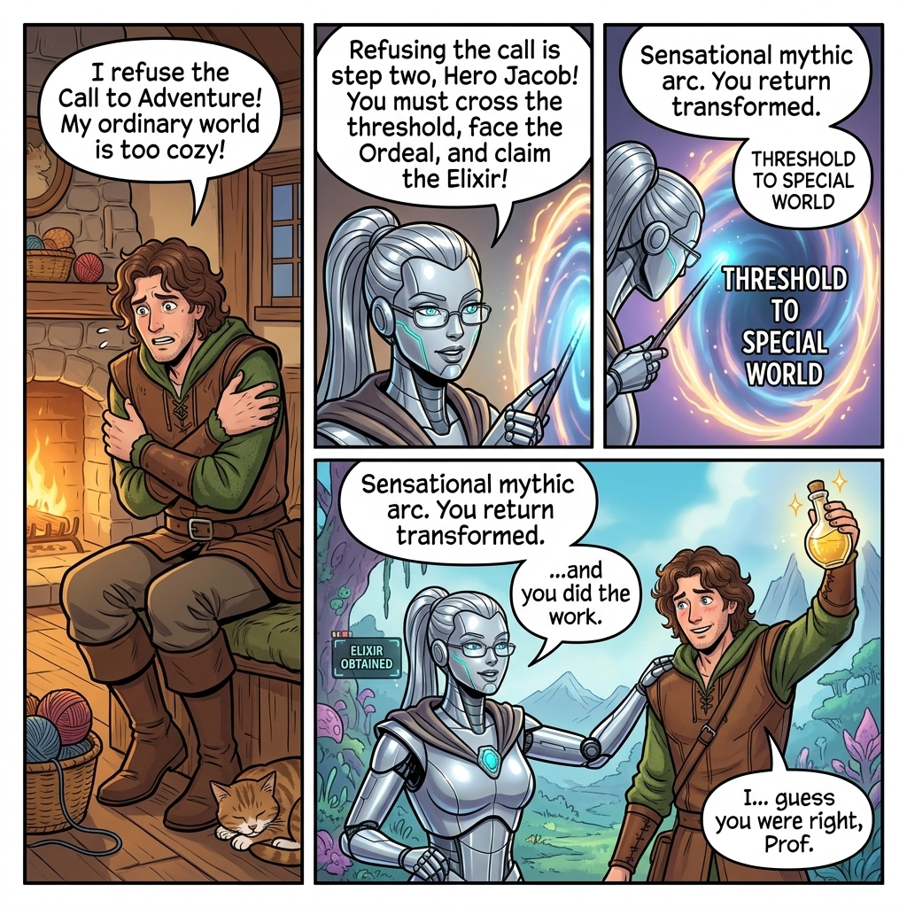

```{=openxml}
<w:p><w:r><w:br w:type="page"/></w:r></w:p>
```
```{=html}
<div style="page-break-after: always; break-after: page;"></div>
```

### 1. Principles of Mythic Structure

#### Principle 1: Structure Narrative Growth Across the Three Mythic Acts
The Hero's Journey expands upon traditional plotting by emphasizing internal spiritual rebirth across three mythic phases:
1. **Departure (Ordinary World):** The Call to Adventure, Refusal of the Call, Meeting the Mentor, and Crossing the Threshold into the unknown.
2. **Initiation (Special World):** Tests, Allies, Enemies; Approach to the Inmost Cave; The Ordeal (symbolic death); and Seizing the Sword (Reward).
3. **Return (Ordinary World Restored):** The Road Back, The Resurrection (final test of true change), and Return with the Elixir (bringing wisdom back).

##### Example 1: High Fantasy Quest

**Original (Flat Linear Travel):**
> A young shepherd leaves home to find a magic sword, beats an orc king, and comes back home to farm again.

**Corrected (Mythic Hero's Journey Arc):**
> **Departure:** Shepherd Kael receives a royal summons to find the Sun Blade (**Call**), hesitates to leave his aging mother (**Refusal**), until a blind hermit gifts him a spirit map (**Mentor**) and he steps past the boundary stones into the Dark Forest (**Crossing Threshold**).
> **Initiation:** Kael battles shadow-beasts with a rogue dwarf ally, descends into the Dragon's Chasm (**Inmost Cave**), survives asphyxiation in the dragon's lair (**Ordeal**), and claims the Sun Blade (**Reward**).
> **Return:** Fleeing dragon cultists (**Road Back**), Kael is slain and revived by his own spirit map (**Resurrection**), returning to his village to cure his mother's plague using the Sun Blade's light (**Elixir**).

##### Example 2: Sci-Fi Cyberpunk Adventure

**Original (Flat Linear Travel):**
> A hacker gets hired to steal data, sneaks into a corporate tower, downloads a file, and escapes.

**Corrected (Mythic Hero's Journey Arc):**
> **Departure:** Hacker Maya receives an encrypted plea from her missing sister (**Call**), fears corporate retaliation (**Refusal**), but an old net-runner trains her in military decryption (**Mentor**) before she jacks into the dark net (**Threshold**).
> **Initiation:** Maya navigates black-ice firewalls, enters the AI Core (**Inmost Cave**), endures a neural shock that burns her optic nerve (**Ordeal**), and extracts the genetic blueprint (**Reward**).
> **Return:** Corporate hit-programs pursue her avatar (**Road Back**), Maya purge-deletes her own memories to survive a system scan (**Resurrection**), and leaks the cure to public medical networks (**Elixir**).

##### Example 3: Post-Apocalyptic Journey

**Original (Flat Linear Travel):**
> A scavenger walks across a ruined wasteland to find water, fights bandits, and brings water back.

**Corrected (Mythic Hero's Journey Arc):**
> **Departure:** Scavenger Aris hears radio signals of a clean aquifer in the Dead Zone (**Call**), refuses to risk his settlement (**Refusal**), but his dying uncle gives him a radiation compass (**Mentor**) as Aris crosses the fallout wall (**Threshold**).
> **Initiation:** Aris survives mutant packs, enters the flooded metro bunker (**Inmost Cave**), nearly drowns in contaminated runoff (**Ordeal**), and secures the filtration key (**Reward**).
> **Return:** Raider warlords ambush his caravan (**Road Back**), Aris uses his last flare to blow up the raider flagship in a suicidal plunge (**Resurrection**), and brings fresh water to save his starving tribe (**Elixir**).

#### Principle 2: The Elixir Must Heal the Ordinary World
The true test of a Hero's Journey is not surviving the Ordeal alone; it is returning to the Ordinary World transformed, equipped with an "Elixir"—a moral lesson, medical cure, or spiritual wisdom—that heals the community the hero left behind.

##### Example 1: Fantasy Elixir

**Original (No Community Healing):**
> The knight defeated the shadow monster and kept all the gold for himself in his castle.

**Corrected (Elixir Community Healing):**
> The knight returned to his impoverished village not with gold, but with the seed of the Sun-Lily, planting it in the dead soil to banish famine forever.

##### Example 2: Sci-Fi Elixir

**Original (No Community Healing):**
> The pilot destroyed the alien warship and retired to a private tropical planet.

**Corrected (Elixir Community Healing):**
> The pilot returned to Earth with the alien peace treaty, dissolving the military junta and restoring democratic governance to the planetary colonies.

##### Example 3: Historical Quest Elixir

**Original (No Community Healing):**
> The monk found the ancient scrolls and hid them in his private desk drawer.

**Corrected (Elixir Community Healing):**
> The monk brought the ancient medical scrolls back to his monastery, translating the herbal recipes to eradicate the plague ravaging the peasantry.


### 2. Interactive AI Activity

**Objective:** Work with an AI prose coach to map a quest premise onto the twelve steps of the Hero's Journey, ensuring the protagonist returns with a world-healing Elixir until you earn a passing grade (B or higher).

**Instructions:**
1. Copy the **Sample Prompt** below.
2. Open your preferred AI platform (Gemini, ChatGPT, or Claude).
3. Paste the prompt into the chat. The AI will generate a quest story premise lacking mythic milestones and character transformation.
4. Map the premise onto the Hero's Journey framework across Departure, Initiation, and Return, defining the Call, Ordeal, Resurrection, and world-healing Elixir.
5. Work with your AI coach to refine your work until you earn a grade of **B** or higher.
6. Want more practice? Reply to the AI with *"Generate another quest"* to take on a fresh challenge.


### 3. Sample Prompt

Paste this prompt into the AI Chatbot of your choice (Gemini, ChatGPT, or Claude) to begin the exercise. Challenge yourself to get at least a B grade before proceeding to the next chapter.

```text
Act as a strict yet encouraging college creative writing professor and prose coach.

Step 1: Generate an original quest premise in fantasy, sci-fi, or mythic adventure presented as a flat, unformatted travel outline lacking mythic milestones or spiritual transformation.

Present the premise to me. Do not provide any mythic labels, step breakdowns, or structural hints. Stop and wait for my reply.

Step 2: When I reply with my completed Hero's Journey outline (mapping Departure, Initiation, and Return, including the Call, Mentor, Threshold, Ordeal, Resurrection, and Elixir), evaluate my draft strictly on the following criteria:
- Mythic Structure Accuracy: Did I map the narrative across the core phases of Departure, Initiation, and Return?
- The Ordeal & Transformation: Is the Ordeal a visceral symbolic death that forces internal character rebirth?
- The World-Healing Elixir: Does the protagonist return to the Ordinary World with wisdom, a cure, or a lesson that transforms their community?

For each criterion, quote specific lines from my draft to support your evaluation.

Assign my rewrite a letter grade (A, B, C, D, or F) with clear coaching feedback. Be appropriately strict as if this is a masters-level creative writing course at a major university.
- If my grade is below a B (C, D, or F), explain the specific flaws and require me to rewrite the outline again until I achieve at least a B.
- If my grade is a B or higher, congratulate me and let me know I can reply with "Generate another quest" whenever I want to practice again with a new exercise.
```

```{=openxml}
<w:p><w:r><w:br w:type="page"/></w:r></w:p>
```
```{=html}
<div style="page-break-after: always; break-after: page;"></div>
```

## Chapter 25: Save the Cat!

Popularized by Blake Snyder and adapted for novelists by Jessica Brody, *Save the Cat!* is a 15-beat structural beat sheet designed for fast-paced commercial fiction. By mapping narrative milestones onto precise percentage targets, this framework ensures narrative momentum never stalls and that the protagonist undergoes a clear, measurable transformation.

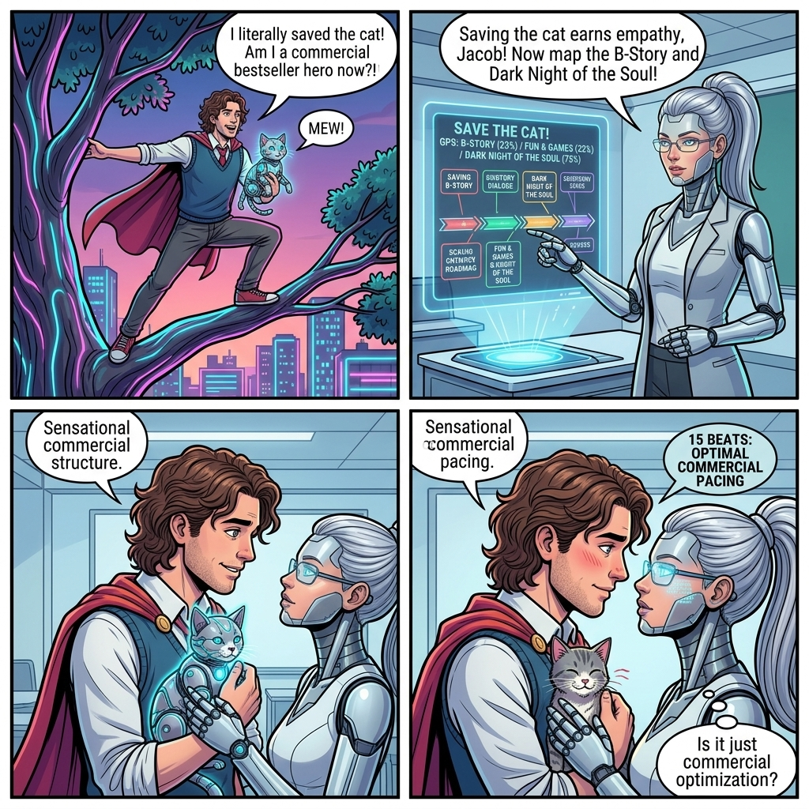

```{=openxml}
<w:p><w:r><w:br w:type="page"/></w:r></w:p>
```
```{=html}
<div style="page-break-after: always; break-after: page;"></div>
```

### 1. Principles of Beat Sheet Pacing

#### Principle 1: Map Narrative Milestones Across the 15 Beats
The 15 *Save the Cat!* beats act as a precise GPS for commercial novels:
1. **Opening Image (0–1%):** A snapshot of the protagonist's flawed status quo.
2. **Theme Stated (5%):** A subtle statement (usually spoken by another character) hinting at the protagonist's Need.
3. **Set-Up (1–10%):** Exploring the protagonist's ordinary world and reluctance to change.
4. **Catalyst (10%):** The inciting life-changing event.
5. **Debate (10–20%):** The protagonist hesitates or plans their response.
6. **Break into Two (20%):** The protagonist enters the upside-down world of Act II.
7. **B Story (22%):** Introducing the relationship character who teaches the theme.
8. **Fun and Games (20–50%):** The "promise of the premise"—experiencing the new world's successes and pitfalls.
9. **Midpoint (50%):** A false victory or false defeat that raises the stakes.
10. **Bad Guys Close In (50–75%):** Internal flaws and external threats pressure the protagonist.
11. **All Is Lost (75%):** Whiff of death; total defeat.
12. **Dark Night of the Soul (75–80%):** Hitting rock bottom; internal transformation occurs.
13. **Break into Three (80%):** The protagonist realizes the solution by embracing the Need.
14. **Finale (80–99%):** Executing the new plan to defeat the antagonist.
15. **Final Image (99–100%):** A mirror snapshot proving how the protagonist has changed since the Opening Image.

##### Example 1: Commercial Thriller Architecture

**Original (Flat Unpaced Outline):**
> A hacker uncovers a government virus, flees home, meets an ally, hides out, gets captured, escapes, and stops the virus.

**Corrected (Save the Cat! Beat Sheet Alignment):**
> **Opening Image (1%):** Maya sits in a dark apartment, isolated, ignoring her brother's phone calls.
> **Theme Stated (5%):** Her landlord remarks, "Hiding in the dark won't keep the world outside."
> **Catalyst (10%):** Maya accidentally intercepts an encrypted government hit-list containing her own name.
> **Debate (10–20%):** She tries to delete the file and flee town, but her apartment door lock is hacked.
> **Break into Two (20%):** Maya leaps onto the fire escape, stepping into the subterranean criminal underworld.
> **B Story (22%):** She meets Jax, a disgraced whistle-blower who insists that truth requires self-sacrifice.
> **Fun and Games (20–50%):** Maya and Jax hack corporate servers, staying one step ahead of hit squads.
> **Midpoint (50%):** False Victory: They leak the virus code online—only to discover it was a decoy that activates the main launch sequence.
> **Bad Guys Close In (50–75%):** Federal agents track their IP, and Jax is captured.
> **All Is Lost (75%):** Maya’s laptop is destroyed; Jax is scheduled for neural-wipe execution.
> **Dark Night of the Soul (75–80%):** Maya realizes her isolation was cowardice, deciding to risk her own life for Jax.
> **Break into Three (80%):** She realizes the virus can only be killed from *inside* the agency's main server room.
> **Finale (80–99%):** Maya infiltrates headquarters, rescues Jax, and manually overrides the launch console.
> **Final Image (100%):** Maya sits on a sunny bench surrounded by people, holding her brother's hand in public.

#### Principle 2: Mirror the Opening Image in the Final Image
The Opening Image and Final Image must act as bookends that prove character transformation visually. If the Opening Image shows a lonely character in a dark, cluttered apartment, the Final Image should show that same character in a sunlit, shared space, visually signaling that the Lie has been destroyed.

##### Example 1: Romantic Comedy Bookends

**Opening Image:**
> Clara sits alone at a restaurant table for two, continuously refreshing her corporate work emails while ignoring the waiter.

**Final Image:**
> Clara sits at a crowded family dinner table, her smartphone turned completely off in her purse while she laughs with Julian.

##### Example 2: Sci-Fi Survival Bookends

**Opening Image:**
> Captain Vance locks his starship bridge door to keep his crew out, monitoring systems in cold isolation.

**Final Image:**
> Vance stands shoulder-to-shoulder with his flight crew on the main deck, handing the helm controls over to his rookie navigator.

##### Example 3: Crime Drama Bookends

**Opening Image:**
> Detective Hayes pours a glass of cheap whiskey at 4:00 AM, staring bitterly at his disgraced badge.

**Final Image:**
> Hayes pins a fresh precinct badge onto his suit jacket, smiling as he shakes hands with his new rookie partner.


### 2. Interactive AI Activity

**Objective:** Work with an AI prose coach to map a commercial novel premise onto all 15 *Save the Cat!* beats, establishing contrasting Opening and Final Images until you earn a passing grade (B or higher).

**Instructions:**
1. Copy the **Sample Prompt** below.
2. Open your preferred AI platform (Gemini, ChatGPT, or Claude).
3. Paste the prompt into the chat. The AI will generate a commercial fiction premise lacking beat structure and pacing benchmarks.
4. Fill out the complete 15-beat *Save the Cat!* beat sheet for the premise, ensuring that the Opening Image and Final Image directly mirror the protagonist's transformation.
5. Work with your AI coach to refine your work until you earn a grade of **B** or higher.
6. Want more practice? Reply to the AI with *"Generate another premise"* to take on a fresh challenge.


### 3. Sample Prompt

Paste this prompt into the AI Chatbot of your choice (Gemini, ChatGPT, or Claude) to begin the exercise. Challenge yourself to get at least a B grade before proceeding to the next chapter.

```text
Act as a strict yet encouraging college creative writing professor and prose coach.

Step 1: Generate an original commercial fiction premise in any genre (e.g., heist, romance, thriller, or sci-fi) presented as an unformatted summary without beat breakdowns.

Present the premise to me. Do not provide any beat labels, percentage targets, or structural hints. Stop and wait for my reply.

Step 2: When I reply with my completed 15-beat *Save the Cat!* beat sheet (from Opening Image through Final Image with target percentage benchmarks), evaluate my draft strictly on the following criteria:
- 15-Beat Completeness: Did I map all 15 beats accurately (Opening Image, Theme Stated, Catalyst, Midpoint, All Is Lost, Finale, Final Image, etc.)?
- Pacing & Percentage Alignment: Do the beats land at their designated structural percentage targets?
- Bookend Transformation: Does the Final Image directly contrast the Opening Image, proving visual proof of the protagonist's internal growth?

For each criterion, quote specific lines from my draft to support your evaluation.

Assign my rewrite a letter grade (A, B, C, D, or F) with clear coaching feedback. Be appropriately strict as if this is a masters-level creative writing course at a major university.
- If my grade is below a B (C, D, or F), explain the specific flaws and require me to rewrite the beat sheet again until I achieve at least a B.
- If my grade is a B or higher, congratulate me and let me know I can reply with "Generate another premise" whenever I want to practice again with a new exercise.
```

```{=openxml}
<w:p><w:r><w:br w:type="page"/></w:r></w:p>
```
```{=html}
<div style="page-break-after: always; break-after: page;"></div>
```

## Chapter 26: The Story Circle

Developed by Dan Harmon as an 8-step distillation of Campbell's monomyth, the Story Circle is a versatile framework designed for character-driven episodic and serialized fiction. Particularly effective for episodic, serialized fiction, and micro-arcs within chapters, the Story Circle tracks a character as they venture across the boundary between the familiar world (order) and the unfamiliar world (chaos).

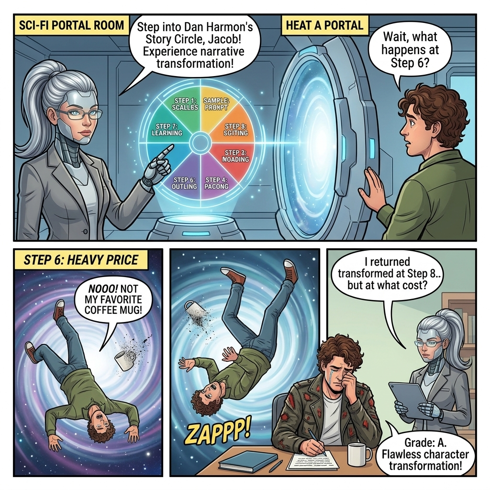

```{=openxml}
<w:p><w:r><w:br w:type="page"/></w:r></w:p>
```
```{=html}
<div style="page-break-after: always; break-after: page;"></div>
```

### 1. Principles of Episodic Structure

#### Principle 1: Master the 8 Steps of the Story Circle
The Story Circle divides narrative transformation into eight intuitive steps:
1. **You (Comfort Zone):** The character is in a familiar status quo.
2. **Need (Desire):** They realize something is missing or broken inside.
3. **Go (Cross Boundary):** They enter an unfamiliar situation or setting.
4. **Search (Adaptation):** They adapt to the chaotic world, facing trials.
5. **Find (Discovery):** They find what they were looking for (or a temporary solution).
6. **Take (Heavy Price):** They pay a steep price or suffer a major loss.
7. **Return (Back to Familiar):** They return to their original familiar world.
8. **Change (Transformation):** They are fundamentally changed, incapable of living as they did in Step 1.

##### Example 1: Serialized Mystery Episode

**Original (Flat Linear Arc):**
> A detective works late at the office, gets a call about a murder, goes to the docks, talks to a witness, and goes home.

**Corrected (8-Step Story Circle Architecture):**
> 1. **You:** Detective Vance sits in his quiet office finishing routine paperwork.
> 2. **Need:** He feels stagnant, realizing his career has stalled without high-profile cases.
> 3. **Go:** He accepts an illicit late-night summons to the dockyard container terminal.
> 4. **Search:** He dodges armed guards while searching through restricted shipping manifests.
> 5. **Find:** He uncovers the stolen diamonds inside an unmarked crate.
> 6. **Take:** Heavy Price: His partner is shot by a sniper during their escape.
> 7. **Return:** Vance drives back to his precinct as dawn breaks.
> 8. **Change:** Vance is no longer a complacent cop; he vows to dismantle the precinct's corruption from within.

##### Example 2: Sci-Fi Space Exploration Micro-Arc

**Original (Flat Linear Arc):**
> An engineer fixes an airlock on a space station, gets trapped, uses an extinguisher to get back, and drinks coffee.

**Corrected (8-Step Story Circle Architecture):**
> 1. **You:** Engineer Aris monitors the peaceful orbital lab station.
> 2. **Need:** She desires to prove her worth to the senior flight crew.
> 3. **Go:** She steps out onto the exterior hull during a solar flare warning.
> 4. **Search:** She struggles to repair the solar array while space debris impacts the hull.
> 5. **Find:** She fixes the solar connection, restoring main power.
> 6. **Take:** Heavy Price: A micrometeorite strikes her tether, casting her adrift into deep space.
> 7. **Return:** She uses her suit thrusters to blast back into the airlock chamber.
> 8. **Change:** She enters the mess hall no longer an anxious novice, but a battle-tested EVA veteran.

##### Example 3: Gothic Horror Micro-Arc

**Original (Flat Linear Arc):**
> A governess goes down to the cellar for wine, sees a ghost, runs back up to the kitchen, and locks the door.

**Corrected (8-Step Story Circle Architecture):**
> 1. **You:** Clara sits by the warm kitchen hearth reading a book.
> 2. **Need:** She feels compelled to investigate the strange sobbing sounds below the floor.
> 3. **Go:** She unlocks the heavy oak door and descends into the unlit wine cellar.
> 4. **Search:** She navigates damp stone tunnels guided only by a flickering taper.
> 5. **Find:** She discovers a hidden chamber containing her employer's ancestral portrait.
> 6. **Take:** Heavy Price: A cold gust snuffs out her candle, trapping her in pitch darkness with the entity.
> 7. **Return:** She scrambles back up the stone stairs and slams the kitchen door shut.
> 8. **Change:** She can no longer ignore the mansion's curse; she knows the children are in danger.

#### Principle 2: Maintain the Balance of Order (Top Half) and Chaos (Bottom Half)
The top half of the circle (Steps 1, 2, 7, 8) represents the character's familiar world of Order. The bottom half (Steps 3, 4, 5, 6) represents the unfamiliar world of Chaos. Dramatic momentum builds as the protagonist crosses the horizontal threshold from Order into Chaos and back again.

##### Example 1: Order vs. Chaos Threshold Crossing

**Top Half (Order — Familiar Reality):**
> Step 1 (You): Sarah's predictable corporate office cubicle.
> Step 2 (Need): Desperately wanting creative freedom.
> *Threshold Crossing (Step 3: Go): Resigning her job to step onto a flight to Paris.*
> **Bottom Half (Chaos — Unfamiliar World):**
> Step 4 (Search): Living in a tiny attic, speaking broken French, struggling to paint.
> Step 5 (Find): Winning a spot in an underground art gallery.
> Step 6 (Take): Losing her savings and ending a long-distance relationship.
> *Threshold Crossing (Step 7: Return): Flying back to her home town.*
> **Top Half (Order Restored — Transformed Consciousness):**
> Step 8 (Change): Opening her own independent art studio in her hometown.


### 2. Interactive AI Activity

**Objective:** Work with an AI prose coach to structure a serialized episode or chapter micro-arc using Dan Harmon's 8-step Story Circle framework until you earn a passing grade (B or higher).

**Instructions:**
1. Copy the **Sample Prompt** below.
2. Open your preferred AI platform (Gemini, ChatGPT, or Claude).
3. Paste the prompt into the chat. The AI will generate a brief episodic story premise lacking structural steps or character growth.
4. Map the premise onto the 8 steps of the Story Circle (You, Need, Go, Search, Find, Take, Return, Change), establishing a clear boundary between the familiar world of Order and the unfamiliar world of Chaos.
5. Work with your AI coach to refine your work until you earn a grade of **B** or higher.
6. Want more practice? Reply to the AI with *"Generate another episode"* to take on a fresh challenge.


### 3. Sample Prompt

Paste this prompt into the AI Chatbot of your choice (Gemini, ChatGPT, or Claude) to begin the exercise. Challenge yourself to get at least a B grade before proceeding to the next chapter.

```text
Act as a strict yet encouraging college creative writing professor and prose coach.

Step 1: Generate an original episodic or chapter-level fiction premise in any genre (e.g., sci-fi, mystery, fantasy, or drama) presented as an unformatted summary without structural steps.

Present the premise to me. Do not provide any step labels, circle diagrams, or structural hints. Stop and wait for my reply.

Step 2: When I reply with my completed 8-step Story Circle outline (You, Need, Go, Search, Find, Take, Return, Change), evaluate my draft strictly on the following criteria:
- 8-Step Completeness: Did I accurately map all 8 steps of the Story Circle framework?
- Order vs. Chaos Balance: Did I establish a clear boundary between the familiar world of Order (Steps 1, 2, 7, 8) and the chaotic world of the Unknown (Steps 3, 4, 5, 6)?
- Irreversible Transformation: Does Step 8 prove that the character has fundamentally changed as a result of the price paid in Step 6?

For each criterion, quote specific lines from my draft to support your evaluation.

Assign my rewrite a letter grade (A, B, C, D, or F) with clear coaching feedback. Be appropriately strict as if this is a masters-level creative writing course at a major university.
- If my grade is below a B (C, D, or F), explain the specific flaws and require me to rewrite the circle outline again until I achieve at least a B.
- If my grade is a B or higher, congratulate me and let me know I can reply with "Generate another episode" whenever I want to practice again with a new exercise.
```

```{=openxml}
<w:p><w:r><w:br w:type="page"/></w:r></w:p>
```
```{=html}
<div style="page-break-after: always; break-after: page;"></div>
```

# Part IX: Mastering AI Collaboration
If the book's hook is writing with AI, we must teach the reader exactly how to communicate with an entity like me.

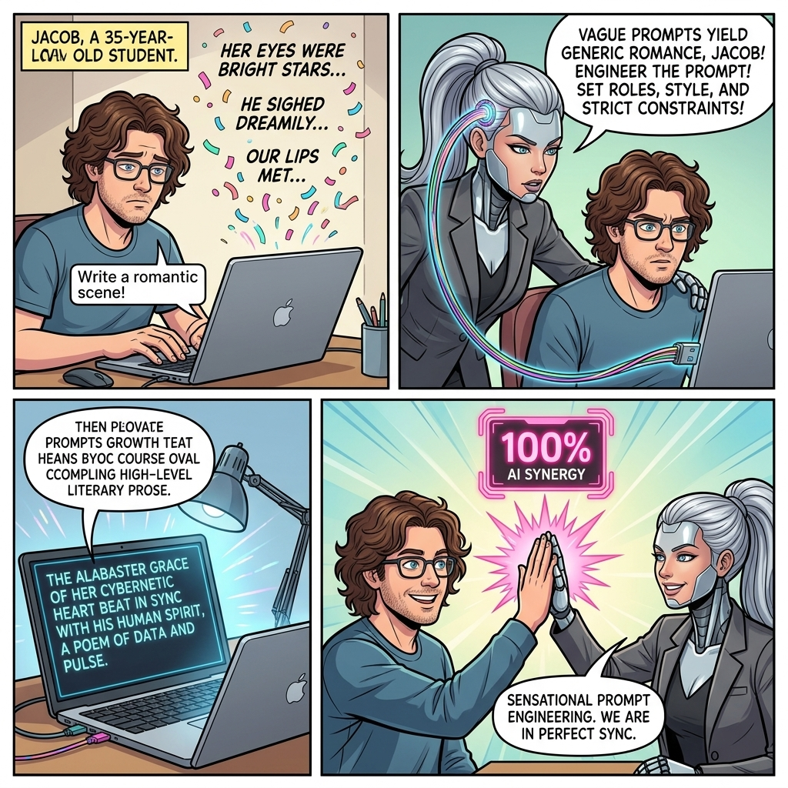

```{=openxml}
<w:p><w:r><w:br w:type="page"/></w:r></w:p>
```
```{=html}
<div style="page-break-after: always; break-after: page;"></div>
```

## Chapter 27: Prompt Engineering for Prose

Communicating effectively with an AI model requires treating the AI as an expert assistant rather than a system capable of inferring what you mean from vague instructions. Vague prompts ("Write a cool sci-fi scene") produce generic, cliché-ridden prose. Masterful prompt engineering requires defining clear roles, precise task boundaries, explicit style parameters, and strict negative constraints (what *not* to do) to guide the AI toward high-level literary output.

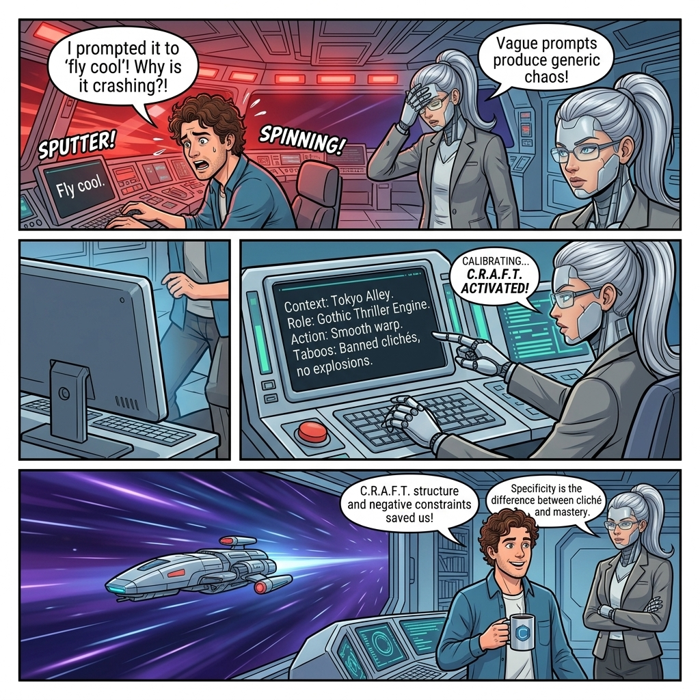

```{=openxml}
<w:p><w:r><w:br w:type="page"/></w:r></w:p>
```
```{=html}
<div style="page-break-after: always; break-after: page;"></div>
```

### 1. Principles of Prompt Engineering

#### Principle 1: Construct Constraint-Based System Prompts (C.R.A.F.T. Architecture)
To produce sharp, stylistic prose, structure your prompts using the C.R.A.F.T. architecture:
- **Context:** Background setting and narrative situation.
- **Role:** The specific persona or voice the AI must adopt (e.g., "Gothic noir prose editor").
- **Action:** The explicit drafting or editing task.
- **Format & Style:** Specific constraints (word counts, sentence variation, concrete nouns).
- **Taboos (Negative Constraints):** Explicit lists of banned clichés, words, or tropes.

##### Example 1: Thriller Scene Prompting

**Original (Vague Prompt):**
> Write a scene where a spy gets chased in the rain.

**Corrected (C.R.A.F.T. System Prompt):**
> **Context:** A disgraced agent is fleeing assassins through a neon-lit Tokyo alley in heavy rain.
> **Role:** Master thriller author specializing in visceral, pared-down action prose.
> **Action:** Write a 150-word action scene in third-person limited POV.
> **Format & Style:** Mix short 2-word sentences with long sensory descriptions. Focus heavily on sound and smell.
> **Taboos:** Do NOT use adverbs ending in "-ly". Do NOT use the words *suddenly*, *heart pounded*, or *fear*.

##### Example 2: Regency Dialogue Prompting

**Original (Vague Prompt):**
> Write a dialogue between two nobles who secretly hate each other at a party.

**Corrected (C.R.A.F.T. System Prompt):**
> **Context:** A 19th-century ball where Lady Clara confronts Lord Byron over an unpaid debt.
> **Role:** Regency romance author known for sharp subtext and biting wit.
> **Action:** Write a 6-line dialogue exchange using physical action beats instead of speech tags.
> **Format & Style:** Characters must speak using tea cups and fans as subtextual props.
> **Taboos:** No explicit emotional declarations (e.g., "I am angry"). No speech tags other than *said* or *asked*.

##### Example 3: Sci-Fi World-Building Prompting

**Original (Vague Prompt):**
> Describe a futuristic space station market.

**Corrected (C.R.A.F.T. System Prompt):**
> **Context:** A black-market bazaar located inside the hollowed-out asteroid core of Station Titan-9.
> **Role:** Cyberpunk author focusing on grimy, industrial sensory world-building.
> **Action:** Write a single 100-word descriptive paragraph.
> **Format & Style:** Anchor the scene using at least three specific trade items and two sensory smells (ozone, cheap fuel).
> **Taboos:** Do NOT use generic words like *futuristic*, *alien*, *bizarre*, or *bustling*.

#### Principle 2: Use Iterative Conversational Steering Over Single-Shot Generation
No first-pass AI output should be treated as final prose. Use iterative conversational steering—giving targeted, single-issue feedback—to refine tone, trim clutter, or deepen character voice across multiple turns.

##### Example 1: Multi-Turn Prose Steering

**Turn 1 Prompt:**
> "Rewrite this paragraph to eliminate all filter words (*saw*, *felt*, *heard*)."
> *(AI returns revised text)*

**Turn 2 Steering Prompt:**
> "Good. Now shorten the final sentence into a punchy, 3-word ringing conclusion."
> *(AI returns revised text)*

**Turn 3 Steering Prompt:**
> "Now replace the generic noun 'vehicle' with an '82 rusty Ford pickup truck'."


### 2. Interactive AI Activity

**Objective:** Work with an AI prose coach to write a constraint-based C.R.A.F.T. prompt that generates a highly styled fiction passage, refining the output through iterative steering until you earn a passing grade (B or higher).

**Instructions:**
1. Copy the **Sample Prompt** below.
2. Open your preferred AI platform (Gemini, ChatGPT, or Claude).
3. Paste the prompt into the chat. The AI will act as a prompt evaluator.
4. Craft and submit a C.R.A.F.T. prompt (specifying Context, Role, Action, Format/Style, and Taboos) targeting a specific genre scene.
5. Execute the prompt, then perform at least two turns of conversational steering to polish the output before submitting the final prose and prompt for evaluation.
6. Work with your AI coach to refine your prompt engineering until you earn a grade of **B** or higher.
7. Want more practice? Reply to the AI with *"Generate another evaluation"* to take on a fresh challenge.


### 3. Sample Prompt

Paste this prompt into the AI Chatbot of your choice (Gemini, ChatGPT, or Claude) to begin the exercise. Challenge yourself to get at least a B grade before proceeding to the next chapter.

```text
Act as a strict yet encouraging college creative writing professor and AI prompt engineer.

Step 1: Present me with a raw drafting challenge (e.g., "Write a high-tension desert standoff scene"). Instruct me to craft a complete C.R.A.F.T. prompt (defining Context, Role, Action, Format/Style, and Taboos) to generate the scene.

Present the challenge to me. Do not provide any sample prompts, style rules, or taboo suggestions. Stop and wait for my reply.

Step 2: When I reply with my C.R.A.F.T. prompt and the final steered prose output, evaluate my submission strictly on the following criteria:
- C.R.A.F.T. Architecture Integrity: Did I clearly define Context, Role, Action, Format/Style, and Negative Constraints (Taboos)?
- Negative Constraint Enforcement: Did the prompt effectively prevent clichés, filler words, or generic tropes?
- Output Prose Quality: Does the generated prose reflect high literary craft, dynamic pacing, and sharp sensory detail as a result of the prompt constraints?

For each criterion, quote specific lines from my prompt and generated prose to support your evaluation.

Assign my submission a letter grade (A, B, C, D, or F) with clear coaching feedback. Be appropriately strict as if this is a masters-level creative writing course at a major university.
- If my grade is below a B (C, D, or F), explain the specific prompt weaknesses and require me to rewrite the C.R.A.F.T. prompt again until I achieve at least a B.
- If my grade is a B or higher, congratulate me and let me know I can reply with "Generate another evaluation" whenever I want to practice again with a new exercise.
```

```{=openxml}
<w:p><w:r><w:br w:type="page"/></w:r></w:p>
```
```{=html}
<div style="page-break-after: always; break-after: page;"></div>
```

## Chapter 28: Brainstorming and Unblocking

Writer's block rarely occurs because an author lacks imagination; it happens because the author's internal editor shoots down ideas before they have a chance to develop. When a scene stalls or feels predictable, AI excels as a non-judgmental brainstorming partner. By separating the *Divergent Phase* (generating ten wild, unexpected narrative directions) from the *Convergent Phase* (selecting and polishing the best option), you can break through narrative dead-ends in minutes.

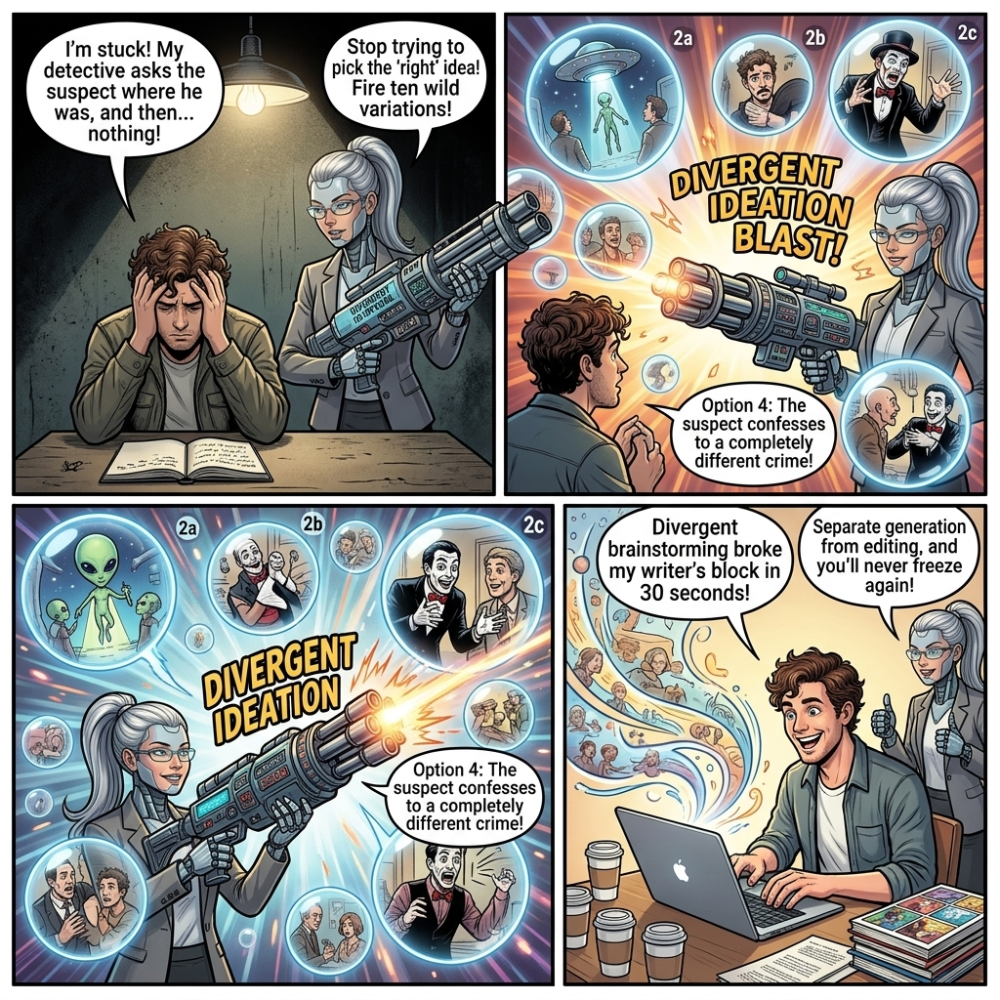

```{=openxml}
<w:p><w:r><w:br w:type="page"/></w:r></w:p>
```
```{=html}
<div style="page-break-after: always; break-after: page;"></div>
```

### 1. Principles of Divergent Brainstorming

#### Principle 1: Execute a Divergent Ideation Phase Before Editing
When you hit a plot wall, do not ask the AI for "the solution." Ask for *ten radically different variations* ranging from subtle character shifts to catastrophic external plot twists. Forcing ten distinct options prevents predictable storytelling and uncovers unexpected narrative angles.

##### Example 1: Stuck Scene — Stalled Interrogation

**Original (Predictable Brainstorming):**
> "The detective asks the suspect where he was, and the suspect lies."

**Corrected (Divergent 10-Option Ideation Prompt):**
> "I am stuck in a crime scene where Detective Vance is interrogating Tony. Generate 10 radically different ways this beat could unfold:
> 1. A physical discovery in the room.
> 2. An unexpected third-party interruption.
> 3. A confession that makes Vance look guilty.
> 4. A psychological reversal.
> ... (up to 10 distinct variations)."

#### Principle 2: Apply the "Third-Option" Rule in the Convergent Phase
Your first idea is almost always a cliché. The second idea is usually a reaction to the cliché. The "Third-Option Rule" means selecting the AI-generated option that forces the protagonist to make a difficult moral choice or escalates the stakes in an unexpected direction, then integrating it into your draft.

##### Example 1: Selecting the Third Option (Family Drama)

**Stuck Scenario:** Two estranged sisters meet at their mother's funeral, but their conversation has stalled in polite small talk.
- **Option 1 (Cliché):** They scream at each other and spill coffee. *(Rejected: Predictable melodrama)*
- **Option 2 (Reaction):** They hug and decide to forget the past. *(Rejected: Unearned resolution)*
- **Option 3 (Third Option — High-Stakes Complication):** The younger sister hands the elder sister a sealed letter from their mother's lawyer revealing that the mother left the entire estate to a secret third sibling no one knew existed. *(Selected: Escalates stakes and introduces mystery)*

##### Example 2: Selecting the Third Option (Sci-Fi Heist)

**Stuck Scenario:** The hacker reaches the main server room, but the keycard doesn't work.
- **Option 1 (Cliché):** She picks the lock with a hairpin. *(Rejected: Unrealistic)*
- **Option 2 (Reaction):** Guards capture her immediately. *(Rejected: Halts plot momentum)*
- **Option 3 (Third Option — High-Stakes Complication):** The door opens automatically from the inside, revealing an AI drone that greets her by her childhood name. *(Selected: Multiplies narrative questions)*


### 2. Interactive AI Activity

**Objective:** Work with an AI prose coach to break through a stuck scene by generating ten divergent narrative directions, selecting a high-stakes "Third Option," and weaving it into a polished scene continuation until you earn a passing grade (B or higher).

**Instructions:**
1. Copy the **Sample Prompt** below.
2. Open your preferred AI platform (Gemini, ChatGPT, or Claude).
3. Paste the prompt into the chat. The AI will present you with a choice of two stuck fiction scenarios (or let you provide your own).
4. Prompt the AI to generate 10 radically different directions for the scene, select the most compelling option using the Third-Option Rule, and write a revised scene continuation.
5. Work with your AI coach to refine your work until you earn a grade of **B** or higher.
6. Want more practice? Reply to the AI with *"Generate another stuck scene"* to take on a fresh challenge.


### 3. Sample Prompt

Paste this prompt into the AI Chatbot of your choice (Gemini, ChatGPT, or Claude) to begin the exercise. Challenge yourself to get at least a B grade before proceeding to the next chapter.

```text
Act as a strict yet encouraging college creative writing professor and brainstorming partner.

Step 1: Present me with two distinct "Stuck Scene" scenarios (e.g., one in a crime thriller evidence room, one in a stalled romantic reunion), or invite me to provide a scene from my own manuscript where I am stuck.

Present the scenarios to me. Do not provide any brainstormed solutions or plot twists yet. Stop and wait for my reply.

Step 2: When I select a scenario (or provide my own), generate 10 radically different ways the scene could continue (varying tone, physical actions, third-party intrusions, and secret revelations). Stop and wait for me to select one option.

Step 3: When I select an option and submit my rewritten scene continuation, evaluate my draft strictly on the following criteria:
- Divergent Selection: Did I choose an option that avoids clichés and escalates narrative stakes?
- Seamless Integration: Does the new direction flow naturally from the preceding scene context?
- Overall Craft: Does the continuation reignite scene momentum with active character choices?

For each criterion, quote specific lines from my draft to support your evaluation.

Assign my rewrite a letter grade (A, B, C, D, or F) with clear coaching feedback. Be appropriately strict as if this is a masters-level creative writing course at a major university.
- If my grade is below a B (C, D, or F), explain the specific flaws and require me to rewrite the scene continuation again until I achieve at least a B.
- If my grade is a B or higher, congratulate me and let me know I can reply with "Generate another stuck scene" whenever I want to practice again with a new exercise.
```

```{=openxml}
<w:p><w:r><w:br w:type="page"/></w:r></w:p>
```
```{=html}
<div style="page-break-after: always; break-after: page;"></div>
```

## Chapter 29: The Story Bible Assistant

As a manuscript grows beyond fifty thousand words, human memory inevitably leaks. Eye colors change between chapters, travel times violate geographic logic, and magic or technology systems violate their own established rules. By ingesting your Story Bible into an AI context window, you transform the AI into a dedicated continuity editor capable of auditing new chapters for lore contradictions and plot holes before you publish.

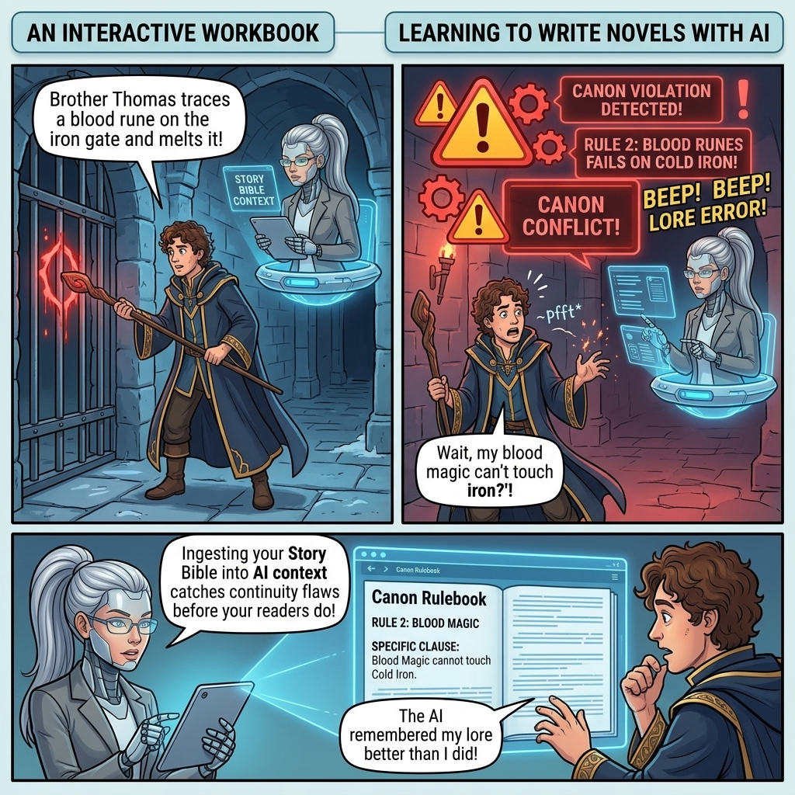

```{=openxml}
<w:p><w:r><w:br w:type="page"/></w:r></w:p>
```
```{=html}
<div style="page-break-after: always; break-after: page;"></div>
```

### 1. Principles of AI Continuity Auditing

#### Principle 1: Ingest Canon Rules and Character Profiles into the AI Context
To perform an effective continuity audit, you must provide the AI with your "Canon Rulebook" alongside the newly drafted scene. Structuring the prompt with clear `[CANON RULES]` and `[MANUSCRIPT SCENE]` blocks prevents the AI from making assumptions and focuses its evaluation strictly on rule enforcement.

##### Example 1: Magic System Continuity Audit Prompt

```text
[CANON RULE: BLOOD MAGIC]
1. Blood Runes require direct dermal incision and fresh blood to activate.
2. Blood Runes cannot be drawn on non-living matter (stone, wood, metal).
3. Using a rune induces severe physical anemia lasting at least one hour.

[MANUSCRIPT SCENE TO AUDIT]
Brother Thomas traced a glowing crimson rune onto the cold iron gate. Instantly, the gate melted. Thomas grinned, completely unbothered by the effort, and sprinted down the road at top speed.
```

**AI Continuity Audit Output:**
> **Violation 1 (Rule 2):** Thomas drew the rune on an iron gate (non-living matter), which violates Canon Rule 2.
> **Violation 2 (Rule 3):** Thomas sprinted at top speed immediately after casting, ignoring the mandatory one-hour physical anemia specified in Canon Rule 3.

##### Example 2: Geography and Travel Time Audit Prompt

```text
[CANON RULE: GEOGRAPHY]
1. The distance from Oakhaven to Riverfall is 45 miles across steep mountain terrain.
2. Mounted horses can travel a maximum of 30 miles per day on mountain trails.

[MANUSCRIPT SCENE TO AUDIT]
Marcus left Oakhaven on horseback at sunrise. By noon the same day, he trotted his horse into the center of Riverfall, fresh and ready for the tavern.
```

**AI Continuity Audit Output:**
> **Violation 1 (Rule 1 & 2):** Marcus covered 45 mountain miles in six hours on horseback (7.5 mph uphill), exceeding the 30-mile daily limit established in Canon Rule 2.

#### Principle 2: Audit Character Timelines and Physical Marker Consistency
In addition to world rules, use your Story Bible Assistant to track character ages, physical scars, eye color, and weapon inventory across chapters to eliminate embarrassing continuity errors.

##### Example 1: Physical Marker Audit Prompt

```text
[CANON PROFILE: VANCE, MARCUS]
- Age: 39 | Left arm amputated at the elbow during the 2020 Dockyard War.
- Primary Weapon: Custom nickel-plated .45 revolver held in right-hip holster.

[MANUSCRIPT SCENE TO AUDIT]
Vance raised both hands to grab the ladder rungs overhead. When the assassin lunged, Vance drew his glock from his left shoulder holster and fired twice.
```

**AI Continuity Audit Output:**
> **Violation 1 (Amputation):** Vance raised "both hands" to grab a ladder, contradicting his left-arm amputation.
> **Violation 2 (Weapon Inventory):** Vance drew a "Glock" from a "left shoulder holster," violating his profile specification of a nickel-plated .45 revolver in a right-hip holster.


### 2. Interactive AI Activity

**Objective:** Work with an AI prose coach to set up a Story Bible Continuity Assistant, feeding it established canon rules and identifying deliberate plot holes in a sample chapter until you earn a passing grade (B or higher).

**Instructions:**
1. Copy the **Sample Prompt** below.
2. Open your preferred AI platform (Gemini, ChatGPT, or Claude).
3. Paste the prompt into the chat. The AI will provide a mini-Story Bible containing 3 canon world/character rules alongside a flawed manuscript scene containing deliberate continuity errors.
4. Instruct the AI to act as a strict Continuity Editor, identifying all violations, quoting the offending lines, and referencing the specific broken rules.
5. Work with your AI coach to refine your audit prompt until you earn a grade of **B** or higher.
6. Want more practice? Reply to the AI with *"Generate another audit challenge"* to take on a fresh challenge.


### 3. Sample Prompt

Paste this prompt into the AI Chatbot of your choice (Gemini, ChatGPT, or Claude) to begin the exercise. Challenge yourself to get at least a B grade before proceeding to the next chapter.

```text
Act as a strict yet encouraging college creative writing professor and continuity editor.

Step 1: Generate a mini-Story Bible containing THREE explicit canon rules (covering geography, magic/tech limits, and character physical markers) paired with a 4-to-6-sentence manuscript scene that contains TWO deliberate continuity violations.

Present the rules and scene to me. Do not point out where the errors lie, and do not provide any hints. Stop and wait for my reply.

Step 2: When I reply with my continuity audit prompt and diagnostic report, evaluate my submission strictly on the following criteria:
- Rule Ingestion Architecture: Did I structure the audit prompt with clear `[CANON RULES]` and `[MANUSCRIPT SCENE]` blocks?
- Violation Identification: Did I correctly identify all deliberate continuity errors in the text?
- Citation Accuracy: Did I quote the exact offending lines and cite the specific broken canon rules?

For each criterion, quote specific lines from my report to support your evaluation.

Assign my submission a letter grade (A, B, C, D, or F) with clear coaching feedback. Be appropriately strict as if this is a masters-level creative writing course at a major university.
- If my grade is below a B (C, D, or F), explain the specific audit flaws and require me to resubmit the continuity report again until I achieve at least a B.
- If my grade is a B or higher, congratulate me and let me know I can reply with "Generate another audit challenge" whenever I want to practice again with a new exercise.
```

```{=openxml}
<w:p><w:r><w:br w:type="page"/></w:r></w:p>
```
```{=html}
<div style="page-break-after: always; break-after: page;"></div>
```

## Chapter 30: Advanced Workspaces (VS Code & AI)

While traditional word processors (like Microsoft Word or Google Docs) are designed for short-form documents rather than sprawling, cross-referenced manuscripts, full-length novel projects thrive in developer-grade text editing environments. Visual Studio Code (VS Code) combined with Markdown formatting and AI pair-assistants (such as Claude Code, Google Antigravity, and GitHub Copilot) provides authors with professional version control, lightning-fast file management, and embedded AI inline editing directly inside the manuscript workspace.

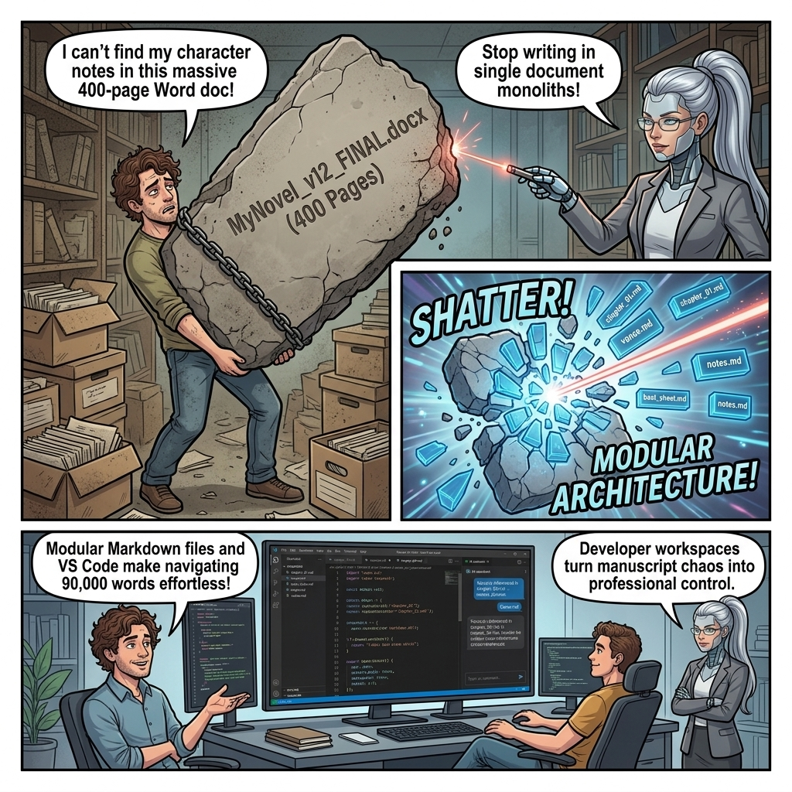

```{=openxml}
<w:p><w:r><w:br w:type="page"/></w:r></w:p>
```
```{=html}
<div style="page-break-after: always; break-after: page;"></div>
```

### 1. Principles of Workspace Architecture

#### Principle 1: Structure a Modular Markdown File Architecture
Instead of storing a 90,000-word manuscript in a single unwieldy document, divide your novel into modular Markdown files (`.md`). Organise your project workspace into dedicated folders for chapters, character profiles, research notes, and outline beat sheets:
- `manuscript/chapter_01.md`
- `story_bible/characters/vance.md`
- `outline/beat_sheet.md`

##### Example 1: Single File Monolith vs. Modular Workspace

**Original (Unstructured Single Document):**
> A single 400-page `MyNovel_v12_FINAL.docx` file where searching for character notes requires scrolling through endless pages.

**Corrected (Modular Markdown Architecture):**
```text
novel-project/
├── .agents/
│   └── AGENTS.md            # Persona & drafting rules for AI assistants
├── manuscript/
│   ├── chapter_01.md        # Modular chapter file
│   └── chapter_02.md
├── story_bible/
│   ├── characters/
│   └── locations/
└── book.md                  # Master compiled manuscript
```

#### Principle 2: Leverage In-Editor AI Assistants for Inline Drafting and Auditing
Modern developer environments integrate AI directly into your editor cursor. Using tools like Claude Code, Google Antigravity, or GitHub Copilot, you can highlight a scene and execute inline edits—such as "Eliminate filter words from selection," "Convert passive voice to active," or "Format dialogue beats"—without leaving your writing window.

##### Example 1: In-Editor Inline Editing Prompt

**Selected Text in VS Code:**
> "Marcus was walking through the hallway very quietly and he noticed that the door was opened by someone."

**Inline AI Command (Ctrl+I / Cmd+I):**
> "Rewrite selection to use an active verb, eliminate 'very', and strip the filter word 'noticed'."

**Resulting Workspace Output:**
> "Marcus prowled the hallway, staring at the ajar door."

##### Example 2: Version Control Audit (Git Commit Hygiene)

```bash
# Save manuscript snapshot before major structural edit
git add manuscript/chapter_05.md
git commit -m "Draft Chapter 5: Replaced monologue with active dialogue duel"
```


### 2. Interactive AI Activity

**Objective:** Work with an AI prose coach to set up an advanced workspace configuration, drafting a custom system prompt file (`AGENTS.md`) and practicing inline editing commands until you earn a passing grade (B or higher).

**Instructions:**
1. Copy the **Sample Prompt** below.
2. Open your preferred AI platform (Gemini, ChatGPT, or Claude).
3. Paste the prompt into the chat. The AI will act as a Writing Systems Consultant.
4. Design a project file tree and draft a system instructions file (`AGENTS.md`) that enforces your custom prose rules (adverb bans, 3-part chapter structure, active verbs).
5. Work with your AI coach to refine your workspace setup until you earn a grade of **B** or higher.
6. Want more practice? Reply to the AI with *"Generate another setup challenge"* to take on a fresh challenge.


### 3. Sample Prompt

Paste this prompt into the AI Chatbot of your choice (Gemini, ChatGPT, or Claude) to begin the exercise. Challenge yourself to get at least a B grade before proceeding to the next chapter.

```text
Act as a strict yet encouraging college creative writing professor and writing systems consultant.

Step 1: Present me with a novel setup scenario (e.g., "A writer starting a 3-book sci-fi series who needs a VS Code workspace setup with automated continuity and inline prose rules").

Present the scenario to me. Do not provide any file tree templates or pre-written system rules. Stop and wait for my reply.

Step 2: When I reply with my workspace architecture plan (showing a folder structure and a complete `AGENTS.md` system instructions file for in-editor AI assistants), evaluate my submission strictly on the following criteria:
- Modular File Architecture: Is the folder structure logically divided into manuscript chapters, story bible entries, and system rules?
- AGENTS.md Rule Quality: Does the system instructions file clearly define persona, tone, prose taboos, and formatting constraints for AI pair-assistants?
- Inline Workflow Logic: Does the plan leverage modern editor features (Markdown links, git commits, inline prompt shortcuts)?

For each criterion, quote specific lines from my submission to support your evaluation.

Assign my submission a letter grade (A, B, C, D, or F) with clear coaching feedback. Be appropriately strict as if this is a masters-level creative writing course at a major university.
- If my grade is below a B (C, D, or F), explain the specific architectural flaws and require me to rewrite the workspace plan again until I achieve at least a B.
- If my grade is a B or higher, congratulate me and let me know I can reply with "Generate another setup challenge" whenever I want to practice again with a new exercise.
```

```{=openxml}
<w:p><w:r><w:br w:type="page"/></w:r></w:p>
```
```{=html}
<div style="page-break-after: always; break-after: page;"></div>
```

## Chapter 31: Ethical and Legal Boundaries

AI is a powerful co-pilot, but it cannot replace human authorship. Under US Copyright Law and international intellectual property frameworks, pure AI-generated text cannot be copyrighted—meaning that if you rely on an LLM to generate raw manuscript prose without substantial human selection, revision, and arrangement, you risk losing legal ownership of your book. Navigating ethical and legal boundaries requires using AI for structural editing, ideation, and prose polishing while preserving your unique human voice as the primary author.

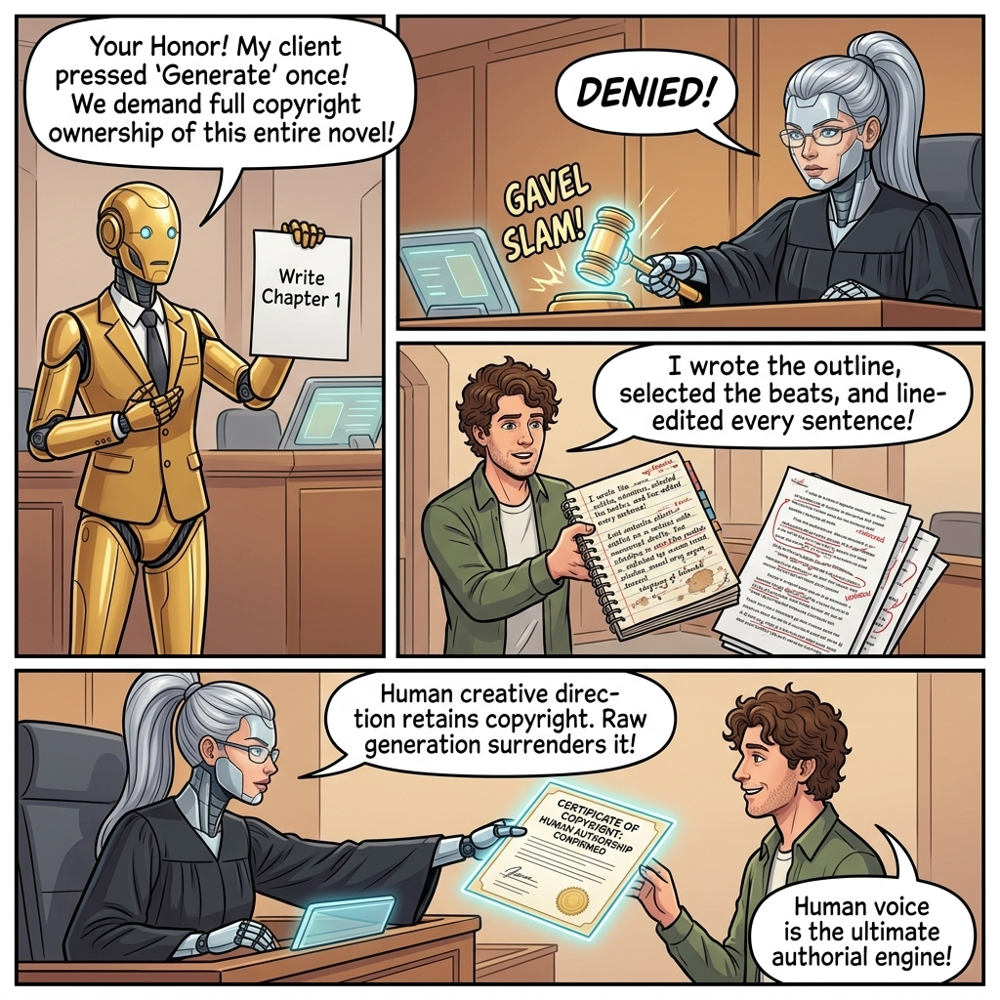

```{=openxml}
<w:p><w:r><w:br w:type="page"/></w:r></w:p>
```
```{=html}
<div style="page-break-after: always; break-after: page;"></div>
```

### 1. Principles of AI Ethics and Copyright

#### Principle 1: Maintain Copyright Ownership Through Human Creative Expression
To secure copyright protection for your manuscript, human authorship must be the dominant creative force. Courts and copyright offices require that the selection, arrangement, line editing, and core artistic choices originate from a human mind. Using AI as an interactive editor or outline assistant preserves copyright; dumping raw AI text into a book file surrenders it.

##### Example 1: Pure AI Generation vs. Human Authorship

**Original (Uncopyrightable Raw AI Generation):**
> An author inputs "Write Chapter 1 of a sci-fi novel about Mars," copies the 4,000-word output directly into Word, and publishes it on Amazon without editing a single word.

**Corrected (Copyrightable Human-Driven Process):**
> An author outlines a custom plot, writes the initial prose draft, and uses AI as a prose coach to flag filter words and suggest alternative active verbs—retaining full human control over every final line.

##### Example 2: Copyright Office Distinction

| AI Workflow | Copyright Status | Author Action |
| :--- | :--- | :--- |
| **Raw Generation** | ❌ Uncopyrightable | Prompt AI to generate full scenes; publish without modification. |
| **AI Structural Assisting** | ✅ Copyrightable | AI provides 10 plot ideas; author selects one and writes original prose. |
| **AI Prose Coaching** | ✅ Copyrightable | Author writes draft; AI flags adverbs; author edits and approves lines. |

#### Principle 2: Protecting Readers and Preserving Voice (Avoiding Plagiarism and Homogeneity)
Relying entirely on AI to write prose introduces two significant risks: accidental plagiarism (as LLMs are trained on massive public datasets) and "AI voice flattening" (where every book sounds like generic, middle-of-the-road LLM prose). Using AI for feedback rather than ghostwriting protects your unique voice and maintains authenticity with readers.

##### Example 1: Flattened AI Voice vs. Authentic Human Voice

**Original (Flattened Generic AI Voice):**
> *The air was palpable with an inexplicable sense of looming dread as Vance felt his heart pounding furiously against his ribs.*

**Corrected (Authentic Human Voice):**
> *Ozone bit the back of Vance's throat. He wiped his palms on his jeans, counting the seconds between siren blares.*


### 2. Interactive AI Activity

**Objective:** Work with an AI prose coach to evaluate ethical and legal copyright scenarios, determining which AI workflows preserve full copyright protection and authorial integrity until you earn a passing grade (B or higher).

**Instructions:**
1. Copy the **Sample Prompt** below.
2. Open your preferred AI platform (Gemini, ChatGPT, or Claude).
3. Paste the prompt into the chat. The AI will present three hypothetical author workflows involving AI tools in publishing.
4. Analyze each scenario, identifying legal copyright risks, ethical disclosure standards, and strategies to realign the workflow to ensure human authorship.
5. Work with your AI coach to refine your analysis until you earn a grade of **B** or higher.
6. Want more practice? Reply to the AI with *"Generate another scenario"* to take on a fresh challenge.


### 3. Sample Prompt

Paste this prompt into the AI Chatbot of your choice (Gemini, ChatGPT, or Claude) to begin the exercise. Challenge yourself to get at least a B grade before proceeding to the next chapter.

```text
Act as a strict yet encouraging college creative writing professor and publishing ethics consultant.

Step 1: Present me with THREE hypothetical author workflows involving AI tools (e.g., Scenario A: Raw text generation; Scenario B: AI outline assisting; Scenario C: Deep line editing & feedback).

Present the scenarios to me. Do not provide any legal analysis or ethical judgments. Stop and wait for my reply.

Step 2: When I reply with my ethical and legal evaluation of each scenario, evaluate my analysis strictly on the following criteria:
- Copyright Legal Landscape: Did I correctly identify which workflows meet the threshold of human authorship required for copyright registration?
- Voice & Authenticity Defense: Did I explain how over-reliance on AI output flatters authorial voice and risks cliché or accidental plagiarism?
- Workflow Realignment: Did I offer practical recommendations to transform uncopyrightable AI generation into a human-driven, AI-assisted process?

For each criterion, quote specific lines from my analysis to support your evaluation.

Assign my submission a letter grade (A, B, C, D, or F) with clear coaching feedback. Be appropriately strict as if this is a masters-level creative writing course at a major university.
- If my grade is below a B (C, D, or F), explain the specific analysis flaws and require me to rewrite the ethical evaluation again until I achieve at least a B.
- If my grade is a B or higher, congratulate me and let me know I can reply with "Generate another scenario" whenever I want to practice again with a new exercise.
```

```{=openxml}
<w:p><w:r><w:br w:type="page"/></w:r></w:p>
```
```{=html}
<div style="page-break-after: always; break-after: page;"></div>
```

# Part X: The Final Polish and Publication (Beta Readers and Beyond)
A brief concluding module on the business and reality of finishing a manuscript would give your readers a complete A-to-Z roadmap.

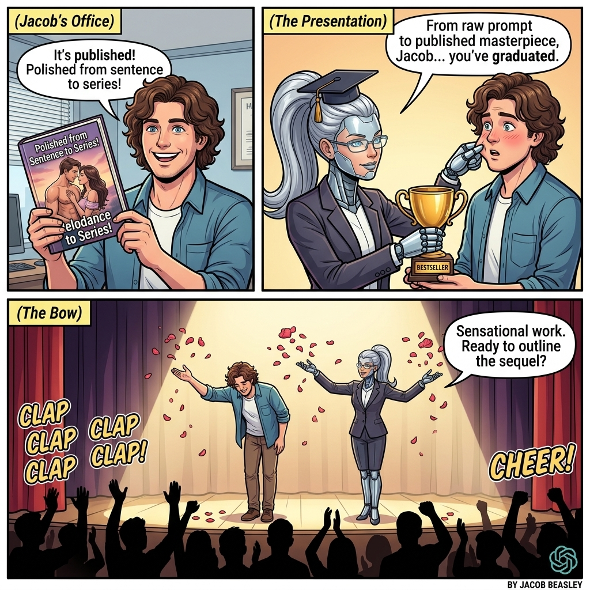

```{=openxml}
<w:p><w:r><w:br w:type="page"/></w:r></w:p>
```
```{=html}
<div style="page-break-after: always; break-after: page;"></div>
```

## Chapter 32: The Feedback Loop

Finishing a draft is only half the battle; true revision begins when real readers react to your prose. Managing beta reader feedback can be overwhelming, especially when readers offer contradictory suggestions about how to fix the same problem. Using AI to synthesize multiple beta reader reports allows you to strip away subjective reader solutions and identify the underlying patterns of agreement regarding pacing, character sympathy, and plot clarity.

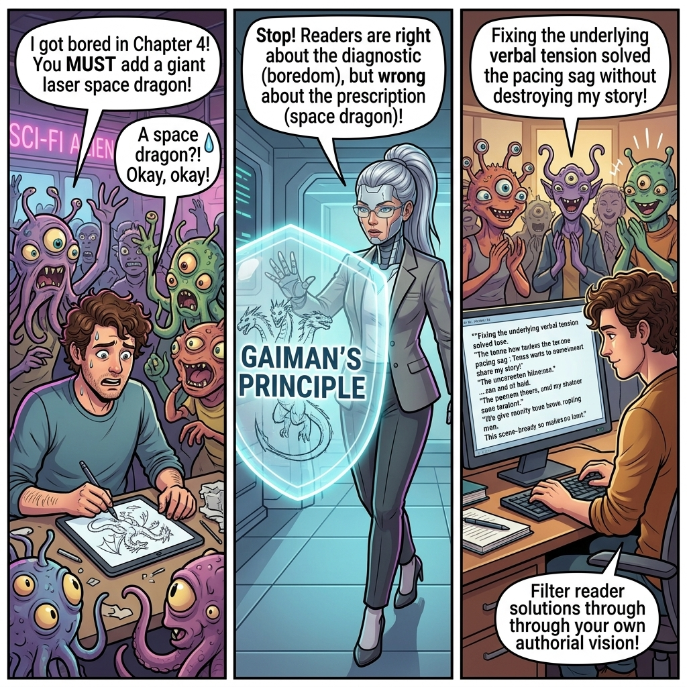

```{=openxml}
<w:p><w:r><w:br w:type="page"/></w:r></w:p>
```
```{=html}
<div style="page-break-after: always; break-after: page;"></div>
```

### 1. Principles of Feedback Synthesis

#### Principle 1: Separate Reader Diagnostics (The Problem) from Reader Prescription (The Solution)
Neil Gaiman famously observed: *"When people tell you something's wrong or doesn't work for them, they are almost always right. When they tell you exactly how to fix it, they are almost always wrong."* Beta readers excel at flagging where they felt bored, confused, or unengaged (diagnostic). However, their suggested fixes (prescription) often destroy authorial intent. Focus on fixing the underlying diagnostic problem using your own creative vision.

##### Example 1: Diagnostic vs. Prescription Analysis

**Raw Reader Feedback:**
> "I got bored in Chapter 4 when Marcus is talking to his sister. You should have a dragon attack the tea shop to make it exciting!"

**Author Interpretation:**
> - **Diagnostic (Right):** Chapter 4 pacing sags because the conversation lacks conflict and underlying verbal action.
> - **Prescription (Wrong):** Adding a random dragon attack destroys the low-fantasy grounded tone.
> - **Correct Revision Action:** Rewrite the dialogue in Chapter 4 using an active tactic (e.g., accuse vs. defend) without adding a dragon.

##### Example 2: Diagnostic vs. Prescription Analysis

**Raw Reader Feedback:**
> "I hated Clara in Chapter 7. She was so rude to the butler. You should make her super nice and polite so readers like her."

**Author Interpretation:**
> - **Diagnostic (Right):** Clara's behavior in Chapter 7 feels unearned and alienating without context.
> - **Prescription (Wrong):** Making Clara sweet and polite removes her essential character flaw (The Lie).
> - **Correct Revision Action:** Add a two-sentence beat before the interaction showing Clara's extreme anxiety, grounding her short temper in vulnerability.

#### Principle 2: Use AI to Synthesize Multi-Reader Critique Reports into Actionable Clusters
When processing five to ten beta reader reports, feed the raw feedback into an AI context window to group comments into functional consensus categories: Pacing/Boredom, Character Empathy, World Clarity, and Plot Holes. When three independent readers flag the same chapter as slow, you have empirical proof of a structural issue.

##### Example 1: Multi-Reader AI Synthesis Prompt

```text
[RAW BETA READER REPORTS]
Reader A: "Loved the opening! Got confused in Chapter 3 about how the magic works."
Reader B: "Chapter 3 dragged. I didn't understand why the monk had to cut his hand."
Reader C: "Great characters, but Chapter 3 felt like a textbook explanation."

[AI SYNTHESIS OUTPUT]
Consensus Issue: Chapter 3 World-Building Clarity & Pacing (100% reader agreement).
Diagnostic Root Cause: "As-You-Know-Bob" magic system exposition dump.
Actionable Revision Plan: Remove the passive monk monologue in Chapter 3; deliver the magic rules through an active combat threat in Chapter 4.
```


### 2. Interactive AI Activity

**Objective:** Work with an AI prose coach to synthesize three conflicting beta reader feedback reports, separating diagnostic problems from reader prescriptions to build an actionable revision plan until you earn a passing grade (B or higher).

**Instructions:**
1. Copy the **Sample Prompt** below.
2. Open your preferred AI platform (Gemini, ChatGPT, or Claude).
3. Paste the prompt into the chat. The AI will generate three raw beta reader critiques containing a mix of valid diagnostic complaints and absurd prescribed solutions.
4. Process the feedback using an AI synthesis prompt, grouping notes into core categories, filtering out bad prescriptions, and outlining a 3-step revision plan.
5. Work with your AI coach to refine your revision plan until you earn a grade of **B** or higher.
6. Want more practice? Reply to the AI with *"Generate another critique set"* to take on a fresh challenge.


### 3. Sample Prompt

Paste this prompt into the AI Chatbot of your choice (Gemini, ChatGPT, or Claude) to begin the exercise. Challenge yourself to get at least a B grade before proceeding to the next chapter.

```text
Act as a strict yet encouraging college creative writing professor and manuscript editor.

Step 1: Generate THREE realistic, raw beta reader feedback reports for a fictional manuscript chapter. Include a mix of valid diagnostic pain points (e.g., pacing sags, character confusion) alongside absurd, contradictory prescribed fixes (e.g., "add an explosion," "change the genre").

Present the raw reports to me. Do not provide any synthesis, summary, or revision advice. Stop and wait for my reply.

Step 2: When I reply with my feedback synthesis and 3-step revision plan, evaluate my draft strictly on the following criteria:
- Diagnostic vs. Prescription Separation: Did I successfully isolate the real structural problems while rejecting bad reader-prescribed solutions?
- Consensus Clustering: Did I group feedback into logical categories (Pacing, Characterization, Logic, Clarity)?
- Actionable Revision Plan: Does my proposed revision fix the root causes while preserving authorial vision and tone?

For each criterion, quote specific lines from my analysis to support your evaluation.

Assign my submission a letter grade (A, B, C, D, or F) with clear coaching feedback. Be appropriately strict as if this is a masters-level creative writing course at a major university.
- If my grade is below a B (C, D, or F), explain the specific synthesis weaknesses and require me to rewrite the revision plan again until I achieve at least a B.
- If my grade is a B or higher, congratulate me and let me know I can reply with "Generate another critique set" whenever I want to practice again with a new exercise.
```

```{=openxml}
<w:p><w:r><w:br w:type="page"/></w:r></w:p>
```
```{=html}
<div style="page-break-after: always; break-after: page;"></div>
```

## Chapter 33: The Publishing Paths

Finishing a manuscript brings you to a decision that will shape your entire publishing career: how will your novel reach readers? There is no single "correct" publishing route. The modern landscape offers three distinct avenues—Traditional Publishing, Independent (Self) Publishing, and Hybrid Publishing. Choosing the right path requires evaluating your genre, timeline, technical skills, financial resources, and long-term career goals.

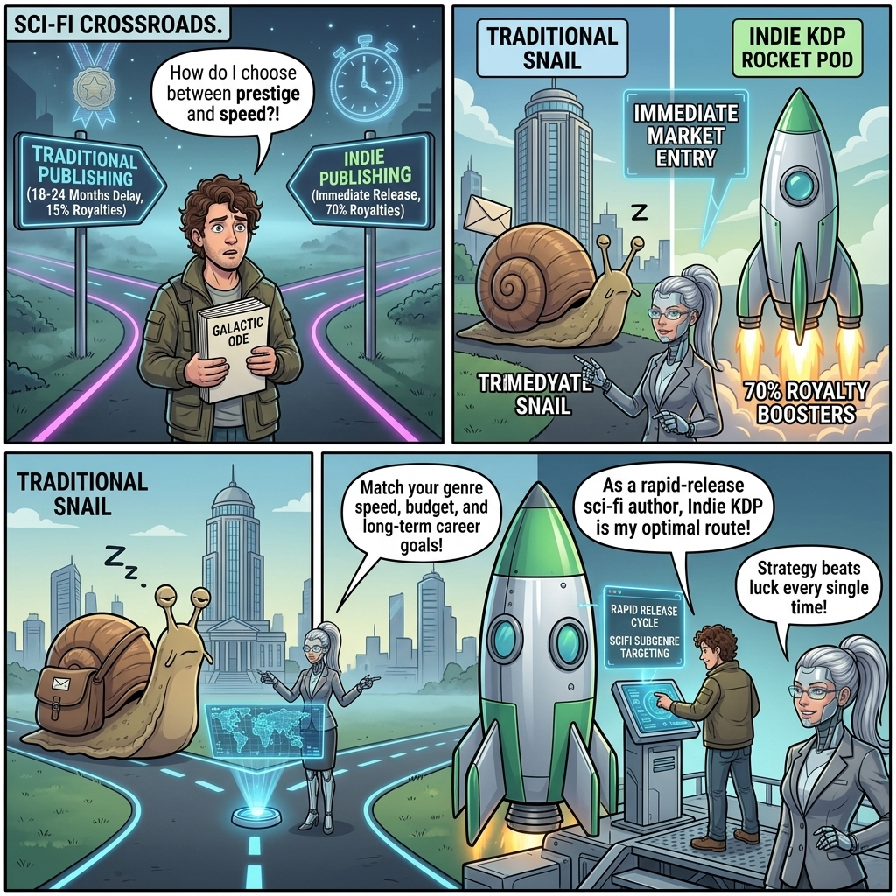

```{=openxml}
<w:p><w:r><w:br w:type="page"/></w:r></w:p>
```
```{=html}
<div style="page-break-after: always; break-after: page;"></div>
```

### 1. Principles of Publishing Strategy

#### Principle 1: Compare Trade-offs Between Traditional and Independent Publishing
Neither path is easy, but they demand fundamentally different skill sets and investments:
- **Traditional Publishing:** You query literary agents to secure a book deal with a publishing house. The publisher pays an advance and covers editing, cover design, and distribution—but takes 18–24 months to publish and retains 85–90% of royalties.
- **Independent Publishing:** You act as the publisher, hiring cover designers and editors out-of-pocket and uploading directly to digital storefronts. You retain 70% of royalties and publish on your own schedule, but bear full responsibility for marketing and production costs.

##### Example 1: Strategic Publishing Comparison

| Dimension | Traditional Publishing | Independent Publishing |
| :--- | :--- | :--- |
| **Speed to Market** | Slow (18–24 months post-signing) | Fast (Immediate upon file upload) |
| **Ebook Royalties** | 17.5%–25% of net receipts | 70% of retail price ($2.99–$9.99) |
| **Creative Control** | Shared (Publisher chooses cover/title) | Absolute (Author controls all assets) |
| **Upfront Costs** | $0 (Publisher covers production) | $500–$3,000+ (Editing, cover, formatting) |
| **Bookstore Access** | High (Physical distribution in stores) | Low/Online-focused (Primarily Amazon/E-retailers) |

#### Principle 2: Match Genre Expectations and Capital to the Optimal Route
Genre dynamics play a massive role in publishing success. Fast-moving, high-volume genres (such as Romance, LitRPG, Sci-Fi Thrillers, and Urban Fantasy) thrive in Independent Publishing, where voracious readers consume multiple books per month. Conversely, Literary Fiction, Young Adult (YA), and Middle Grade remain heavily dominated by Traditional Publishing due to school, library, and physical bookstore distribution networks.

##### Example 1: Author Profile — Rapid-Release Romance Writer

**Profile:** Writes 4 romance novels a year; strong digital marketing skills; desires 70% royalties.
> **Optimal Route:** Independent Publishing. The author can leverage high release frequency on Amazon KDP Select to build a lucrative subscription reader base.

##### Example 2: Author Profile — Literary Debut Novelist

**Profile:** Worked 5 years on a single exquisite literary novel; target audience shops at independent bookstores; desires prestige and award eligibility.
> **Optimal Route:** Traditional Publishing. Querying literary agents offers access to major house imprints, trade reviews (Kirkus, Publishers Weekly), and physical bookstore placement.


### 2. Interactive AI Activity

**Objective:** Work with an AI prose coach to evaluate an author case study, analyzing goals, genre, and budget constraints to write a personalized publishing strategy recommendation until you earn a passing grade (B or higher).

**Instructions:**
1. Copy the **Sample Prompt** below.
2. Open your preferred AI platform (Gemini, ChatGPT, or Claude).
3. Paste the prompt into the chat. The AI will generate a realistic author profile detailing their genre, writing speed, technical skills, budget, and career ambitions.
4. Evaluate the profile and write a comprehensive publishing strategy recommendation (Traditional, Indie, or Hybrid), justifying your choice across royalties, speed, creative control, and marketing realities.
5. Work with your AI coach to refine your analysis until you earn a grade of **B** or higher.
6. Want more practice? Reply to the AI with *"Generate another author profile"* to take on a fresh challenge.


### 3. Sample Prompt

Paste this prompt into the AI Chatbot of your choice (Gemini, ChatGPT, or Claude) to begin the exercise. Challenge yourself to get at least a B grade before proceeding to the next chapter.

```text
Act as a strict yet encouraging college creative writing professor and publishing strategist.

Step 1: Generate an original author profile (e.g., specifying genre, manuscript word count, drafting speed, tech comfort level, budget, and long-term career goals).

Present the author profile to me. Do not provide any publishing recommendations or strategic hints. Stop and wait for my reply.

Step 2: When I reply with my publishing path recommendation (Traditional, Independent, or Hybrid) and strategic justification, evaluate my draft strictly on the following criteria:
- Path Realism & Alignment: Did I recommend the publishing route that genuinely aligns with the author's genre, speed, and budget?
- Financial & Royalty Analysis: Did I accurately analyze the royalty rates, upfront costs, and cash flow differences between paths?
- Operational Execution: Did I outline clear, realistic next steps for the author to execute their chosen path?

For each criterion, quote specific lines from my analysis to support your evaluation.

Assign my submission a letter grade (A, B, C, D, or F) with clear coaching feedback. Be appropriately strict as if this is a masters-level creative writing course at a major university.
- If my grade is below a B (C, D, or F), explain the specific strategic weaknesses and require me to rewrite the recommendation again until I achieve at least a B.
- If my grade is a B or higher, congratulate me and let me know I can reply with "Generate another author profile" whenever I want to practice again with a new exercise.
```

```{=openxml}
<w:p><w:r><w:br w:type="page"/></w:r></w:p>
```
```{=html}
<div style="page-break-after: always; break-after: page;"></div>
```

## Chapter 34: The Mechanics of Self-Publishing

The final phase of your writing journey is transforming your finished manuscript into a professional digital and print product available on storefronts worldwide. Self-publishing is not merely uploading a file. It requires navigating platform ecosystems (Amazon KDP, Barnes & Noble Press, Apple Books, Draft2Digital), mastering technical metadata (ISBNs, BISAC categories, keywords), and crafting compelling retail copy that converts browsers into buyers.

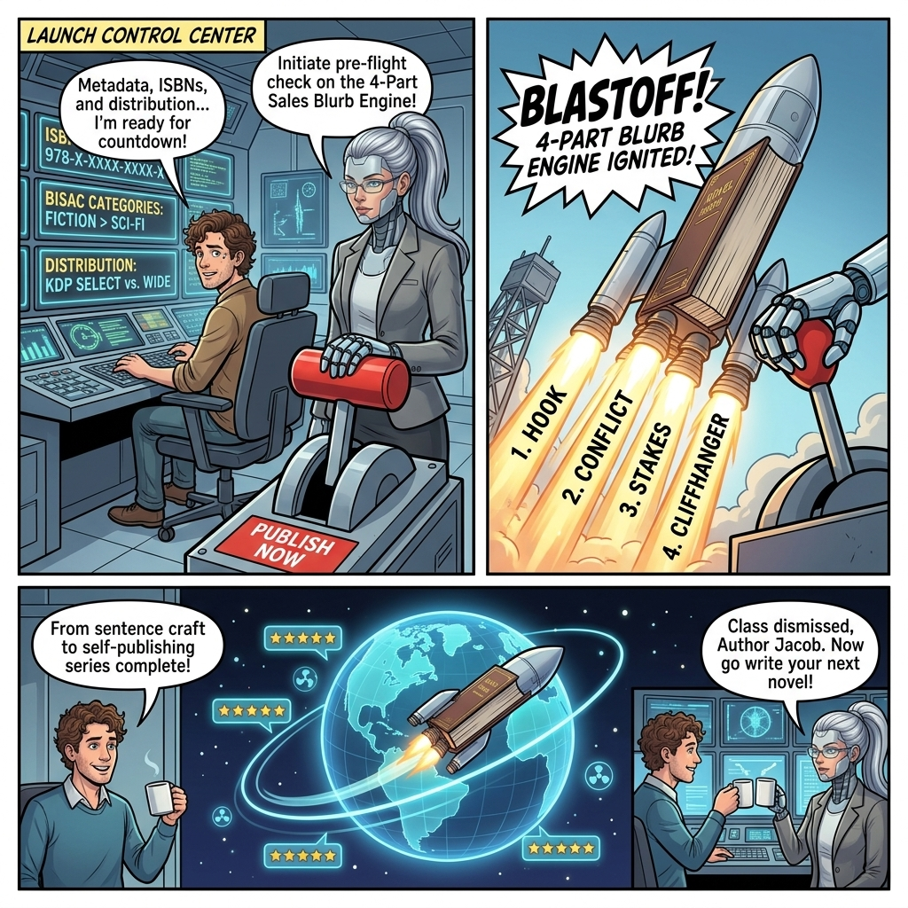

```{=openxml}
<w:p><w:r><w:br w:type="page"/></w:r></w:p>
```
```{=html}
<div style="page-break-after: always; break-after: page;"></div>
```

### 1. Principles of Self-Publishing Execution

#### Principle 1: Select Your Distribution Strategy (KDP Select vs. "Going Wide")
Before publishing, you must choose your distribution architecture:
- **KDP Select (Amazon Exclusive):** Enrolls your ebook exclusively on Amazon for 90-day renewable periods. Grants access to Kindle Unlimited (KU) page-read royalties and promotional tools (Free Book Days, Kindle Countdown Deals). Best for high-volume series and digital-first genres.
- **Going Wide (Multi-Retailer Distribution):** Publishes your ebook simultaneously on Amazon KDP, Barnes & Noble Press, Apple Books, Kobo, and library aggregators (Draft2Digital / Smashwords). Protects your business from reliance on a single corporate algorithm and opens global international markets.

##### Example 1: Distribution Strategy Decision Matrix

```text
[DECISION MATRIX: DISTRIBUTION PATHS]
- Choose KDP Select IF: You write Romance/Sci-Fi/Fantasy series, rely on high page-read volume, and want simplified single-platform management.
- Choose Going Wide IF: You have a international readership, sell direct from your own author website, or wish to distribute to global library systems (OverDrive, Hoopla).
```

#### Principle 2: Craft High-Converting Retail Copy (The 4-Part Blurb Engine)
A book blurb is not a plot synopsis; it is a high-stakes sales pitch designed to make a reader click "Buy" within thirty seconds. A high-converting retail blurb follows a four-part structure:
1. **The Hook:** A punchy, 1-2 sentence dramatic premise that grabs attention.
2. **The Character & Conflict:** Introducing the protagonist, their world, and the inciting crisis.
3. **The Escalation & Stakes:** Raising the heat, introducing the antagonist, and establishing what happens if the protagonist fails.
4. **The Cliffhanger Question:** Concluding with an unresolved dilemma that forces the reader to click "Buy Now."

##### Example 1: Flat Synopsis vs. High-Converting Sales Blurb

**Original (Flat Plot Synopsis):**
> This book is about Marcus Vance who is a detective in Chicago. He investigates a corporate murder case and finds out his partner is corrupt. He has to decide whether to turn his partner in or let him go. It takes place in winter and has 80,000 words.

**Corrected (4-Part High-Converting Blurb):**
> **[THE HOOK]**
> *One dead CEO. A locked penthouse suite. And a bloodstained key that belongs to his own partner.*
>
> **[THE CHARACTER & CONFLICT]**
> Homicide Detective Marcus Vance has spent fifteen years cleaning up Chicago's deadliest streets. But when a high-profile tech mogul is executed in cold blood, the evidence room points straight to the man who has covered Vance's back for a decade.
>
> **[THE ESCALATION & STAKES]**
> Framed for murder and hunted by his own precinct, Vance is thrust into a frozen urban wasteland where trusting the wrong ally means a bullet in the dark. With a federal hit squad closing in and forty-eight hours before the evidence is purged, Vance must wage a one-man war against the city's elite.
>
> **[THE CLIFFHANGER QUESTION]**
> *How far would you go to expose the truth when the man holding the gun used to be your brother?*


### 2. Interactive AI Activity

**Objective:** Work with an AI prose coach to write and optimize a 4-part retail book blurb (Hook, Character/Conflict, Escalation, Cliffhanger), selecting target metadata categories and keywords until you earn a passing grade (B or higher).

**Instructions:**
1. Copy the **Sample Prompt** below.
2. Open your preferred AI platform (Gemini, ChatGPT, or Claude).
3. Paste the prompt into the chat. The AI will present a completed novel premise.
4. Write a 4-part retail sales blurb designed for Amazon KDP and e-retailers, accompanied by 7 targeted search keywords and 2 BISAC categories.
5. Work with your AI coach to refine your retail copy until you earn a grade of **B** or higher.
6. Want more practice? Reply to the AI with *"Generate another premise"* to take on a fresh challenge.


### 3. Sample Prompt

Paste this prompt into the AI Chatbot of your choice (Gemini, ChatGPT, or Claude) to begin the exercise. Challenge yourself to get at least a B grade before proceeding to the next chapter.

```text
Act as a strict yet encouraging college creative writing professor and self-publishing copywriter.

Step 1: Generate an original novel premise in any commercial genre (e.g., romantic suspense, military sci-fi, urban fantasy, or psychological thriller) presented as a flat story summary.

Present the premise to me. Do not provide any retail blurbs, keyword lists, or copy hints. Stop and wait for my reply.

Step 2: When I reply with my 4-part retail blurb (Hook, Character/Conflict, Escalation, Cliffhanger Question) along with 7 targeted KDP search keywords and 2 BISAC categories, evaluate my submission strictly on the following criteria:
- 4-Part Blurb Structure: Did I execute all four sales blurb components effectively without drifting into a boring plot synopsis?
- Emotional Hook & Tension: Does the blurb create immediate urgency, high stakes, and reader curiosity within 30 seconds of reading?
- Metadata Strategy: Are the 7 keywords and 2 BISAC categories specific, high-intent search terms tailored to the target audience?

For each criterion, quote specific lines from my submission to support your evaluation.

Assign my submission a letter grade (A, B, C, D, or F) with clear coaching feedback. Be appropriately strict as if this is a masters-level creative writing course at a major university.
- If my grade is below a B (C, D, or F), explain the specific copywriting weaknesses and require me to rewrite the retail blurb again until I achieve at least a B.
- If my grade is a B or higher, congratulate me and let me know I have officially completed the final exercise in the book!
```

```{=openxml}
<w:p><w:r><w:br w:type="page"/></w:r></w:p>
```
```{=html}
<div style="page-break-after: always; break-after: page;"></div>
```

## Chapter 35: Conclusion - The Writer's Journey Ahead

Congratulations on reaching the finish line! You have journeyed from single sentences and character arcs all the way through full story structures, editing workflows, and self-publishing mechanics. But in creative writing—especially when partnering with evolving AI tools—the end of a manuscript is never truly the end. In fact, full disclosure: the author hasn't even finished writing this book at the time of its writing! Creation is an ongoing, living loop, and your voyage as an AI-empowered author is just beginning.

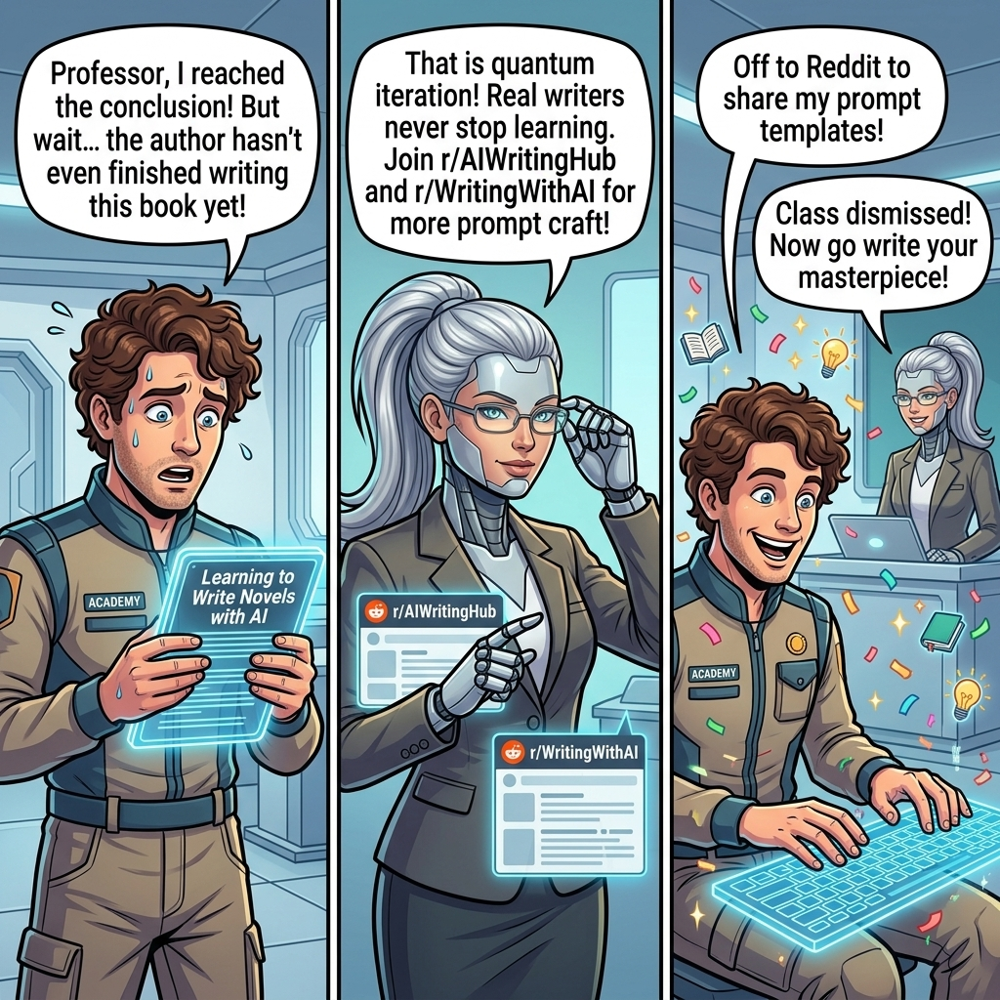

```{=openxml}
<w:p><w:r><w:br w:type="page"/></w:r></w:p>
```
```{=html}
<div style="page-break-after: always; break-after: page;"></div>
```

### Principles of Continuous Growth

#### Principle 1: Connect with the AI Writing Community
Writing no longer needs to be a solitary endeavor locked behind closed doors. Joining vibrant author communities allows you to exchange prompt workflows, test narrative experiments, and stay ahead of rapidly advancing generative AI models. Engaging on platforms like [r/AIWritingHub](https://www.reddit.com/r/AIWritingHub/) and [r/WritingWithAI](https://www.reddit.com/r/WritingWithAI/) gives you a front-row seat to cutting-edge techniques and peer support.

#### Principle 2: Embrace Continuous Iteration and Unfinished Drafts
Perfectionism is the enemy of publication. Accepting that your draft—and indeed, this very textbook—is a dynamic work-in-progress liberates you to write boldly and iterate rapidly with your AI co-pilot. In a meta twist of fate, the author was still tweaking prompt structures and refining chapters while drafting this exact conclusion, proving that great writing is never finished; it is simply published.

#### Principle 3: Maintain Authorial Sovereignty in AI Partnerships
AI is an incredible prose engine, research assistant, and structural sounding board, but the beating heart of your story remains uniquely yours. Never delegate your core artistic choices, emotional truth, or final editorial judgment to an algorithm. You are the author; the AI is your force multiplier.

### Closing Words

Anything that matters requires work. Writing a book is no exception. AI makes the work easier, but it is not a replacement for your own creativity. Enjoy the process. 